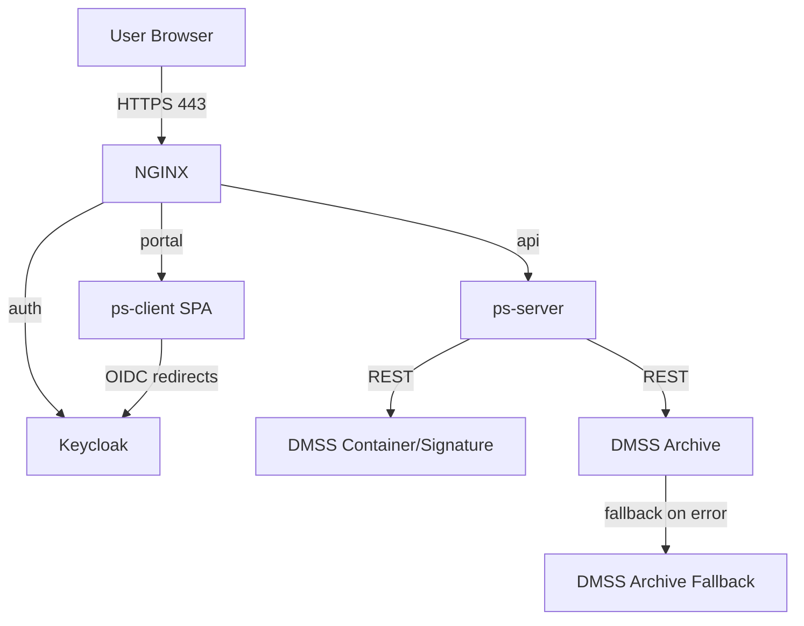
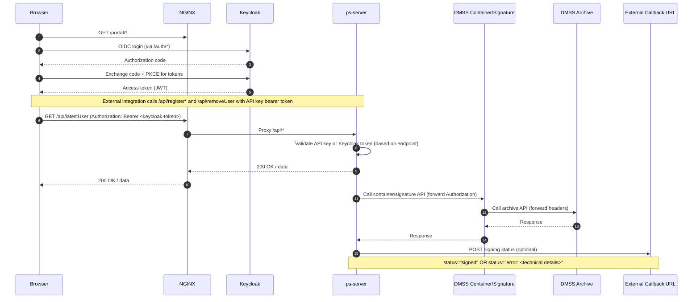
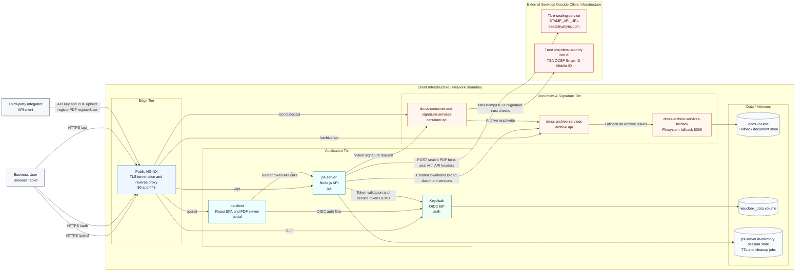
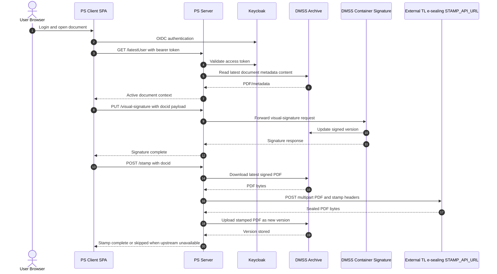
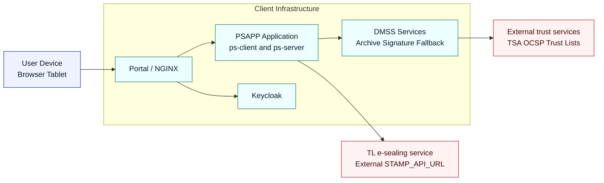

# PadSign 2.0 Application

## Table of Contents

1. [Release Snapshot](#release-snapshot)
2. [Overview](#overview)
3. [Architecture](#architecture)
4. [Application Overview](#application-overview)
5. [Prerequisites](#prerequisites)
6. [Prerequisites (Quick Checklist)](#prerequisites-quick-checklist)
7. [Domain and TLS Certificates](#domain-and-tls-certificates)
8. [Running the Stack](#running-the-stack)
9. [Configuration](#configuration)
10. [Keycloak Setup](#keycloak-setup)
11. [Client Configuration](#client-configuration)
12. [Server Configuration](#server-configuration)
13. [Environment Variables](#environment-variables)
14. [Configuration Constants Reference](#configuration-constants-reference)
15. [Testing the Integration](#testing-the-integration)
16. [Troubleshooting](#troubleshooting)
17. [Troubleshooting (Integration and Auth)](#troubleshooting-integration-and-auth)
18. [Security and Route Protection](#security-and-route-protection)
19. [Data Flow](#data-flow)
20. [Production Deployment](#production-deployment)
21. [Production Hardening](#production-hardening)
22. [Local Development Tips](#local-development-tips)
23. [Security Considerations](#security-considerations)
24. [File Map and References](#file-map-and-references)
25. [Notes on Security](#notes-on-security)
26. [FAQ](#faq)
27. [Support](#support)
28. [Additional Resources](#additional-resources)

## Release Snapshot

- `ps-server`: `mihailsgordijenko/ps-server:3.20`
- `ps-client`: `mihailsgordijenko/ps-client:8.33`
- Keycloak: `quay.io/keycloak/keycloak:26.3.2`
- DMSS Archive: `trustlynx/dmss-archive-services:24.2.0.8`
- DMSS Container/Signature: `trustlynx/container-signature-service:24.3.0.49`
- DMSS Archive fallback: `trustlynx/dmss-archive-services-fallback:24.0.5`

## Overview

- Reverse proxy and TLS termination via NGINX.
- Authentication and authorization via Keycloak.
- PS Client (SPA) served via container.
- PS Server (Node.js backend) with configurable endpoints and Keycloak integration.
- DMSS services for archive, container/signature, and a local fallback archive.
- Docker Compose orchestration with a persistent volume for Keycloak data.

---

## Architecture

Services defined in `docker-compose.yml`:

- NGINX: Public entrypoint on ports 80/443; routes to backend services and Keycloak.
- Keycloak: Identity provider; exposed on port 8080 and proxied at `/auth` through NGINX.
- PS Client: SPA served by its own NGINX; proxied by the public NGINX at `/portal`.
- PS Server: Backend API consumed by PS Client; proxied by the public NGINX at `/api`.
- DMSS Container and Signature Services: PDF/container operations, signing flows, Smart-ID/Mobile-ID.
- DMSS Archive Services: Archive API; configured with in-memory DB by default.
- DMSS Archive Services Fallback: Filesystem-based fallback archive; stores files in `./docs`.

High-level routing:

- `https://<host>/portal/...` -> `ps-client`
- `https://<host>/auth/...` -> `keycloak`
- `https://<host>/api/...` -> `ps-server`
- `https://<host>/container/api/...` -> `dmss-container-and-signature-services`
- `https://<host>/archive/api/...` -> `dmss-archive-services` (fallback to `dmss-archive-services-fallback` as configured)

---

## Application Overview

The PadSign application uses Keycloak for authentication and authorization. The setup includes:
- **Keycloak Server**: Containerized authentication server
- **Client Application**: React frontend with Keycloak integration
- **Server Application**: Node.js backend with Keycloak middleware

### How this solution works

- Users open the PadSign portal in the browser and are redirected to Keycloak to log in securely.
- After login, the SPA pulls its runtime config and shows the latest PDF that was registered for that user and company.
- External systems register sessions/documents through API-key endpoints (`/api/registerUser`, `/api/registerUserPDF`, `/api/registerPDF`) and clear them using `/api/removeUser`.
- The SPA polls the backend for that user/company pair; when a PDF is found, it streams the document from the archive service for viewing and signing.
- All traffic flows through the NGINX reverse proxy over HTTPS, which routes to the SPA (`/portal`), Keycloak (`/auth`), backend (`/api`), and the DMSS services used for document storage and signing.

## Prerequisites

- Docker Desktop 4.x (Docker Engine 20+; Compose v2).
- A DNS name you control (production) or a local hostname mapping (development).
- TLS certificate and key for your hostname (PEM). Self-signed is acceptable for local testing.
- Open host ports: 80, 443, 8080, 3001, 84, 86, 93.
- Suggested resources: 4 vCPU, 6-8 GB RAM.

Optional (local):

- mkcert (included as `nginx/mkcert.exe` for Windows) to generate a locally trusted certificate.

---

## Prerequisites (Quick Checklist)

- Docker and Docker Compose installed
- Domain name configured (e.g., `padsign.trustlynx.com`)
- SSL certificates for HTTPS
- Access to Keycloak admin panel

## Domain and TLS Certificates

The NGINX virtual host is configured for `padsign.trustlynx.com` out of the box. Update this to your hostname and provide matching certificates.

### TLS Prerequisites (For Installation Scripts)

The installation scripts expect PEM files named after the hostname you pass in `--host`.

- Put certs here (source location):
  - `installation-scripts/certs/<host>.crt`
  - `installation-scripts/certs/<host>.key`
- The scripts copy them to (NGINX bind-mount location):
  - `nginx/certs/<host>.crt`
  - `nginx/certs/<host>.key`
- NGINX reads them inside the container from:
  - `/etc/nginx/certs/<host>.crt`
  - `/etc/nginx/certs/<host>.key`

Certificate file format expectations
- `<host>.crt` should be a PEM certificate (for example a full chain file like Let's Encrypt `fullchain.pem`).
- `<host>.key` must be a PEM private key.

Password-protected private keys
- If the private key is encrypted (has `ENCRYPTED` in the PEM header), NGINX won’t be able to start non-interactively.
- Recommended: convert it to an unencrypted key before running the scripts:

```bash
# Example for Let's Encrypt files:
cp /etc/letsencrypt/live/<host>/fullchain.pem installation-scripts/certs/<host>.crt
openssl pkey -in /etc/letsencrypt/live/<host>/privkey.pem -out installation-scripts/certs/<host>.key
```

If you intentionally want to keep an encrypted key, you need to extend `nginx/nginx.conf` with `ssl_password_file` and mount a password file into the container (not implemented by default).

1) Replace server_name and cert paths

- Edit `nginx/nginx.conf` and change:
  - `server_name` to your hostname, e.g. `example.yourdomain.com`.
  - `ssl_certificate` and `ssl_certificate_key` to your certificate files in `nginx/certs`.

2) Provide certificates

- Place your certificate and key files in `nginx/certs/`.
- Ensure file names match those referenced in `nginx/nginx.conf`.

Local option (Windows):

- Generate a local cert: `nginx/mkcert.exe example.local` and then point `ssl_certificate` and `ssl_certificate_key` to the generated files.

3) DNS or hosts entry

- Production: Point your domain's A/AAAA record to the host running this stack.
- Local: Add a hosts entry mapping your hostname to `127.0.0.1` (or the Docker host IP) and use a locally trusted cert.

---

## Running the Stack

1) Prepare folders

- Ensure `./nginx/certs` contains your TLS cert and key.
- Ensure `./docs` exists (used by fallback archive service).

2) Start services

```sh
docker compose up -d
```

3) Verify

- Portal: `https://<host>/portal/`
- API: `https://<host>/api/health` (if exposed by ps-server) or check container logs
- Keycloak: `https://<host>/auth/`
- DMSS health (Spring Boot): `/actuator/health` on the service base paths if enabled
- Run `/api/registerPDF` and receive status code `201`.
  


4) Logs

```sh
docker compose ps
docker compose logs -f nginx
# or a specific service, e.g.
docker compose logs -f ps-server
```

5) Stop / remove

```sh
docker compose down
# Add -v to remove named volumes if required
```

---

## Configuration

Review and adjust these files before running:

- `docker-compose.yml`
  - `KC_HOSTNAME` should match your hostname.
  - Host ports 80/443, 8080, 3001, 84, 86, 93 must be free.
  - Image versions should match the release snapshot (`ps-server:3.20`, `ps-client:8.33`).

- `nginx/nginx.conf`
  - Update `server_name` and TLS files.
  - Proxy targets are pre-wired to internal services; `/archive/api` and `/container/api` routes target host ports `86` and `84` via `host.docker.internal` (intentional for Windows/macOS). Keep the published host ports in `docker-compose.yml` aligned with these.

- `config/config.js` (PS Server)
  - Update all hardcoded URLs from `https://padsign.trustlynx.com/...` to your hostname.
  - Set `KEYCLOAK_CONFIG` for your realm and backend client secret.
  - Adjust CORS: `ALLOWED_ORIGINS` should include your portal origin(s).
  - Set directories: `DOCUMENT_OUTPUT_DIRECTORY`, `READONLY_PDF_DIRECTORY` to writable paths where required by your runtime.

- `config/constants.json` (PS Client)
  - Change `KEYCLOAK_URL`, `KEYCLOAK_REALM`, `KEYCLOAK_CLIENT_ID`, and redirect URIs to match your hostname and Keycloak setup.
  - Update `PS_DOWNLOAD_API` and any other absolute URLs.
  - Optional: Branding (logo, page title) and UX parameters.

- `config/keycloak.js` (PS Client runtime Keycloak override)
  - Keep this file mounted to `/portal/keycloak.js` in `ps-client`.
  - This prevents fallback to bundled default host values inside client assets.
  - Use hostname-based values (recommended):
    - `url: ${window.location.origin}/auth`
    - `redirectUri: ${window.location.origin}/portal/`
    - `postLogoutRedirectUri: ${window.location.origin}/portal/`

- `dmss-container-and-signature-services/application.yml`
  - `archive-services.baseUrl` and `fallbackUrl` point to internal service names and typically do not need changes.
  - Trust stores and certificate files referenced under `/confs` must exist in `dmss-container-and-signature-services/`.

- `dmss-archive-services/application.yml`
  - Default uses in-memory HSQL database. For persistence, configure Postgres (uncomment and set `spring.datasource.*`) and provide the DB instance.

- `dmss-archive-services-fallback/application.yml`
  - File paths point to `/docs` inside the container. The `./docs` folder on the host is bind-mounted; ensure it exists and is writable.

- Keycloak database persistence
  - A named Docker volume `keycloak_data` is created by compose and used for Keycloak; back it up for production.

Secrets and credentials

- Do not commit real client secrets, keystore passwords, or API keys.
- Replace placeholder values before going live and rotate any credentials found in this repo.

---

## Keycloak Setup

### 1. Start Keycloak Container

The Keycloak container is defined in `docker-compose.yml`:

```yaml
keycloak:
  image: quay.io/keycloak/keycloak:26.3.2
  environment:
    - KEYCLOAK_ADMIN=admin
    - KEYCLOAK_ADMIN_PASSWORD=admin
    - KC_HOSTNAME=padsign.trustlynx.com
    - KC_HTTP_RELATIVE_PATH=/auth
    - KC_PROXY=edge
    - KC_HOSTNAME_STRICT=false
    - KC_HOSTNAME_STRICT_HTTPS=false
    - KC_PROXY_HEADERS=xforwarded
  command: start-dev
  ports:
    - "8080:8080"
  restart: unless-stopped
  volumes:
    - keycloak_data:/opt/keycloak/data
```

### 2. Automated Setup (Recommended)

This repo includes an idempotent bootstrap script that creates the realm, clients, and required roles for you.

One-shot (Linux, recommended for new servers):

```bash
chmod +x ./installation-scripts/*.sh
./installation-scripts/bootstrap.sh --host padsign.trustlynx.com --company-role "YourCompany"
docker compose up -d
./installation-scripts/verify-keycloak.sh --host padsign.trustlynx.com --company-role "YourCompany"
```

Run (Linux):

```bash
docker compose up -d
./installation-scripts/keycloak-bootstrap.sh --host padsign.trustlynx.com --company-role "YourCompany"
```

Run (Windows PowerShell):

```powershell
docker compose up -d
.\installation-scripts\keycloak-bootstrap.ps1 -PublicHost padsign.trustlynx.com -CompanyRole "YourCompany"
```

The script prints the backend client secret; set it in `config/config.js` under `KEYCLOAK_CONFIG.credentials.secret`.

Compatibility notes (important):
- `installation-scripts/keycloak-bootstrap.sh` in this package was updated for Keycloak 26 compatibility:
  - readiness check uses `http://localhost:8080/`
  - avoids shell reserved variable `UID`
  - strips quoted CSV IDs returned by `kcadm.sh`
  - sets client `name` fields for `padsign-client` and `padsign-backend` (same as client IDs)

If bootstrap still fails in your environment, perform these manual activities:
1. Ensure scripts are executable:
   - `chmod +x ./installation-scripts/*.sh`
2. Bootstrap Keycloak manually in admin UI:
   - Realm: `padsign`
   - Roles: `padsign-admin`, `psapp-integration`, `<CompanyRole>`
   - User: `test` with password `<company role lowercased>` and role `<CompanyRole>`
   - Clients:
     - `padsign-client` (public), Name: `padsign-client`
     - `padsign-backend` (confidential + service accounts), Name: `padsign-backend`
3. Set these values for `padsign-client`:
   - Redirect URIs:
     - `https://<host>/portal/*`
     - `https://<host>/portal/`
     - `https://<host>/portal`
   - Web Origins:
     - `https://<host>/portal/`
     - `https://<host>/portal`
4. Copy backend client secret to:
   - `config/config.js` -> `KEYCLOAK_CONFIG.credentials.secret`

### 3. Access Keycloak Admin Panel (Manual / Verification)

1. Start the containers:
   ```bash
   docker-compose up -d
   ```

2. Access Keycloak admin panel:
   ```
   https://padsign.trustlynx.com/auth/
   ```
   - Username: `admin`
   - Password: `admin`

### 4. Create Realm (Manual)

1. Log in to Keycloak admin panel
2. Click "Create Realm"
3. Enter realm name: `padsign`
4. Click "Create"

### 5. Create Client for Frontend (Manual)

1. In the `padsign` realm, go to "Clients" ? "Create"
2. Configure the client:
   - **Client ID**: `padsign-client`
   - **Client Protocol**: `openid-connect`
   - **Root URL**: `https://padsign.trustlynx.com/portal/`
   - create user, as user role setup the company name.


4. Go to "Settings" tab and configure:
   - **Access Type**: `public`
   - **Valid Redirect URIs**: 
     - `https://padsign.trustlynx.com/portal/*`
     - `https://padsign.trustlynx.com/portal/`
     - `https://padsign.trustlynx.com/portal`
   - **Valid Post Logout Redirect URIs**:
     - `https://padsign.trustlynx.com/portal/*`
     - `https://padsign.trustlynx.com/portal/`
     - `https://padsign.trustlynx.com/portal`
   - **Web Origins**:
     - `https://padsign.trustlynx.com/portal/`
     - `https://padsign.trustlynx.com/portal`
     - `https://padsign.trustlynx.com`

5. Save the configuration

### 6. Create Client for Backend (Manual)

1. Create another client for the backend:
   - **Client ID**: `padsign-backend`
   - **Client Protocol**: `openid-connect`
   - **Access Type**: `confidential`
   - **Service accounts roles**:
     - Enable this only if you will call privileged internal APIs using the backend client service user.
     - If your deployment does not use service-user calls, this can stay disabled.

2. Go to "Credentials" tab and copy the client secret

3. Configure settings:
   - **Valid Redirect URIs**: `https://padsign.trustlynx.com/auth/realms/padsign/protocol/openid-connect/auth`

## Client Configuration

### 1. Update Constants File

Edit `config/constants.json` to match your domain:

```json
{
  "KEYCLOAK_URL": "https://padsign.trustlynx.com/auth",
  "KEYCLOAK_REALM": "padsign",
  "KEYCLOAK_CLIENT_ID": "padsign-client",
  "KEYCLOAK_REDIRECT_URI": "https://padsign.trustlynx.com/portal/",
  "KEYCLOAK_POST_LOGOUT_REDIRECT_URI": "https://padsign.trustlynx.com/portal/"
}
```

### 2. Environment Variables (Optional)

You can override constants using environment variables:

```bash
# Development
VITE_HOST=padsign.trustlynx.com
VITE_PORT=5173

# Production
# Set these in your deployment environment
```

## Server Configuration

### 1. Update Server Config

Edit `config/config.js` to include Keycloak configuration:

```javascript
module.exports = {
  // ... other config
  keycloak: {
    realm: "padsign",
    "auth-server-url": "https://padsign.trustlynx.com/auth",
    resource: "padsign-backend",
    "credentials": {
      "secret": "YOUR_CLIENT_SECRET_HERE"
    }
  }
};
```

### 2. Replace Client Secret

Replace `YOUR_CLIENT_SECRET_HERE` with the actual client secret from the `padsign-backend` client in Keycloak.

## Environment Variables

### Keycloak Container Environment Variables

| Variable | Description | Default |
|----------|-------------|---------|
| `KEYCLOAK_ADMIN` | Admin username | `admin` |
| `KEYCLOAK_ADMIN_PASSWORD` | Admin password | `admin` |
| `KC_HOSTNAME` | Keycloak hostname | `padsign.trustlynx.com` |
| `KC_HTTP_RELATIVE_PATH` | Auth path | `/auth` |
| `KC_PROXY` | Proxy mode | `edge` |

### Client Environment Variables

| Variable | Description | Default |
|----------|-------------|---------|
| `VITE_HOST` | Development host | `padsign.trustlynx.com` |
| `VITE_PORT` | Development port | `5173` |

## Configuration Constants Reference

This document describes all configurable values exposed in the two runtime configuration files used by this project:

- Client runtime config: `config/constants.json`
- Backend server config: `config/config.js`

It explains what each constant does, default values present in the repo, and how deployers can change them for their environment.

Cloud usage note
- This deployment uses two parallel flows:
- External integration flow (API key): `/api/registerUser`, `/api/registerUserPDF`, `/api/registerPDF`, `/api/removeUser`.
- Internal operator flow (Keycloak token): `/api/latestUser`, `/api/fillPDFDemo`, `/api/visual-signature`, `/api/stamp`, `/api/cleanupUser`, `/api/demo/upload`, `/api/demo/upload/version`, `/api/demo/fill-by-docid`.
- Any item below explicitly marked “API is not relevant for cloud instance” is not used in standard cloud operation and can be ignored.

### Cloud Essentials (TL;DR)

Client essentials (constants.json)
- `KEYCLOAK_URL`, `KEYCLOAK_REALM`, `KEYCLOAK_CLIENT_ID`, `KEYCLOAK_REDIRECT_URI`, `KEYCLOAK_POST_LOGOUT_REDIRECT_URI`
- `PS_API_ACTUAL_USER` (polls `/api/latestUser`)
- `USER_POLLING_FREQUENCY`
- `PS_DOWNLOAD_API` (viewer downloads archive doc)
- `PDF_RENDER_SYNCFUSION_SECRET_KEY`
- `PDF_SIGNATURE_X`, `PDF_SIGNATURE_Y`, `PDF_SIGNATURE_ZOOM`, `PDF_SIGNATURE_PAGE`
- `PDF_ZOOM_VALUE`, `MAX_ZOOM`, `MIN_ZOOM`, `DEFAULT_PAGE_SIZE`, `EXTRA_HEIGHT_MARGIN_PX`, `OPACITY_DELAY`
- `CANVA_WIDTH`, `CANVA_HEIGHT`
- `RUN_STAMPING_REQUEST` (optional)
- `PDF_SIGNING_STATUS_CALLBACK`, `PDF_SIGNING_STATUS_CALLBACK_ENABLED` (optional)
- Branding: `PS_PAGE_TITLE`, `PS_LOGO_PATH`, `PS_DEFAULT_LOGO_PATH`, `SHOW_USER_DATA_BOX`

Server essentials (config.js)
- `KEYCLOAK_CONFIG`, `ALLOWED_ORIGINS`, `PORT`
- `REGISTER_PDF_API_KEY`
- `ARCHIVE_API_BASE_URL`, `CONTAINER_API_BASE_URL`
- `CREATE_DOCUMENT_API_URL`, `DEFAULT_DOCUMENT_JSON`
- `VISUAL_SIGNATURE_API_TEMPLATE`
- `STAMP_API_URL` (optional, if e-seal integration is enabled)
- Resilience knobs for upload/signing stability:
- `REGISTER_PDF_MAX_CONCURRENCY`, `REGISTER_PDF_QUEUE_MAX_SIZE`, `REGISTER_PDF_QUEUE_WAIT_MS`
- `REGISTER_PDF_UPSTREAM_TIMEOUT_MS`, `REGISTER_PDF_UPSTREAM_RETRIES`
- `DEPENDENCY_CB_FAILURE_THRESHOLD`, `DEPENDENCY_CB_COOLDOWN_MS`
- `DOC_OPERATION_LOCK_TTL_MS`, `IDEMPOTENCY_TTL_MS`
- `USER_ENTRY_TTL_MS`, `USER_STATE_CLEANUP_MS`
- `PRIVILEGED_API_ROLES` (optional privileged bypass for internal cleanup flow)

#### Cloud minimal examples

Client `constants.json` (essential keys only; keep TRANSLATIONS from default)
```json
{
  "PS_PAGE_TITLE": "TrustLynx",
  "PS_LOGO_PATH": "/portal/logo.png",
  "PS_DEFAULT_LOGO_PATH": "/portal/logo.png",
  "KEYCLOAK_URL": "https://padsign.trustlynx.com/auth",
  "KEYCLOAK_REALM": "padsign",
  "KEYCLOAK_CLIENT_ID": "padsign-client",
  "KEYCLOAK_REDIRECT_URI": "https://padsign.trustlynx.com/portal/",
  "KEYCLOAK_POST_LOGOUT_REDIRECT_URI": "https://padsign.trustlynx.com/portal/",
  "PS_API_ACTUAL_USER": "/api/latestUser",
  "PS_API_CLEANUP_USER": "/api/cleanupUser",
  "PS_API_DEMO_UPLOAD": "/api/demo/upload",
  "PS_API_DEMO_UPLOAD_VERSION": "/api/demo/upload/version",
  "PS_API_DEMO_FILL_BY_DOCID": "/api/demo/fill-by-docid",
  "DEMO_MODE": "DISABLE",
  "USER_POLLING_FREQUENCY": 5000,
  "PS_DOWNLOAD_API": "https://padsign.trustlynx.com/archive/api/document/",
  "PDF_RENDER_SYNCFUSION_SECRET_KEY": "<your-syncfusion-license>",
  "PDF_SIGNATURE_X": -250,
  "PDF_SIGNATURE_Y": -100,
  "PDF_SIGNATURE_ZOOM": 100,
  "PDF_SIGNATURE_PAGE": 10000,
  "PDF_ZOOM_VALUE": "125",
  "MAX_ZOOM": 125,
  "MIN_ZOOM": 125,
  "DEFAULT_PAGE_SIZE": "7800px",
  "EXTRA_HEIGHT_MARGIN_PX": 2500,
  "OPACITY_DELAY": 4000,
  "CANVA_WIDTH": 300,
  "CANVA_HEIGHT": 100,
  "RUN_STAMPING_REQUEST": false,
  "PDF_SIGNING_STATUS_CALLBACK": "",
  "PDF_SIGNING_STATUS_CALLBACK_ENABLED": false,
  "SHOW_USER_DATA_BOX": false
  /* Keep TRANSLATIONS, DEFAULT_LANGUAGE from default file */
}
```

Server `config.js` (cloud-focused)
```js
module.exports = {
  PORT: 3001,
  CONTAINER_API_BASE_URL: "https://padsign.trustlynx.com/container/api/",
  ARCHIVE_API_BASE_URL: "https://padsign.trustlynx.com/archive/api/",
  CREATE_DOCUMENT_API_URL: "https://padsign.trustlynx.com/archive/api/document/create",
  VISUAL_SIGNATURE_API_TEMPLATE: "https://padsign.trustlynx.com/container/api/signing/visual/pdf/{docid}/sign",
  STAMP_API_URL: "https://eseal.trustlynx.com/api/gateway/esealing/sign/api-key/DEMOCOMPANY",
  ALLOWED_ORIGINS: [
    'https://padsign.trustlynx.com:5173',
    'https://padsign.trustlynx.com'
  ],
  DEFAULT_DOCUMENT_JSON: {
    objectName: "template",
    contentType: "application/pdf",
    documentType: "DMSSDoc",
    documentFilename: "template.pdf"
  },
  KEYCLOAK_CONFIG: {
    realm: "padsign",
    "auth-server-url": "https://padsign.trustlynx.com/auth",
    resource: "padsign-backend",
    credentials: { secret: "<backend-client-secret>" }
  },
  REGISTER_PDF_API_KEY: "<strong-api-key>",
  REGISTER_PDF_UPSTREAM_TIMEOUT_MS: 15000,
  REGISTER_PDF_UPSTREAM_RETRIES: 3,
  REGISTER_PDF_MAX_CONCURRENCY: 4,
  REGISTER_PDF_QUEUE_MAX_SIZE: 100,
  REGISTER_PDF_QUEUE_WAIT_MS: 30000,
  DEPENDENCY_CB_FAILURE_THRESHOLD: 5,
  DEPENDENCY_CB_COOLDOWN_MS: 30000,
  USER_ENTRY_TTL_MS: 7200000,
  USER_STATE_CLEANUP_MS: 60000,
  DOC_OPERATION_LOCK_TTL_MS: 45000,
  IDEMPOTENCY_TTL_MS: 600000,
  PRIVILEGED_API_ROLES: ["padsign-admin", "psapp-integration"]
};
```

### How configuration is loaded

- Client (SPA): On load, the SPA fetches `/portal/constants.json` at runtime and merges it into the app. In Docker, this is provided by the `ps-client` container and is volume-mounted from `./config/constants.json`. Changing this file takes effect on next page load (no rebuild required).
- Server (Node backend): The server reads `config.js` at startup. In Docker, this is provided to the `ps-server` container as `/usr/src/app/config.js` and volume-mounted from `./config/config.js`. Changing this file requires a container restart.

Docker Compose mappings (see `docker-compose.yml`):
- `./config/constants.json` ? `ps-client:/usr/share/nginx/html/portal/constants.json`
- `./config/keycloak.js` ? `ps-client:/usr/share/nginx/html/portal/keycloak.js`
- `./config/config.js` ? `ps-server:/usr/src/app/config.js`

> Note: There is a second `server/config.js` kept for local development of the backend; production deployments should use `config/config.js` via Compose.

---

### Client: config/constants.json

Branding and UI
- `PS_PAGE_TITLE`: Window title and logo alt text. Default: `"TrustLynx"`.
- `PS_LOGO_PATH`: Path to logo used in header. Default: `"/portal/logo.png"`.
- `PS_DEFAULT_LOGO_PATH`: Fallback logo if `PS_LOGO_PATH` missing. Default: `"/portal/logo.png"`.
- `SHOW_USER_DATA_BOX`: Toggle small user-info box for authenticated users. Default: `false`.

Authentication (Keycloak)
- `KEYCLOAK_URL`: Base URL to Keycloak auth server. Default: `"https://padsign.trustlynx.com/auth"`.
- `KEYCLOAK_REALM`: Realm name. Default: `"padsign"`.
- `KEYCLOAK_CLIENT_ID`: Public client ID used by the SPA. Default: `"padsign-client"`.
- `KEYCLOAK_REDIRECT_URI`: SPA redirect URI after login. Default: `"https://padsign.trustlynx.com/portal/"`.
- `KEYCLOAK_POST_LOGOUT_REDIRECT_URI`: Redirect URI after logout. Default: `"https://padsign.trustlynx.com/portal/"`.

Data polling and backend endpoints
- `PS_API_ACTUAL_USER`: Path to latest user API (proxied by nginx to backend). Used by polling worker. Default: `"/api/latestUser"`.
- `USER_POLLING_FREQUENCY`: Polling interval in ms for `/latestUser`. Default: `5000`.
- `PS_API_SAVE_DOC_IN_STORAGE`: Path to backend endpoint that downloads a generated PDF into `DOCUMENT_OUTPUT_DIRECTORY`. Default: `"/api/save"`. API is not relevant for cloud instance.
- `PS_API_CLEANUP_USER`: Internal app cleanup endpoint. Default: `"/api/cleanupUser"` (Keycloak protected).
- `PS_API_DEMO_UPLOAD`: DEMO upload endpoint. Default: `"/api/demo/upload"`.
- `PS_API_DEMO_UPLOAD_VERSION`: DEMO upload new version endpoint. Default: `"/api/demo/upload/version"`.
- `PS_API_DEMO_FILL_BY_DOCID`: DEMO fill-by-doc endpoint. Default: `"/api/demo/fill-by-docid"`.

PDF rendering, download, and signature overlay
- `PS_DOWNLOAD_API`: Archive service base used by the viewer to open PDFs in readonly mode. Final URL: `PS_DOWNLOAD_API + <docId> + "/download"`. Default: `"https://padsign.trustlynx.com/archive/api/document/"`.
- `PDF_TEST_PATH`: Base URL to static templates for interactive mode. Viewer uses `PDF_TEST_PATH + "_" + <lng> + ".pdf"` (e.g., `/portal/template_LV.pdf`). Default: `"https://padsign.trustlynx.com/template"` (override to your SPA path if hosting templates with the client). API is not relevant for cloud instance.
- `PDF_RENDER_SYNCFUSION_SECRET_KEY`: Syncfusion viewer license key used at runtime. Default: present key in repo (replace with your own license key).
- `PDF_SIGNATURE_X`: X position for visual signature overlay (px units, service-specific). Default: `-250`.
- `PDF_SIGNATURE_Y`: Y position for visual signature overlay. Default: `-100`.
- `PDF_SIGNATURE_ZOOM`: Scale for signature image in overlay. Default: `100`.
- `PDF_SIGNATURE_PAGE`: Page index for the overlay (special value `10000` instructs service to place at last page). Default: `10000`.
- `PDF_ZOOM_VALUE`: Initial zoom level in viewer. Default: `"125"`.
- `MAX_ZOOM`: Max zoom allowed. Default: `125`.
- `MIN_ZOOM`: Min zoom allowed. Default: `125`.
- `DEFAULT_PAGE_SIZE`: CSS height for PDF viewer container. Default: `"7800px"`.
- `EXTRA_HEIGHT_MARGIN_PX`: Extra pixels added to computed PDF height to prevent clipping. Default: `2500`.
- `OPACITY_DELAY`: Delay (ms) before removing loading overlays after viewer load. Default: `4000`.

Signature pad and phone prefixing
- `CANVA_WIDTH`: Signature canvas width (px). Default: `300`.
- `CANVA_HEIGHT`: Signature canvas height (px). Default: `100`.
- `DEFAULT_PHONE_PREFIX`: Default country prefix used by UI helpers. Default: `"371"`.

Form fields
- The app extracts PDF form fields generically (text -> string, checkbox -> boolean) and does not run business validations or field-type coercion based on field names.
- `HIDDEN_FIELDS`: Fields to hide per language (currently not active in code; kept for future use).

Localization and text
- `DEFAULT_LANGUAGE`: Default language code for UI and date formatting. Default: `"LV"`.
- `LV_MONTHS_LIST` / `EN_MONTHS_LIST`: Month names used to build `getCurrentDate()` texts placed into PDF fields. Not relevant for cloud instance.
- `TRANSLATIONS`: String resources for UI and notifications in `LV` and `EN`. Update to localize texts.
- Signature visual labels in visual-sign payload:
- `SIGNATURE_LABEL_SIGNER`, `SIGNATURE_LABEL_DATE`: Localized labels used in `pdfSignatureVisuals.signatureText` (for example, `Signer/Date` vs `Parakstitajs/Datums`).
- Signing workflow popup labels/statuses:
- `WF_TITLE_IN_PROGRESS`, `WF_SUBTITLE_IN_PROGRESS`, `WF_STEP_PREPARE`, `WF_STEP_VISUAL_SIGNATURE`, `WF_STEP_STAMP`, `WF_STEP_FINALIZE`, `WF_SUBTITLE_SUCCESS`, `WF_TITLE_FAILED`, `WF_SUBTITLE_FAILED`, `WF_CLOSE`, `WF_REFRESH_COUNTDOWN`.
- Stage-specific signing error texts:
- `ERROR_VISUAL_SIGNATURE`, `ERROR_STAMP_RESPONSE`.

Workflow toggles and callbacks
- `RUN_STAMPING_REQUEST`: When `true`, triggers a backend call to stamp the PDF after signing. Default: `false`.
- `DEMO_MODE`: Enables/disables DEMO behavior (`ENABLE`/`DISABLE`). Default: `"DISABLE"`.
- `PDF_SIGNING_STATUS_CALLBACK`: Optional external webhook URL to notify when signing finishes. Callback supports both success (`status: "signed"`) and failures (`status: "error: <technical details>"`). Default: `"https://example.com/api/signing-status"`.
- `PDF_SIGNING_STATUS_CALLBACK_ENABLED`: Enables the webhook above when `true`. Default: `false`.

---

### Server: config/config.js

Service endpoints and templates
- `CONTAINER_API_BASE_URL`: Base URL for container/signature service. Default: `"https://padsign.trustlynx.com/container/api/"`.
- `ARCHIVE_API_BASE_URL`: Base URL for archive/document service. Default: `"https://padsign.trustlynx.com/archive/api/"`.
- `CREATE_DOCUMENT_API_URL`: Archive endpoint to create a new document. Default: `<ARCHIVE_API_BASE_URL>document/create`.
- `FORM_FILL_API_URL`: Container endpoint to fill a template with field data. Final URL is `FORM_FILL_API_URL + <lng>`. Default: `"https://padsign.trustlynx.com/container/api/forms/fill/template/application"`. API is not relevant for cloud instance.
- `DOCUMENT_DOWNLOAD_API_URL`: Archive endpoint to download a document by ID. Default: `<ARCHIVE_API_BASE_URL>document/`. API is not relevant for cloud instance.
- `VISUAL_SIGNATURE_API_TEMPLATE`: Template URL for visual signature call; `"{docid}"` is replaced by the backend. Default: `"https://padsign.trustlynx.com/container/api/signing/visual/pdf/{docid}/sign"`.
- `STAMP_API_URL`: e-seal service endpoint used by stamping flow when enabled.

Files and directories
- `TEMPLATE_DIRECTORY`: Legacy template path prefix (not used by standard cloud flows). Default: `"/Repos/psapp/client/public/template"`.
- `DEFAULT_TEMPLATE_FILENAME`: Filename presented to archive service when uploading a template stream. Default: `"template.pdf"`.
- `TEMP_DIRECTORY`: Local directory for temporary PDFs produced by form fill. Default: `"./tmp/"`. Not relevant for cloud instance.
- `DOCUMENT_OUTPUT_DIRECTORY`: Directory where saved PDFs/XMLs are written. Default: `"/PSDOCS/out/"`. Not relevant for cloud instance.
- `READONLY_PDF_DIRECTORY`: Directory to search for readonly PDFs by naming pattern. Default: `"/PSDOCS/in/"`. API is not relevant for cloud instance.

Server and CORS
- `PORT`: Port the Node server listens on. Default: `3001`.
- `ALLOWED_ORIGINS`: Array of origins allowed by CORS. Must include the browser origins that call the backend through nginx. Default: `['https://padsign.trustlynx.com:5173', 'https://padsign.trustlynx.com']`.
- `REGISTER_PDF_API_KEY`: API key used by external integrations for API-key protected endpoints.
- `ALLOW_INSECURE_TLS`: Optional TLS relaxation for troubleshooting only (keep `false` in production).
- `SESSION_SECRET`: Session secret for backend internals.
- `REGISTER_PDF_UPSTREAM_TIMEOUT_MS`, `REGISTER_PDF_UPSTREAM_RETRIES`: Upstream retry/timeout controls for register flow.
- `REGISTER_PDF_MAX_CONCURRENCY`, `REGISTER_PDF_QUEUE_MAX_SIZE`, `REGISTER_PDF_QUEUE_WAIT_MS`: In-memory queue controls for burst handling.
- `DEPENDENCY_CB_FAILURE_THRESHOLD`, `DEPENDENCY_CB_COOLDOWN_MS`: Circuit breaker thresholds/cooldown.
- `DOC_OPERATION_LOCK_TTL_MS`, `IDEMPOTENCY_TTL_MS`: Duplicate/parallel signing protection controls.
- `USER_ENTRY_TTL_MS`, `USER_STATE_CLEANUP_MS`: In-memory state retention and cleanup interval.
- `PRIVILEGED_API_ROLES`: Optional role allowlist for privileged internal cleanup operations.

---

### Cloud Flow: /api/registerPDF

Purpose
- Upload a ready PDF to Archive and make it available to the SPA for viewing and signing.
- Protected by an API key carried in the `Authorization: Bearer` header, configured in server `config/config.js` as `REGISTER_PDF_API_KEY`.

Endpoint
- Method: `POST`
- URL: `/api/registerPDF`
- Auth: `Authorization: Bearer <REGISTER_PDF_API_KEY>` (NOT a Keycloak token)
- Content-Type: `multipart/form-data`
- Body fields:
  - `file`: The PDF file (must be `application/pdf`; max 10 MB)
  - `email`: End user or session email identifier (string)
  - `company`: Company identifier (string). For SPA auto-detection, it should match a Keycloak realm role name assigned to the operator using the SPA.
  - `clientName` (optional): Friendly display name for UI (alias: `clientname`).

Behavior
- On success, backend uploads the PDF to Archive (`CREATE_DOCUMENT_API_URL`), stores `{ email, company, doc }` in memory, and returns `201` with the document ID.
- SPA polls `/api/latestUser?email=<email>&company=<company>` with a Keycloak Bearer token and will display the document for viewing/signing.
- Data is kept in memory (non-persistent). A server restart clears registrations.

Responses
- `201` JSON: `{ "message": "PDF registered successfully", "docId": "<uuid>" }`
- `400` JSON: `{ "error": "Please provide all required fields: file, email, company" }`
- `400` JSON: `{ "error": "Only PDF files are allowed" }`
- `401` JSON: `{ "error": "Invalid API key" }` (or `Authorization header required`)
- `429` JSON: queue overload (`REGISTER_PDF_QUEUE_FULL`)
- `503` JSON: queue timeout or dependency circuit open (`REGISTER_PDF_QUEUE_TIMEOUT`, `ARCHIVE_CIRCUIT_OPEN`)
- `502/503/504`: deterministic upstream/archive failures with `errorCode`
- `500` JSON: unhandled internal server error

Example (curl)
```bash
curl -X POST "https://padsign.trustlynx.com/api/registerPDF" \
  -H "Authorization: Bearer ${REGISTER_PDF_API_KEY}" \
  -F "file=@/path/to/file.pdf;type=application/pdf" \
  -F "email=user@example.com" \
  -F "company=<your-company>" \
  -F "clientName=John Doe"
```

Example (HTTPie)
```bash
http -f POST https://padsign.trustlynx.com/api/registerPDF \
  Authorization:"Bearer ${REGISTER_PDF_API_KEY}" \
  file@/path/to/file.pdf email=user@example.com company=<your-company> clientName='John Doe'
```

Follow-up in SPA
- The SPA, once an authenticated user is logged in to Keycloak, requests `/api/latestUser` with the same `email` and `company`. Ensure the `company` matches a role assigned to that user to enable the email/company polling mode.
- The viewer constructs the download URL as: `PS_DOWNLOAD_API + <docId> + "/download"`.

Related configuration
- `REGISTER_PDF_API_KEY` (server): API key expected in `Authorization` header for this endpoint.
- `ARCHIVE_API_BASE_URL` and `CREATE_DOCUMENT_API_URL` (server): Where the PDF is persisted.
- `PS_DOWNLOAD_API` (client): Used by the viewer to fetch the registered PDF by `docId`.
- `USER_POLLING_FREQUENCY` (client): Controls how often the SPA checks for the registered PDF.
- `REGISTER_PDF_MAX_CONCURRENCY`, `REGISTER_PDF_QUEUE_MAX_SIZE`, `REGISTER_PDF_QUEUE_WAIT_MS`: Throughput and backpressure tuning.
- `REGISTER_PDF_UPSTREAM_TIMEOUT_MS`, `REGISTER_PDF_UPSTREAM_RETRIES`: Archive upstream reliability tuning.
- `DEPENDENCY_CB_FAILURE_THRESHOLD`, `DEPENDENCY_CB_COOLDOWN_MS`: Fail-fast protection during dependency outages.

Behavior flags and defaults
- `ENABLE_PERSONAL_CODE_VALIDATION`: When `true`, validates Latvian personal code format on specific routes. Default: `false`. API is not relevant for cloud instance.
- `DEFAULT_DOCUMENT_JSON`: JSON payload sent when creating a new archive document. Includes `objectName`, `contentType`, `documentType`, `documentFilename`.

Authentication and security
- `KEYCLOAK_CONFIG`: Backend Keycloak adapter configuration. Important fields:
  - `realm`: Keycloak realm, default `"padsign"`.
  - `auth-server-url`: Base URL to Keycloak, default `"https://padsign.trustlynx.com/auth"`.
  - `resource`: Backend client (confidential) ID, default `"padsign-backend"`.
  - `credentials.secret`: Client secret for the confidential backend client.
- `REGISTER_PDF_API_KEY`: Static API key protecting the `/api/registerPDF` endpoint (sent as `Authorization: Bearer <key>` by 3rd-party uploaders). Replace with a strong secret for production.

---

### Changing values safely

- Update `config/constants.json` to tune client behavior, UI, and runtime endpoints. Most changes apply on page reload. Avoid committing real secrets (e.g., Syncfusion license) to VCS.
- Update `config/config.js` to point the backend to your DMSS services, tune storage paths, and set auth. Restart `ps-server` after changes. Treat the Keycloak secret and API key as sensitive.

### Quick verification

- Client loads `constants.json`: Open the browser DevTools network tab and verify `/portal/constants.json` loads and values match your changes.
- Backend uses `config.js`: Check `ps-server` logs on startup. You should see the configured port, output folder, and realm printed.

### Notes

- Legacy PDF field-analysis constants (field mappings, country selector injection, survey mapping, etc.) were removed to keep the solution generic and avoid field-name-specific logic.
- If you need environment-based switching, consider generating these files at deploy time (e.g., mounting environment-specific variants) rather than baking many conditionals into the code.
2. Verify nginx proxy settings
3. Ensure containers can reach each other

### Debug Steps

1. **Check Keycloak Logs**:
   ```bash
   docker-compose logs keycloak
   ```

2. **Check Application Logs**:
   ```bash
   docker-compose logs ps-server
   docker-compose logs nginx
   ```

3. **Verify Network Connectivity**:
   ```bash
   docker-compose exec keycloak ping ps-server
   ```

4. **Test Keycloak Endpoints**:
   ```bash
   curl https://padsign.trustlynx.com/auth/realms/padsign/.well-known/openid_configuration
   ```

## Testing the Integration

### 1. Build and Deploy

```bash
# Build client
cd client
npm run build

# Restart containers
docker-compose restart nginx
```

### 2. Test Authentication Flow

1. Access the application: `https://padsign.trustlynx.com/portal/`
2. You should be redirected to Keycloak login
3. Log in with valid credentials
4. You should be redirected back to the application
5. Test logout functionality

### 3. Verify Configuration

Check these URLs are accessible:
- Keycloak admin: `https://padsign.trustlynx.com/auth/`
- Application: `https://padsign.trustlynx.com/portal/`

## Troubleshooting

### Common Issues

#### 0. Browser shows `Failed to load module script` for `/portal/keycloak.js`

**Cause**: `/portal/keycloak.js` is missing, and NGINX serves `index.html` (`text/html`) instead of JS.

**Solution**:
1. Ensure `config/keycloak.js` exists.
2. Ensure compose mount exists in `ps-client`:
   - `./config/keycloak.js:/usr/share/nginx/html/portal/keycloak.js:ro`
3. Recreate `ps-client`:
   - `docker compose up -d ps-client`
4. Hard refresh browser (`Ctrl+F5`) or test in Incognito.

#### 1. "Invalid redirect URI" Error

**Cause**: Redirect URI doesn't match Keycloak client configuration

**Solution**:
1. Check Keycloak client settings
2. Ensure URIs in `constants.json` match Keycloak configuration
3. Verify domain name is correct

#### 2. CORS Errors

**Cause**: Web origins not configured properly

**Solution**:
1. Add your domain to "Web Origins" in Keycloak client
2. Include both with and without trailing slash

#### 3. Authentication Fails

**Cause**: Client secret mismatch or configuration error

**Solution**:
1. Verify client secret in `server/config.js`
2. Check realm name matches
3. Ensure client IDs are correct

#### 4. Container Communication Issues

**Cause**: Network configuration problems

**Solution**:
1. Check Docker network configuration

## Troubleshooting (Integration and Auth)

- Port conflicts: Ensure host ports 80/443/8080/3001/84/86/93 are free before starting.
- TLS/hostname mismatch: Align `server_name`, certificate CN/SANs, and all application URLs with your actual hostname.
- Keycloak login issues: Check SPA client redirect URIs and Web Origins. Verify `KEYCLOAK_CONFIG` in `config/config.js` (backend client secret and realm).
- Self-signed certificate warnings: Trust the local root (mkcert) or install a valid certificate.
- DMSS service connectivity: Review `dmss-container-and-signature-services/application.yml` for endpoints and modes (TEST vs PROD). Check that truststores and referenced files exist under `dmss-container-and-signature-services/`.

---

## Security and Route Protection

- TLS termination: All external traffic enters via NGINX on 443; HTTP 80 redirects to HTTPS.
- Public routes:
  - `/portal/*` serves the SPA. The SPA itself gates features by user auth state.
  - `/auth/*` proxies to Keycloak for login, tokens, and account management.
  - `/api/*` proxies to the backend (ps-server). Authentication depends on endpoint:
    - external integration endpoints accept API key bearer token (`REGISTER_PDF_API_KEY`)
    - internal operator endpoints require Keycloak bearer token
  - `/container/api/*` and `/archive/api/*` proxy to DMSS services. For production, restrict these (IP allowlist, mTLS) or enforce JWT on the services.
- SPA authentication (frontend): Uses Keycloak (public client). Recommended flow is Authorization Code with PKCE. The SPA obtains an access token and attaches it as `Authorization: Bearer <token>` to API calls.
- Backend enforcement (ps-server): applies auth by endpoint, including API-key protection for external registration endpoints and Keycloak JWT validation for internal operator endpoints. CORS should be restricted to known origins in `config/config.js`.
- Header forwarding (DMSS): `dmss-container-and-signature-services` is configured to forward `Authorization` and other headers to the archive service. Align DMSS auth to your policy.
- Enabling JWT on DMSS Archive (recommended for prod): In `dmss-archive-services/application.yml` set `authentication.jwt.enabled: true` and configure either `useCert: true` with a public key/cert or a shared `secret`, and set `validation: true`.
- NGINX hardening: If DMSS endpoints should not be directly reachable from the internet, remove or restrict the `/container/api` and `/archive/api` locations, or protect them with allowlists or client certificates.
- Keycloak admin: Limit admin console access (IP allowlist/VPN) and change the default admin password immediately.

## Data Flow



Legend: portal = /portal/*, auth = /auth/*, api = /api/*



---

## Production Deployment

### Deployment Checklist (Recommended)

Run these steps in order on a clean target host:

1. Prepare runtime files
   - Set hostname values in:
     - `config/constants.json`
     - `config/config.js`
   - Ensure `config/keycloak.js` exists and points to your current host (or uses `window.location.origin` as provided).
   - Place TLS files for your host:
     - `installation-scripts/certs/<host>.crt`
     - `installation-scripts/certs/<host>.key`

2. Bootstrap and start
```bash
chmod +x ./installation-scripts/*.sh
./installation-scripts/bootstrap.sh --host <host> --company-role "<CompanyRole>"
docker compose up -d
```

3. Verify runtime overrides and auth wiring
```bash
curl -kI https://<host>/portal/keycloak.js
curl -k https://<host>/portal/keycloak.js
curl -kI https://<host>/portal/
curl -kI https://<host>/auth/
```
- `/portal/keycloak.js` must return `200` and `Content-Type: application/javascript`.
- If browser still shows old host in console, do a hard refresh (`Ctrl+F5`) or open in Incognito.

4. If bootstrap fails
   - Follow manual fallback steps in `Keycloak Setup` section (client names, roles, test user, backend secret copy to `config/config.js`).

### 1. Environment Variables

Set production environment variables:

```bash
# Keycloak
KEYCLOAK_ADMIN_PASSWORD=your_secure_password
KC_HOSTNAME=your-production-domain.com

# Client
VITE_HOST=your-production-domain.com
```

### 2. SSL Certificates

Ensure SSL certificates are properly configured in nginx:

```nginx
ssl_certificate     /etc/nginx/certs/your-domain.crt;
ssl_certificate_key /etc/nginx/certs/your-domain.key;
```

### 3. Database Persistence

For production, use a persistent database instead of the default H2:

```yaml
keycloak:
  environment:
    - KC_DB=postgres
    - KC_DB_URL=jdbc:postgresql://postgres:5432/keycloak
    - KC_DB_USERNAME=keycloak
    - KC_DB_PASSWORD=your_db_password
```

## Production Hardening

- Replace all sample secrets and keystore passwords.
- Use managed TLS (for example, certbot/ACME or cloud load balancer) and rotate certificates.
- Enable persistent databases for DMSS Archive Services and other stateful components.
- Configure Keycloak for production (HTTPS, hostname, external DB if needed).
- Tighten CORS in `config/config.js` and `config/constants.json` to explicit origins.
- Limit management/actuator exposure to internal networks.
- Consider placing the public NGINX behind a cloud or hardware load balancer.

---

## Local Development Tips

- Hosts entry: map your chosen hostname to 127.0.0.1.
- Certificates: use mkcert to create a locally trusted cert and point `nginx/nginx.conf` to it.
- `host.docker.internal`: The public NGINX forwards to 84 and 86 on the host for container/signature and archive services; these are published by compose. This is intentional for Windows/macOS; Linux users may prefer service-name routing (requires editing `nginx/nginx.conf`).

---

## Security Considerations

1. **Change Default Passwords**: Update `KEYCLOAK_ADMIN_PASSWORD`
2. **Use Strong Client Secrets**: Generate secure secrets for backend clients
3. **Enable HTTPS**: Always use HTTPS in production
4. **Regular Updates**: Keep Keycloak updated
5. **Monitor Logs**: Regularly check authentication logs

## File Map and References

- Compose: `docker-compose.yml`
- Public NGINX: `nginx/nginx.conf`, `nginx/certs/`
- PS Server config: `config/config.js`
- PS Client config: `config/constants.json`
- DMSS Container and Signature Service config: `dmss-container-and-signature-services/application.yml`
- DMSS Container and Signature ancillary files: `dmss-container-and-signature-services/*.p12`, `dmss-container-and-signature-services/*.yaml`, `dmss-container-and-signature-services/documentsigningprofiles.json`
- DMSS Archive Services config: `dmss-archive-services/application.yml`, `dmss-archive-services/mappings.json`
- DMSS Archive Fallback config: `dmss-archive-services-fallback/application.yml`, host data dir `./docs`

---

## Notes on Security

- Treat any secrets present in this repository as placeholders only; rotate them prior to deployment.
- Restrict admin endpoints and Keycloak admin console to trusted networks.
- Regularly back up the `keycloak_data` volume and any persistent stores you configure.

## FAQ

### 1) How does the solution handle a large number of documents sent at the same time (or almost at the same time)?

- `/api/registerPDF` is protected with an internal in-memory queue and concurrency limits.
- Throughput and backpressure are controlled by:
  - `REGISTER_PDF_MAX_CONCURRENCY`
  - `REGISTER_PDF_QUEUE_MAX_SIZE`
  - `REGISTER_PDF_QUEUE_WAIT_MS`
  - `REGISTER_PDF_UPSTREAM_TIMEOUT_MS`
  - `REGISTER_PDF_UPSTREAM_RETRIES`
- When limits are reached, backend returns deterministic overload/timeout responses (for example `429` queue full, `503` queue timeout or circuit open), instead of unstable random behavior.

### 2) How are errors handled if `ps-server` is not available when `registerPDF` is called?

- If `ps-server` is unavailable, the caller will receive a gateway/network failure from the front proxy layer (for example upstream `5xx`).
- If `ps-server` is available but dependencies are unstable, register flow returns controlled errors (`502/503/504` with `errorCode`, `429`, `503` queue timeout/circuit-open).
- For completed signing workflows, optional callback can report failures with technical details in `status`, for example:
  - `status: "error: <technical details>"`

### 3) How are repeated or parallel document-processing scenarios handled (same document in multiple sessions, repeated signing attempts)?

- Backend has duplicate/parallel protection controls:
  - `DOC_OPERATION_LOCK_TTL_MS`
  - `IDEMPOTENCY_TTL_MS`
- Signing-related operations (`/api/visual-signature`, `/api/stamp`) use idempotency/lock behavior to reduce accidental duplicate processing.
- User-document registration state is in-memory and is cleaned by:
  - `/api/removeUser` (external integration flow, API key)
  - `/api/cleanupUser` (internal flow, Keycloak protected)
- Important behavior note: in-memory state is non-persistent; service restart clears current runtime registrations/locks.

### 4) What software is used on tablets, and what is available there?

- No special native tablet app is required.
- Tablet users access the web portal (`/portal`) in a browser.
- Available capabilities in the portal:
  - Keycloak login
  - document rendering (PDF)
  - visual signature placement
  - optional digital stamp stage (depends on `RUN_STAMPING_REQUEST`)
  - callback-enabled workflow completion reporting (if enabled)

### 5) What is the integration flow from a 3rd-party system, and what response is returned after signing?

- 3rd-party system sends documents to backend API-key-protected endpoints:
  - `/api/registerPDF` (multipart upload; primary production flow)
  - legacy-compatible endpoints `/api/registerUser` and `/api/registerUserPDF` may still exist for integration compatibility
- Success response for `/api/registerPDF` is `201` with JSON containing `docId`.
- Operator opens/signs document in portal.
- If callback is enabled (`PDF_SIGNING_STATUS_CALLBACK_ENABLED=true`), backend sends status updates to the configured callback URL:
  - success status (for example `signed`)
  - failure status with technical details (for example `error: <details>`)

### 6) What is the final signed document format, and how does signature/stamp appear?

- Final output remains PDF.
- Visual signature is placed into PDF content via the visual-signature service flow.
- Optional digital stamp is applied via stamping service (`/api/stamp`) when enabled.
- Resulting PDF may include:
  - visible signature graphics/text in document content
  - digital signature/stamp metadata visible in PDF signature panel (viewer-dependent)

## Support

For issues related to:
- **Keycloak Configuration**: Check Keycloak documentation
- **Application Integration**: Review this guide
- **Container Issues**: Check Docker and Docker Compose logs

## Additional Resources

- [Keycloak Documentation](https://www.keycloak.org/documentation)
- [Keycloak JavaScript Adapter](https://www.keycloak.org/docs/latest/securing_apps/#_javascript_adapter)
- [Docker Compose Documentation](https://docs.docker.com/compose/)


## PSAPP Solution Architecture


## Appendix

### 1) Deployment and integration architecture



### 2) Signing and stamping execution flow



### 3) Very high-level component view



