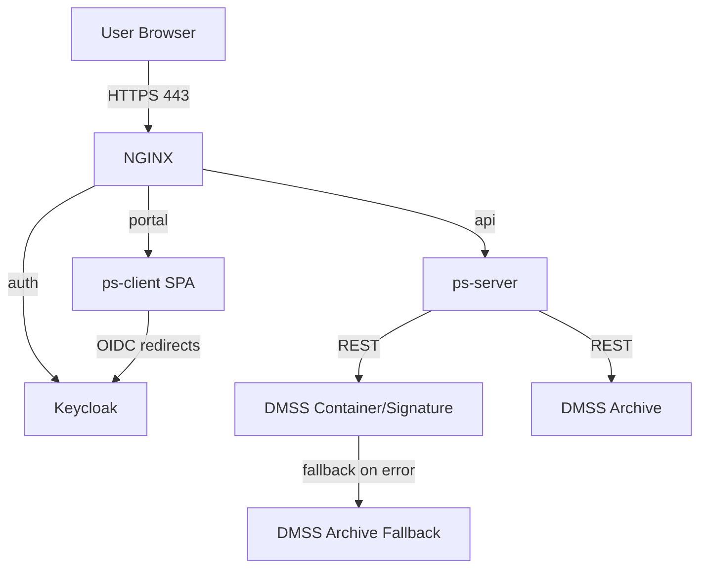
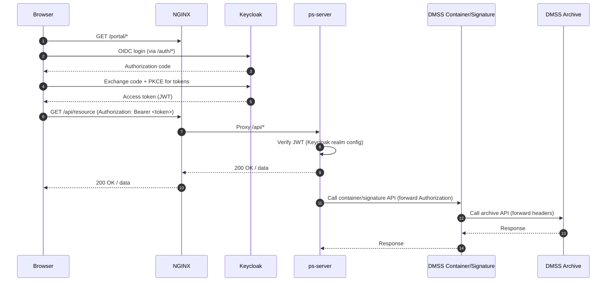

# PS App Cloud Deployment - Deployment Guide

This repository contains a complete, containerized deployment of the PS App platform behind an HTTPS reverse proxy with Keycloak-based authentication and a set of DMSS services for document archiving, container creation, and digital signatures.

Use this guide to configure, run, and operate the stack in local, staging, or production environments.

---

## Overview

- Reverse proxy and TLS termination via NGINX.
- Authentication and authorization via Keycloak.
- PS Client (SPA) served via container.
- PS Server (Node.js backend) with configurable endpoints and Keycloak integration.
- DMSS services for archive, container/signature, and a local fallback archive.
- Docker Compose orchestration with a persistent volume for Keycloak data.

---

## Architecture

Services defined in `docker-compose.yml`:

- NGINX: Public entrypoint on ports 80/443; routes to backend services and Keycloak.
- Keycloak: Identity provider; exposed on port 8080 and proxied at `/auth` through NGINX.
- PS Client: SPA served by its own NGINX; proxied by the public NGINX at `/portal`.
- PS Server: Backend API consumed by PS Client; proxied by the public NGINX at `/api`.
- DMSS Container and Signature Services: PDF/container operations, signing flows, Smart-ID/Mobile-ID.
- DMSS Archive Services: Archive API; configured with in-memory DB by default.
- DMSS Archive Services Fallback: Filesystem-based fallback archive; stores files in `./docs`.

High-level routing:

- `https://<host>/portal/...` -> `ps-client`
- `https://<host>/auth/...` -> `keycloak`
- `https://<host>/api/...` -> `ps-server`
- `https://<host>/container/api/...` -> `dmss-container-and-signature-services`
- `https://<host>/archive/api/...` -> `dmss-archive-services` (fallback to `dmss-archive-services-fallback` as configured)

---

## Prerequisites

- Docker Desktop 4.x (Docker Engine 20+; Compose v2).
- A DNS name you control (production) or a local hostname mapping (development).
- TLS certificate and key for your hostname (PEM). Self-signed is acceptable for local testing.
- Open host ports: 80, 443, 8080, 3001, 84, 86, 93.
- Suggested resources: 4 vCPU, 6-8 GB RAM.

Optional (local):

- mkcert (included as `nginx/mkcert.exe` for Windows) to generate a locally trusted certificate.

---

## Domain and TLS Certificates

The NGINX virtual host is configured for `padsign.trustlynx.com` out of the box. Update this to your hostname and provide matching certificates.

1) Replace server_name and cert paths

- Edit `nginx/nginx.conf` and change:
  - `server_name` to your hostname, e.g. `example.yourdomain.com`.
  - `ssl_certificate` and `ssl_certificate_key` to your certificate files in `nginx/certs`.

2) Provide certificates

- Place your certificate and key files in `nginx/certs/`.
- Ensure file names match those referenced in `nginx/nginx.conf`.

Local option (Windows):

- Generate a local cert: `nginx/mkcert.exe example.local` and then point `ssl_certificate` and `ssl_certificate_key` to the generated files.

3) DNS or hosts entry

- Production: Point your domain's A/AAAA record to the host running this stack.
- Local: Add a hosts entry mapping your hostname to `127.0.0.1` (or the Docker host IP) and use a locally trusted cert.

---

## Configuration

Review and adjust these files before running:

- `docker-compose.yml`
  - `KC_HOSTNAME` should match your hostname.
  - Host ports 80/443, 8080, 3001, 84, 86, 93 must be free.
  - Note: `ps-client` defines a bind mount `./client/docker/nginx.conf`. If you don't intend to override the client image's NGINX, remove this mount or create the file.

- `nginx/nginx.conf`
  - Update `server_name` and TLS files.
  - Proxy targets are pre-wired to internal services; `/archive/api` and `/container/api` routes target host ports `86` and `84` via `host.docker.internal` (intentional for Windows/macOS). Keep the published host ports in `docker-compose.yml` aligned with these.

- `config/config.js` (PS Server)
  - Update all hardcoded URLs from `https://padsign.trustlynx.com/...` to your hostname.
  - Set `KEYCLOAK_CONFIG` for your realm and backend client secret.
  - Adjust CORS: `ALLOWED_ORIGINS` should include your portal origin(s).
  - Set directories: `DOCUMENT_OUTPUT_DIRECTORY`, `READONLY_PDF_DIRECTORY` to writable paths where required by your runtime.

- `config/constants.json` (PS Client)
  - Change `KEYCLOAK_URL`, `KEYCLOAK_REALM`, `KEYCLOAK_CLIENT_ID`, and redirect URIs to match your hostname and Keycloak setup.
  - Update `PS_DOWNLOAD_API` and any other absolute URLs.
  - Optional: Branding (logo, page title) and UX parameters.

- `dmss-container-and-signature-services/application.yml`
  - `archive-services.baseUrl` and `fallbackUrl` point to internal service names and typically do not need changes.
  - `digidoc4j.configuration.mode`: switch `PROD` or `TEST` as appropriate.
  - Smart-ID/Mobile-ID endpoints: point to demo or production as needed (update Relying Party IDs and Names for production).
  - LVRTC settings (if used): provide correct URIs, keystores, and credentials.
  - Trust stores and certificate files referenced under `/confs` must exist in `dmss-container-and-signature-services/`.

- `dmss-archive-services/application.yml`
  - Default uses in-memory HSQL database. For persistence, configure Postgres (uncomment and set `spring.datasource.*`) and provide the DB instance.

- `dmss-archive-services-fallback/application.yml`
  - File paths point to `/docs` inside the container. The `./docs` folder on the host is bind-mounted; ensure it exists and is writable.

- Keycloak database persistence
  - A named Docker volume `keycloak_data` is created by compose and used for Keycloak; back it up for production.

Secrets and credentials

- Do not commit real client secrets, keystore passwords, or API keys.
- Replace placeholder values before going live and rotate any credentials found in this repo.

---

## Security and Route Protection

- TLS termination: All external traffic enters via NGINX on 443; HTTP 80 redirects to HTTPS.
- Public routes:
  - `/portal/*` serves the SPA. The SPA itself gates features by user auth state.
  - `/auth/*` proxies to Keycloak for login, tokens, and account management.
  - `/api/*` proxies to the backend (ps-server). This route requires a valid Bearer token.
  - `/container/api/*` and `/archive/api/*` proxy to DMSS services. For production, restrict these (IP allowlist, mTLS) or enforce JWT on the services.
- SPA authentication (frontend): Uses Keycloak (public client). Recommended flow is Authorization Code with PKCE. The SPA obtains an access token and attaches it as `Authorization: Bearer <token>` to API calls.
- Backend enforcement (ps-server): Configured as a bearer-only confidential client. It validates incoming JWTs from Keycloak and only serves `/api/*` when a valid token is present. CORS should be restricted to known origins in `config/config.js`.
- Header forwarding (DMSS): `dmss-container-and-signature-services` is configured to forward `Authorization` and other headers to the archive service. Align DMSS auth to your policy.
- Enabling JWT on DMSS Archive (recommended for prod): In `dmss-archive-services/application.yml` set `authentication.jwt.enabled: true` and configure either `useCert: true` with a public key/cert or a shared `secret`, and set `validation: true`.
- NGINX hardening: If DMSS endpoints should not be directly reachable from the internet, remove or restrict the `/container/api` and `/archive/api` locations, or protect them with allowlists or client certificates.
- Keycloak admin: Limit admin console access (IP allowlist/VPN) and change the default admin password immediately.

## Data Flow



Legend: portal = /portal/*, auth = /auth/*, api = /api/*



---

## Running the Stack

1) Prepare folders

- Ensure `./nginx/certs` contains your TLS cert and key.
- Ensure `./docs` exists (used by fallback archive service).

2) Start services

```sh
docker compose up -d
```

3) Verify

- Portal: `https://<host>/portal/`
- API: `https://<host>/api/health` (if exposed by ps-server) or check container logs
- Keycloak: `https://<host>/auth/`
- DMSS health (Spring Boot): `/actuator/health` on the service base paths if enabled

4) Logs

```sh
docker compose ps
docker compose logs -f nginx
# or a specific service, e.g.
docker compose logs -f ps-server
```

5) Stop / remove

```sh
docker compose down
# Add -v to remove named volumes if required
```

---

## Local Development Tips

- Hosts entry: map your chosen hostname to 127.0.0.1.
- Certificates: use mkcert to create a locally trusted cert and point `nginx/nginx.conf` to it.
- `host.docker.internal`: The public NGINX forwards to 84 and 86 on the host for container/signature and archive services; these are published by compose. This is intentional for Windows/macOS; Linux users may prefer service-name routing (requires editing `nginx/nginx.conf`).
- Client NGINX override: If `./client/docker/nginx.conf` does not exist locally, remove that bind mount from `docker-compose.yml` or create the file to avoid a bind error.

---

## Production Hardening

- Replace all sample secrets and keystore passwords.
- Use managed TLS (for example, certbot/ACME or cloud load balancer) and rotate certificates.
- Enable persistent databases for DMSS Archive Services and other stateful components.
- Configure Keycloak for production (HTTPS, hostname, external DB if needed).
- Tighten CORS in `config/config.js` and `config/constants.json` to explicit origins.
- Limit management/actuator exposure to internal networks.
- Consider placing the public NGINX behind a cloud or hardware load balancer.

---

## Troubleshooting

- Port conflicts: Ensure host ports 80/443/8080/3001/84/86/93 are free before starting.
- TLS/hostname mismatch: Align `server_name`, certificate CN/SANs, and all application URLs with your actual hostname.
- Keycloak login issues: Check SPA client redirect URIs and Web Origins. Verify `KEYCLOAK_CONFIG` in `config/config.js` (backend client secret and realm).
- Bind mount errors for ps-client: If Docker reports a missing `./client/docker/nginx.conf`, either create the file or remove the bind from `docker-compose.yml`.
- Self-signed certificate warnings: Trust the local root (mkcert) or install a valid certificate.
- DMSS service connectivity: Review `dmss-container-and-signature-services/application.yml` for endpoints and modes (TEST vs PROD). Check that truststores and referenced files exist under `dmss-container-and-signature-services/`.

---

## File Map and References

- Compose: `docker-compose.yml`
- Public NGINX: `nginx/nginx.conf`, `nginx/certs/`
- PS Server config: `config/config.js`
- PS Client config: `config/constants.json`
- DMSS Container and Signature Service config: `dmss-container-and-signature-services/application.yml`
- DMSS Container and Signature ancillary files: `dmss-container-and-signature-services/*.p12`, `dmss-container-and-signature-services/*.yaml`, `dmss-container-and-signature-services/documentsigningprofiles.json`
- DMSS Archive Services config: `dmss-archive-services/application.yml`, `dmss-archive-services/mappings.json`
- DMSS Archive Fallback config: `dmss-archive-services-fallback/application.yml`, host data dir `./docs`

---

## Notes on Security

- Treat any secrets present in this repository as placeholders only; rotate them prior to deployment.
- Restrict admin endpoints and Keycloak admin console to trusted networks.
- Regularly back up the `keycloak_data` volume and any persistent stores you configure.

