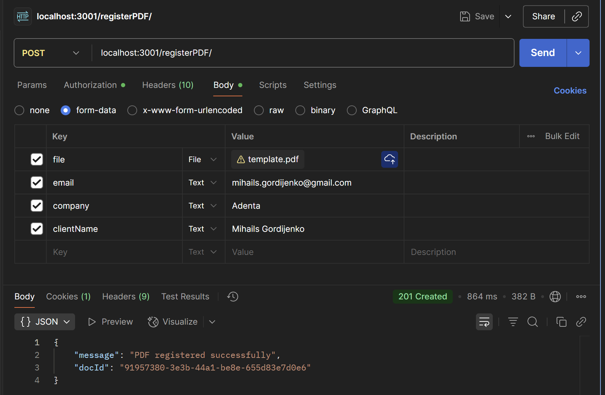
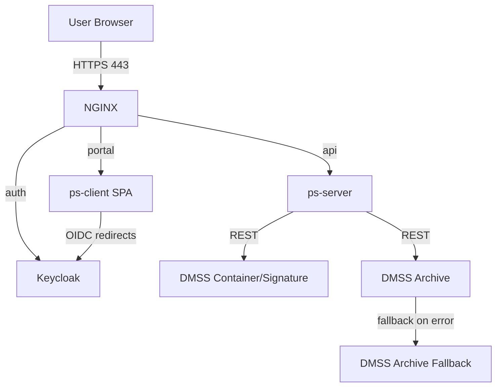
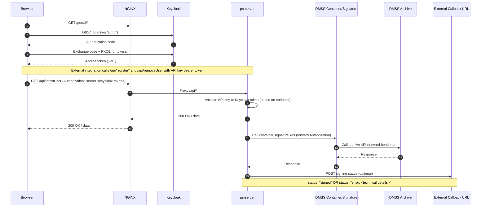
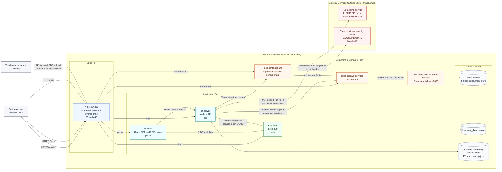
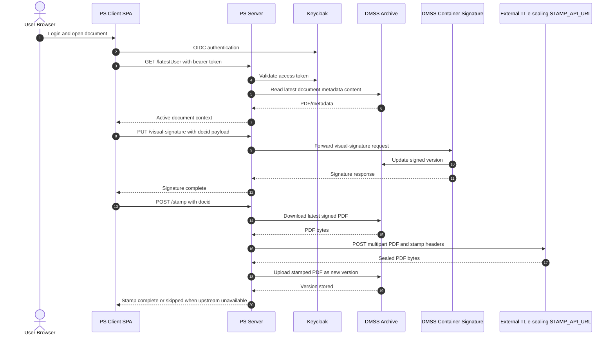
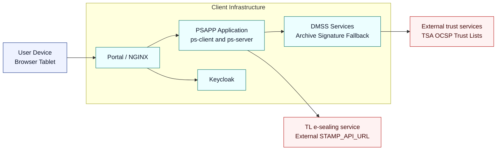

# PadSign 2.0 Application

## Table of Contents

1. [Release Snapshot](#release-snapshot)
2. [Overview](#overview)
3. [Quick Start (New Deployment)](#quick-start-new-deployment)
   - [What bootstrap does (step by step)](#what-bootstrap-does-step-by-step)
   - [Bootstrap parameters](#bootstrap-parameters)
4. [Enabling local e-sealing](#enabling-local-e-sealing)
   - [Concepts and glossary](#concepts-and-glossary)
   - [Architecture deep-dive](#architecture-deep-dive)
   - [Initial deployment (fresh install)](#initial-deployment-fresh-install)
   - [Existing deployment (upgrade an already-deployed instance)](#existing-deployment-upgrade-an-already-deployed-instance)
   - [Switching modes after install](#switching-modes-after-install)
   - [Production hardening checklist (local e-sealing specific)](#production-hardening-checklist-local-e-sealing-specific)
   - [Production setup: deploying with your own key and certificate](#production-setup-deploying-with-your-own-key-and-certificate)
   - [Adding a new signing profile end-to-end](#adding-a-new-signing-profile-end-to-end)
   - [Wiring TSA and OCSP for LT and LTA signature profiles](#wiring-tsa-and-ocsp-for-lt-and-lta-signature-profiles)
   - [Verifying it works](#verifying-it-works)
   - [Verifying signatures end-to-end (beyond the stack)](#verifying-signatures-end-to-end-beyond-the-stack)
   - [Reverting](#reverting)
   - [Debugging local e-sealing](#debugging-local-e-sealing)
   - [Operations cookbook](#operations-cookbook)
   - [Quick reference](#quick-reference)
5. [Upgrading an Existing Deployment](#upgrading-an-existing-deployment)
   - [What upgrade does (step by step)](#what-upgrade-does-step-by-step)
6. [Validating Configuration](#validating-configuration)
   - [What validate-config checks](#what-validate-config-checks)
7. [Architecture](#architecture)
8. [Application Overview](#application-overview)
   - [How this solution works](#how-this-solution-works)
9. [Prerequisites](#prerequisites)
10. [Prerequisites (Quick Checklist)](#prerequisites-quick-checklist)
11. [Domain and TLS Certificates](#domain-and-tls-certificates)
    - [TLS Prerequisites (For Installation Scripts)](#tls-prerequisites-for-installation-scripts)
12. [Running the Stack](#running-the-stack)
13. [Configuration](#configuration)
14. [Keycloak Setup](#keycloak-setup)
    - [1. Start Keycloak Container](#1-start-keycloak-container)
    - [2. Automated Setup (Recommended)](#2-automated-setup-recommended)
    - [3. Access Keycloak Admin Panel (Manual / Verification)](#3-access-keycloak-admin-panel-manual-verification)
    - [4. Create Realm (Manual)](#4-create-realm-manual)
    - [5. Create Client for Frontend (Manual)](#5-create-client-for-frontend-manual)
    - [6. Create Client for Backend (Manual)](#6-create-client-for-backend-manual)
15. [Client Configuration](#client-configuration)
    - [1. Update Constants File](#1-update-constants-file)
    - [2. Environment Variables (Optional)](#2-environment-variables-optional)
16. [Server Configuration](#server-configuration)
    - [1. Update Server Config](#1-update-server-config)
    - [2. Replace Client Secret](#2-replace-client-secret)
17. [Environment Variables](#environment-variables)
    - [Keycloak Container Environment Variables](#keycloak-container-environment-variables)
    - [Client Environment Variables](#client-environment-variables)
18. [Configuration Constants Reference](#configuration-constants-reference)
    - [Cloud Essentials (TL;DR)](#cloud-essentials-tldr)
    - [How configuration is loaded](#how-configuration-is-loaded)
    - [Client: config/constants.json](#client-configconstantsjson)
    - [Server: config/config.js](#server-configconfigjs)
    - [Cloud Flow: /api/registerPDF](#cloud-flow-apiregisterpdf)
    - [Changing values safely](#changing-values-safely)
    - [Quick verification](#quick-verification)
    - [Notes](#notes)
    - [Debug Steps](#debug-steps)
19. [Testing the Integration](#testing-the-integration)
    - [1. Build and Deploy](#1-build-and-deploy)
    - [2. Test Authentication Flow](#2-test-authentication-flow)
    - [3. Verify Configuration](#3-verify-configuration)
20. [Troubleshooting](#troubleshooting)
    - [Common Issues](#common-issues)
21. [Troubleshooting (Integration and Auth)](#troubleshooting-integration-and-auth)
22. [Security and Route Protection](#security-and-route-protection)
23. [Data Flow](#data-flow)
24. [Production Deployment](#production-deployment)
    - [Deployment Checklist (Recommended)](#deployment-checklist-recommended)
    - [1. Environment Variables](#1-environment-variables)
    - [2. SSL Certificates](#2-ssl-certificates)
    - [3. Database Persistence](#3-database-persistence)
25. [Production Hardening](#production-hardening)
26. [Local Development Tips](#local-development-tips)
27. [Security Considerations](#security-considerations)
28. [File Map and References](#file-map-and-references)
29. [Notes on Security](#notes-on-security)
30. [FAQ](#faq)
    - [1) Handling many concurrent documents](#1-how-does-the-solution-handle-a-large-number-of-documents-sent-at-the-same-time-or-almost-at-the-same-time)
    - [2) Error handling when ps-server is unavailable](#2-how-are-errors-handled-if-ps-server-is-not-available-when-registerpdf-is-called)
    - [3) Repeated or parallel document processing](#3-how-are-repeated-or-parallel-document-processing-scenarios-handled-same-document-in-multiple-sessions-repeated-signing-attempts)
    - [4) Tablet software and capabilities](#4-what-software-is-used-on-tablets-and-what-is-available-there)
    - [5) Integration flow from 3rd-party systems](#5-what-is-the-integration-flow-from-a-3rd-party-system-and-what-response-is-returned-after-signing)
    - [6) Signed document format and signature appearance](#6-what-is-the-final-signed-document-format-and-how-does-signaturestamp-appear)
31. [Support](#support)
32. [Additional Resources](#additional-resources)
33. [PSAPP Solution Architecture](#psapp-solution-architecture)
34. [Appendix](#appendix)
    - [1) Deployment and integration architecture](#1-deployment-and-integration-architecture)
    - [2) Signing and stamping execution flow](#2-signing-and-stamping-execution-flow)
    - [3) Very high-level component view](#3-very-high-level-component-view)
35. [Change history](#change-history)

## Release Snapshot

- `ps-server`: `mihailsgordijenko/ps-server:3.25`
- `ps-client`: `mihailsgordijenko/ps-client:8.36`
- Keycloak: `quay.io/keycloak/keycloak:26.3.2`
- DMSS Archive: `trustlynx/dmss-archive-services:24.2.0.8`
- DMSS Container/Signature: `trustlynx/container-signature-service:24.3.0.49`
- DMSS Archive fallback: `trustlynx/dmss-archive-services-fallback:24.0.5`

## Overview

- Reverse proxy and TLS termination via NGINX.
- Authentication and authorization via Keycloak.
- PS Client (SPA) served via container.
- PS Server (Node.js backend) with configurable endpoints and Keycloak integration.
- DMSS services for archive, container/signature, and a local fallback archive.
- Docker Compose orchestration with a persistent volume for Keycloak data.

---

## Quick Start (New Deployment)

One command to deploy PadSign on a new server:

```bash
./installation-scripts/bootstrap.sh \
  --host padsign.client.com \
  --company-role "ClientName" \
  --admin-pass "StrongKeycloakAdminPass" \
  --cert-crt ./installation-scripts/certs/padsign.client.com.crt \
  --cert-key ./installation-scripts/certs/padsign.client.com.key
```

### What bootstrap does (step by step)

1. **Validates inputs** - checks required parameters (host, company-role, admin-pass) and verifies dependencies (docker, docker compose, python3, perl, curl)
2. **Backs up config files** - creates `.bak` copies of `config/config.js`, `config/constants.json`, `nginx/nginx.conf`, and `docker-compose.yml` for safe rollback
3. **Rewrites config for hostname** (`configure-host.sh`):
   - `nginx/nginx.conf`: sets `server_name`, TLS cert paths, and root→`/portal/` redirect
   - `config/constants.json`: sets Keycloak URL, redirect URIs, download API URL
   - `config/config.js`: sets all service URLs, `ALLOWED_ORIGINS`, Keycloak `auth-server-url`, `DEMO_COMPANY_ROLE`
   - `docker-compose.yml`: ensures `signed-output` volume mount exists on ps-server
   - Copies TLS certificates to `nginx/certs/` (if provided)
   - Injects `DOCUMENT_ROUTING` config block if missing (disabled by default)
   - Validates JSON syntax of `constants.json` after editing
4. **Creates `signed-output/` directory** - writable directory for filesystem document routing
5. **Bootstraps Keycloak** (`keycloak-bootstrap.sh`):
   - Starts Keycloak container and waits for health endpoint
   - Creates realm (`padsign`) if not exists
   - Creates roles: `padsign-admin`, `psapp-integration`, and the company role
   - Creates frontend client (`padsign-client`) - public, OIDC, with correct redirect URIs
   - Creates backend client (`padsign-backend`) - confidential, bearer-only, service accounts enabled
   - Creates test user with the company role assigned and a random password
   - Optionally creates additional users from `--users` parameter
6. **Writes backend client secret** - captures the auto-generated Keycloak client secret and writes it into `config/config.js`
7. **Pulls Docker images** - `docker compose pull` for all services
8. **Starts all services** - `docker compose up -d`
9. **Verifies deployment**:
   - Checks ps-server logs for successful startup
   - Tests root redirect (expects 301 → `/portal/`)
   - Lists all running containers with image versions
10. **Prints summary** - portal URL, Keycloak admin URL, API URL, test user credentials

### Bootstrap parameters

| Parameter | Required | Description |
|---|---|---|
| `--host` | Yes | Hostname for the deployment (e.g., `padsign.client.com`) |
| `--company-role` | Yes | Company name / Keycloak realm role (e.g., `"Acme"`) |
| `--admin-pass` | Yes | Keycloak admin password (must be strong for production) |
| `--cert-crt` / `--cert-key` | No | TLS certificate files (or place in `installation-scripts/certs/`) |
| `--realm` | No | Keycloak realm name (default: `padsign`) |
| `--admin-user` | No | Keycloak admin username (default: `admin`) |
| `--users` | No | Additional users: `"user1:pass1:role,user2:pass2:role"` |
| `--enable-routing` | No | Enable filesystem document routing after signing |
| `--enable-demo` | No | Enable DEMO mode in client |
| `--enable-local-eseal` | No | Provision local e-sealing (stamping container + demo PKCS12) and set `STAMP_MODE=local`. External e-sealing remains the default when this flag is omitted. See [Enabling local e-sealing](#enabling-local-e-sealing). |

## Enabling local e-sealing

PadSign ships with **two e-sealing paths** that you can pick between at deploy
time without touching source code:

- **External (default)** - `ps-server` calls a cloud e-sealing service
  configured via `STAMP_API_URL` / `STAMP_API_KEY` / `STAMP_COMPANY_ID` /
  `STAMP_COMPANY_SECRET` in `config/config.js`.
- **Local** - `ps-server` calls an in-stack `dmss-container-and-signature-services`
  endpoint, which delegates to a new `dmss-digital-stamping-service` container.
  The signing key lives inside that container
  (`dmss-digital-stamping-service/seal/seal.p12`). Nothing leaves the host.

**Decision rules:** the toggle lives in `config/config.js`
(`STAMP_MODE: "external" | "local"`), and a docker compose profile
(`local-eseal`) controls whether the stamping container is actually started.
`.env` links the two.

### Concepts and glossary

Local e-sealing is a way to put a cryptographic signature (a "seal") onto a
PDF before it leaves the server. Instead of sending the document out to a
cloud signing service, the signing happens inside a Docker container you
control, using a private key and certificate that live on your host. The
result is the same kind of signed PDF that Adobe Reader and other PDF
readers can verify.

If you have never worked with PDF signatures or digital-signature
infrastructure before, these terms appear repeatedly in the rest of this
guide:

| Term | Meaning |
|---|---|
| **Certificate (cert)** | A file (usually `.crt`, `.cer`, or `.pem`) issued by a Certificate Authority (CA). Contains the public key plus identity info (company name, country, validity dates). |
| **Private key** | The matching secret half of the certificate's key pair. Usually a `.key` file (PEM-encoded), sometimes password-protected. Must never leave the signing host. |
| **PKCS12** (`.p12` / `.pfx`) | A single file format that bundles a private key + certificate (+ optional intermediate-CA chain) together, protected by one password. The stamping service consumes its key+cert in this format. |
| **Alias** | A name pointing at one specific key+cert entry inside a PKCS12/JKS keystore. The stamping service uses the alias `seal` by default - your keystore must have an entry with that name (or you edit the config to point at a different alias). |
| **PEM** | A text-encoded format for keys and certs (`-----BEGIN CERTIFICATE-----` ... `-----END CERTIFICATE-----`). Convertible to PKCS12 with `openssl`. |
| **CA (Certificate Authority)** | The organisation that issues your certificate. Public CAs (Sectigo, DigiCert, eParaksts, SK ID Solutions, etc.) chain to a globally trusted root; private/internal CAs do not. |
| **Trust chain** | The sequence of certificates from your signing cert up through intermediate CAs to a trusted root. Any verifier needs the full chain to validate a signature. |
| **signatureProfile** | The "level" of signature digidoc4j produces. The relevant ones for PDF signing are `B_BES` (basic, self-contained), `LT` (long-term, includes a timestamp), and `LTA` (long-term + archival). |
| **PAdES** | "PDF Advanced Electronic Signatures" - the ETSI standard family for PDF signatures. `PAdES_BASELINE_B`, `PAdES_BASELINE_T`, `PAdES_BASELINE_LT`, `PAdES_BASELINE_LTA` are progressive levels of preservation. The default in `application.yml` is `PAdES_BASELINE_LT`. |
| **ASiC-E** | "Associated Signature Container - Extended" - a zip-based container format that holds one or more files plus their detached signatures. Used for sealing non-PDF artefacts; not the default for the local-eseal flow. |
| **TSA / TSP** | "TimeStamp Authority" / "TimeStamp Protocol". A network service that signs `(hash, current-time)` and returns a timestamp token. Required for `LT` / `LTA` signature levels. |
| **OCSP** | "Online Certificate Status Protocol". A network service the verifier queries to check whether a certificate has been revoked. Required for `LT` / `LTA`. |
| **TSL** | "Trust Service List". An XML document, maintained by each EU member state, listing the qualified Trust Service Providers (CAs, TSAs) accepted as eIDAS-qualified. digidoc4j consults TSLs in PROD mode to decide which issuers it will validate against. |
| **eIDAS** | EU Regulation 910/2014. Defines what counts as a *qualified* electronic signature / seal - broadly, a signature whose cert was issued by a qualified CA and whose long-term integrity is provable. Only `LT`/`LTA` signatures with a qualified CA + qualified TSA satisfy eIDAS. |
| **digidoc4j** | The Java library container-signature uses to actually produce the signature. Configured via `dmss-container-and-signature-services/digidoc4j-custom.yaml` and the `digidoc4j:` section of `application.yml`. |
| **Container-signature** | Short name we use in this guide for the `dmss-container-and-signature-services` container. It is the service that orchestrates document sealing. |
| **Stamping service** | Short name for `dmss-digital-stamping-service`. It holds the keystore and answers two endpoints: `GET /api/signing/certificate/for/<company>` and `POST /api/sign/digest/as/<company>`. |
| **Profile** | An entry in `documentsigningprofiles.json` that bundles a name (used in the URL), an `esealCompany` (which must match a company in the stamping service's config), and visual + signature settings. |
| **Company** | An entry in the stamping service's `application.yml` (under `stamping.companies`) that pairs a name with one or more `providers` (each with its own keystore). |

#### Picking a signature level

| Profile | Self-contained? | Needs TSA? | Needs OCSP? | Legal status (EU eIDAS) |
|---|---|---|---|---|
| `B_BES` (`PAdES_BASELINE_B`) | yes | no | no | Basic electronic signature. Cryptographically valid; not qualified. Suitable for internal workflows, demos, non-regulated business. |
| `LT` (`PAdES_BASELINE_LT`) | yes after TSA | **yes** | **yes** | Advanced electronic signature with long-term validation data embedded. Qualifies for eIDAS *advanced* level; with a qualified CA + qualified TSA, qualifies as a qualified e-seal. |
| `LTA` (`PAdES_BASELINE_LTA`) | yes, with archival timestamps | **yes** | **yes** | Like LT, plus archival timestamps so the signature stays verifiable as algorithms age. Best for long-retention archives. |

**Default in `dmss-container-and-signature-services/application.yml`:**
`pdf.defaultSignatureLevel: PAdES_BASELINE_LT`. The shipped `LocalDemo`
profile overrides this to `B_BES` so the demo certificate works without a
TSA - see [Production setup: deploying with your own key and certificate](#production-setup-deploying-with-your-own-key-and-certificate)
for how to choose for your real cert.

### Architecture deep-dive

In **external mode** the stamping container is not running. The request flow
is short:

```
SPA (browser) ──HTTPS──▶ nginx:443 ──▶ ps-server:3001 /api/stamp
                                              │ POST multipart {file, visualization=false}
                                              │ X-API-KEY / X-COMPANY-ID / X-COMPANY-SECRET
                                              ▼
                                       eseal.trustlynx.com (cloud)
                                              │ returns sealed PDF
                                              ▼
                                       ps-server → dmss-archive-services (new version)
                                              │
                                              ▼
                                       optional DOCUMENT_ROUTING (filesystem / webhook)
```

In **local mode** the cloud hop is replaced by two in-stack containers:

```
SPA (browser) ──HTTPS──▶ nginx:443 ──▶ ps-server:3001 /api/stamp
                                              │ POST multipart {file}
                                              │ Authorization: Basic <user:pass>
                                              ▼
            dmss-container-and-signature-services:8092 /api/eseal/document/profile/<P>
                                              │ docker DNS
                                              ▼
                          dmss-digital-stamping-service:8084
                          /api/signing/certificate/for/<C>   → returns cert hex
                          /api/sign/digest/as/<C>            → returns signature hex
                                              │
                                              ▼
                                /seal/seal.p12  (bind-mounted from
                                                 dmss-digital-stamping-service/seal/)
                                              │
                                              ▼
                  container-signature embeds the signature into the PDF and
                  returns the sealed PDF to ps-server → archive → routing
                  (same downstream pipeline as external mode)
```

Where `<P>` is the profile name in
`dmss-container-and-signature-services/documentsigningprofiles.json` and `<C>`
is the `esealCompany` from that profile, which must equal a company name in
`dmss-digital-stamping-service/application.yml`. The shipped pairing is
`<P>=LocalDemo`, `<C>=TrustLynx`.

#### How a request resolves end-to-end

When ps-server in local mode posts to
`http://dmss-container-and-signature-services:8092/api/eseal/document/profile/LocalDemo`:

1. **container-signature** looks up `LocalDemo` in `documentsigningprofiles.json`.
   It finds:
   ```json
   { "name": "LocalDemo", "esealCompany": "TrustLynx",
     "pdfSigningSigner": { "signatureProfile": "B_BES" } }
   ```
2. container-signature reads `digital-stamping-service.baseUrl` from its
   `application.yml` (set by `--enable-local-eseal` to
   `http://dmss-digital-stamping-service:8084/api`).
3. container-signature calls
   `GET .../api/signing/certificate/for/TrustLynx` on the stamping service.
4. **stamping service** looks up `TrustLynx` in its `application.yml`
   `stamping.companies` list. It finds:
   ```yaml
   - name: "TrustLynx"
     providers:
       - name: P12
         engine: P12
         keystore: file:/seal/seal.p12
         password: changeit
         alias: seal
   ```
5. stamping opens `/seal/seal.p12` (bind-mounted from
   `dmss-digital-stamping-service/seal/seal.p12`), finds the entry under
   alias `seal`, returns the certificate as hex.
6. container-signature computes the SHA-256 digest of the PDF + signature
   placeholder, then calls
   `POST .../api/sign/digest/as/TrustLynx` with the digest bytes.
7. stamping signs the digest with the private key from the same keystore
   entry, returns the signature as hex.
8. container-signature splices the signature into the PDF's
   `/Type /Sig` dictionary and returns the signed PDF to ps-server.

If any link in this chain has a typo - profile name not in JSON,
`esealCompany` not in stamping's `application.yml`, alias not in the
keystore, keystore password mismatch - the request returns 5xx and
ps-server's graceful-skip path returns `200 { stampStatus: "skipped" }`
so the SPA flow continues without a seal. See
[Debugging local e-sealing](#debugging-local-e-sealing) for diagnostics.

### Initial deployment (fresh install)

Pass `--enable-local-eseal` to `bootstrap.sh` and the stack comes up with
local e-sealing ready to use:

```bash
./installation-scripts/bootstrap.sh \
    --host padsign.client.com \
    --company-role "ClientName" \
    --admin-pass "StrongKeycloakAdminPass" \
    --cert-crt ./installation-scripts/certs/padsign.client.com.crt \
    --cert-key ./installation-scripts/certs/padsign.client.com.key \
    --enable-local-eseal
```

What happens additionally when the flag is set:

- `dmss-digital-stamping-service/` is staged with the demo `application.yml`,
  `seal/seal.p12`, and a `seal/README.md` explaining the demo cert.
- The new service block (gated by `profiles: ["local-eseal"]`) is appended
  to `docker-compose.yml` if not already present.
- `dmss-container-and-signature-services/application.yml` is patched so its
  `digital-stamping-service.baseUrl` resolves to the in-network container.
- `SPRING_SECURITY_USER_NAME=user` / `SPRING_SECURITY_USER_PASSWORD=changeit`
  are pinned on container-signature so basic auth from ps-server is stable.
- `STAMP_MODE: "local"` and a `STAMP_LOCAL` block are inserted into
  `config/config.js` (or `STAMP_MODE` is flipped if it already existed).
- `COMPOSE_PROFILES=local-eseal` is appended to `.env` so every subsequent
  `docker compose up -d` includes the new service automatically.

### Existing deployment (upgrade an already-deployed instance)

This is the section to follow if your PadSign deployment is currently
running on a repo version from **before** this feature was added (any
version where `installation-scripts/upgrade.sh` does **not** have the
`--enable-local-eseal` flag, and `config/config.js` does **not** have
`STAMP_MODE` / `STAMP_LOCAL` fields). It walks you through, in order:

- enabling local e-sealing with the **demo cert** that ships in the repo,
- verifying the demo signing works end to end,
- replacing the demo cert with your **own production key + certificate**
  and verifying that too,
- the rollback recipes if anything goes wrong.

Total time: ~10 minutes to reach the demo signing milestone; the
production-cert portion depends on how long your CA takes to issue a
certificate (could be minutes if you already have one, days/weeks if you
need to request a new one from a public CA).

The flow is non-destructive: external mode keeps working until you
explicitly switch `STAMP_MODE` to `"local"`. Every step is reversible
either via the `*.bak` files the script creates or with a small config
edit.

#### Phase 0 - Before you start (10 minutes)

Confirm the prerequisites and capture a known-good baseline you can roll
back to.

1. **External e-sealing is currently working.** Confirm it:
   - Open `https://<your-deployment-host>/portal/` in a browser, log in
     with a test user, upload any small PDF, and complete the signing
     flow. The SPA shows a "Download signed PDF" link when it's done.
     (If you don't have a working test user, the bootstrap section above
     describes the demo user created by `bootstrap.sh`.)
   - In a separate terminal, watch `docker compose logs --tail 50 ps-server`
     during signing. You should see `[DEBUG] Stamp response status: 200`
     (or, if `RUN_STAMPING_REQUEST: false` in `constants.json`, no
     `[stamp]` log line at all, just the visual-signature flow).
   - If signing is already broken, fix that first. Debugging
     "local-eseal upgrade broke signing" is much harder when external
     mode is also failing.
2. **You have shell access** to the deployment host and can edit files
   in the deployment directory. The deployment lives wherever you ran
   `bootstrap.sh` originally (commonly `/opt/psapp` on Linux hosts).
3. **You have `docker compose` v2, `openssl`, and `keytool`** (from the
   JDK) on the host. These are the same prerequisites `bootstrap.sh`
   already requires; if your deployment is running, you have them.
4. **You have internet access from the host** to pull the new
   `trustlynx/digital-stamping-service` image from Docker Hub
   (~830 MB, one-time download - typically 1-2 minutes on a 100 Mbit
   link). If your host is air-gapped, see
   [Operations cookbook → Pulling the stamping image on an air-gapped host](#operations-cookbook)
   for the offline transfer recipe.
5. **Capture the current image tags** of the running containers, so you
   know what to roll back to:
   ```bash
   docker ps --format '{{.Names}}: {{.Image}}' | sort > /tmp/predeploy-images.txt
   cat /tmp/predeploy-images.txt
   ```
6. **Note the current `STAMP_MODE`** (it should be missing, since
   pre-feature deployments don't have this field - meaning external mode):
   ```bash
   cd /opt/psapp     # or wherever your deployment is
   grep -n STAMP_MODE config/config.js || echo "STAMP_MODE not set yet (external mode is implicit)"
   ```
   If the command *does* show a match (e.g. `STAMP_MODE: "external"` or
   `STAMP_MODE: "local"`), you've already enabled local e-sealing at
   some point - this isn't a true "pre-feature" deployment. The
   upgrade is still safe to re-run (idempotent), but you may want to
   skip ahead to [Switching modes after install](#switching-modes-after-install)
   if all you want is to flip the active mode.
7. **Snapshot the deployment directory** (belt-and-braces - `upgrade.sh`
   takes its own `.bak` files but a directory-level snapshot is useful
   if something else goes wrong). Put it somewhere durable (NOT
   `/tmp`, which is typically wiped on reboot):
   ```bash
   # Choose a backup location that survives a reboot. Common picks:
   #   /var/backups/                          (Debian/Ubuntu convention)
   #   /opt/psapp-backups/                    (a sibling of the deployment)
   #   /mnt/backup/                           (a mounted backup volume)
   BACKUP_DIR=/var/backups
   sudo mkdir -p "$BACKUP_DIR"
   sudo tar czf "$BACKUP_DIR/psapp-before-local-eseal-$(date +%Y%m%d-%H%M).tar.gz" \
       --exclude='./signed-output' --exclude='./docs' .
   sudo chmod 600 "$BACKUP_DIR"/psapp-before-local-eseal-*.tar.gz
   ls -la "$BACKUP_DIR"/psapp-before-local-eseal-*.tar.gz
   ```
   The `.tar.gz` contains `config/config.js` with secrets in it, so
   keep the file mode tight (`chmod 600`). To restore from this
   snapshot if everything else has failed:
   `cd /opt/psapp && sudo tar xzf <backup-file>`.
8. **Read or skim** the [Concepts and glossary](#concepts-and-glossary)
   section once. You don't need to memorise the acronyms - but knowing
   that "TSA" means timestamp authority and "PKCS12" means a key+cert
   bundle file will save time when you read error messages later.

#### Phase 1 - Update the deployment scripts and configs (2 minutes)

Pull the new version of this repo into your deployment directory.

```bash
cd /opt/psapp

# 1. Sanity-check your remote - should be the same place you cloned from
#    originally:
git remote -v
# Typical output:
#   origin  git@gitlab.com:.../ps-app-cloud-deployment.git (fetch)
#   origin  git@gitlab.com:.../ps-app-cloud-deployment.git (push)

# 2. Confirm the working tree is clean. If there are local changes, stash
#    or commit them first - `git pull` will refuse to merge over dirty
#    files:
git status

# 3. Pull. Make sure you're on the branch that contains the local-eseal
#    feature; in this repo that branch is `main`:
git checkout main      # safe even if you're already on it
git pull               # fast-forward to the latest upstream commit
```

If you can't pull from a git remote (air-gapped host, no SSH keys, etc.),
the alternative is to download the repo as a `.zip` / `.tar.gz` from
your source code platform on a workstation with internet access, copy
it to the deployment host (scp / USB / internal artefact repo), unpack
it next to the existing deployment, and overwrite the changed files in
place. Don't delete `signed-output/`, `docs/`, your `*.bak` files, or
any customer-specific configs you've added.

After the pull (or unpack), confirm three things landed:

```bash
# 1. The upgrade script gained the new flag (look for "--enable-local-eseal"
#    in the usage text):
./installation-scripts/upgrade.sh --help | grep -i local-eseal

# 2. The pristine asset directory exists (this is where the demo cert
#    gets copied from during the next phase):
ls installation-scripts/assets/dmss-digital-stamping-service/seal/seal.p12

# 3. The DocumentSigningProfiles JSON now has a LocalDemo entry (this
#    is what the demo URL targets):
grep -A2 '"LocalDemo"' dmss-container-and-signature-services/documentsigningprofiles.json
```

If any of those three checks fail, the repo version you pulled does not
contain the local-eseal feature. Stop here and double-check the branch /
tag you fetched.

#### Phase 2 - Enable local e-sealing with the demo cert (3 minutes)

Run the upgrade script with the new flag:

```bash
cd /opt/psapp
./installation-scripts/upgrade.sh --enable-local-eseal
```

The script prints its progress as it runs. What you should see:

```
========================================
PadSign Upgrade
========================================

Step 1/6: Backing up...
  Backups created
Step 2/6: Updating image tags...
Step 3/6: Ensuring DOCUMENT_ROUTING config...
  DOCUMENT_ROUTING already present
Step 4/6: Ensuring signed-output volume...
  Volume mount already present
Step 4b/6: Enabling local e-sealing...
  Demo stamping artifacts staged at ./dmss-digital-stamping-service/
  Compose service block appended (gated by profiles: [local-eseal])
  Patched dmss-container-and-signature-services/application.yml baseUrl
  Pinned Spring Security creds on container-signature
  Inserted STAMP_MODE=local + STAMP_LOCAL in config.js
  Wrote COMPOSE_PROFILES=local-eseal to .env
Step 5/6: Pulling images and restarting...
   ...docker pull / up output...
Step 6/6: Verifying...
   ...health check output...
```

If you're re-running the script on a deployment that already went
through Step 4b at least once, some lines will read "already present"
instead of the verbs above - for example:

```
Step 4b/6: Enabling local e-sealing...
  Stamping artifacts already present (preserved)
  Compose service block already present
  Container-signature baseUrl already patched (or non-default)
  Spring Security creds already pinned
  STAMP_MODE already set to "local" in config.js
  .env already activates local-eseal profile
```

Either output is healthy - `Step 4b` is intentionally idempotent so
re-running the upgrade is always safe.

**What the script did, in plain English:**

1. **Backed up** `docker-compose.yml` and `config/config.js` to
   `.bak` files in place (rollback safety).
2. Did not change any image tags (Step 2) - you didn't pass
   `--server-tag` or `--client-tag` so existing pins on `ps-server` and
   `ps-client` are preserved. Skip this if you only ran `--enable-local-eseal`.
3. Confirmed `DOCUMENT_ROUTING` already in `config.js` (it should be).
4. Confirmed `signed-output` volume mount already in compose.
5. **Step 4b is the new part.** Six sub-steps:
   - Copied `application.yml`, `seal/seal.p12`, and `seal/README.md`
     from `installation-scripts/assets/dmss-digital-stamping-service/`
     into a new `dmss-digital-stamping-service/` directory at the
     repo root. These get bind-mounted into the new stamping container.
   - Appended a new `dmss-digital-stamping-service:` service block to
     `docker-compose.yml`. The block carries `profiles: ["local-eseal"]`
     so it never starts on a plain `docker compose up -d` - it only
     starts when the `local-eseal` profile is active.
   - Edited `dmss-container-and-signature-services/application.yml`:
     changed `digital-stamping-service.baseUrl` from
     `http://host.docker.internal:8084/api` (host-based USB-token
     signer - what some deployments use) to
     `http://dmss-digital-stamping-service:8084/api` (the new in-network
     stamping container).
   - Added `SPRING_SECURITY_USER_NAME=user` and
     `SPRING_SECURITY_USER_PASSWORD=changeit` env vars on the
     `dmss-container-and-signature-services` service, so the HTTP Basic
     auth between ps-server and container-signature has stable known
     credentials (the default is a random UUID password that changes
     every restart, which is impossible to script against).
   - Added two fields to `config/config.js`: `STAMP_MODE: "local"` and
     a `STAMP_LOCAL: { url, username, password, timeoutMs }` block.
     These tell ps-server's `/api/stamp` handler to route through the
     local stamping stack instead of the cloud e-sealing service.
   - Wrote `COMPOSE_PROFILES=local-eseal` to `.env` so all subsequent
     `docker compose up -d` invocations automatically include the new
     stamping service.
6. **Pulled** the `trustlynx/digital-stamping-service:24.0.3.0` image
   (~830 MB; first pull only). Created and started
   `dmss-digital-stamping-service`. Recreated
   `dmss-container-and-signature-services` and `ps-server` so they
   pick up the patched config and env vars. **No other services
   restart.**

After the script finishes, verify the new container is running:

```bash
docker compose ps
```

You should see `dmss-digital-stamping-service` listed with status `Up`,
in addition to the services that were already running.

If you see `dmss-digital-stamping-service` is `Restarting` or
`Exited`, check its logs: `docker compose logs dmss-digital-stamping-service`.
Common first-run causes are listed in
[Debugging local e-sealing](#debugging-local-e-sealing) → "Symptom: stamping
container won't start / exits immediately".

**When can I declare the stack healthy?** The new container takes ~10
seconds to finish Spring Boot startup. Wait until both of these return
true, then proceed to Phase 3:

```bash
# Stamping container reports Spring Boot ready:
docker compose logs --tail 50 dmss-digital-stamping-service \
    | grep -q 'Started Application' && echo "stamping: ready"

# Container-signature (which was recreated) is also back up:
docker compose logs --tail 50 dmss-container-and-signature-services \
    | grep -q 'Started Application' && echo "container-signature: ready"
```

If you don't see "Started Application" for either after ~60 seconds,
something is wrong - see
[Debugging local e-sealing](#debugging-local-e-sealing).

**Can I run this during business hours?** Yes for the demo flow with a
caveat. The pieces that restart during `upgrade.sh --enable-local-eseal`
are: `dmss-container-and-signature-services` (recreated to pick up new
env vars; ~25 second outage) and `ps-server` (restarted; ~3 second
outage). During those windows any in-flight `/api/visual-signature` or
`/api/stamp` call returns 502/503 to the SPA and the user has to retry.
nginx, Keycloak, archive-services, ps-client stay up the whole time.
For production-cert deployments where signing must not be interrupted,
schedule the window outside business hours.

**What if upgrade.sh fails mid-way?** The script is idempotent; the
quickest path is usually to fix the underlying problem and re-run it.
Common mid-run failures:

| Failure | What happened | Recovery |
|---|---|---|
| Docker pull timed out / failed | `Step 5/6` couldn't fetch the stamping image | Verify network, then re-run `./installation-scripts/upgrade.sh --enable-local-eseal`. The earlier idempotent steps will print "already present" and skip ahead. |
| Host ran out of disk during pull | Look for `no space left on device` | Free space (`docker system prune` is a common first action), then re-run the script. |
| `Conflict. The container name "..." is already in use` | A stale container from a previous attempt is hanging around | `docker rm -f dmss-digital-stamping-service` (or whatever name is in the error), then re-run. |
| You SIGINT'd the script during edits | Partial state in `config.js` / compose | The `*.bak` files are still there. Either re-run (idempotent) or `cp docker-compose.yml.bak docker-compose.yml; cp config/config.js.bak config/config.js` and start over. |

If you need to bail out completely after a failed run and return to
pre-feature state, see [Phase 8.c](#phase-8---rollback-recipes) - the
hard rollback works whether or not the upgrade finished.

#### Phase 3 - Verify the demo signing flow (5 minutes)

Three checks. Run them in order; later checks assume earlier ones passed.

**Check 3.1 - The stamping service serves the demo certificate.** Run
this from the deployment host:

```bash
docker exec dmss-container-and-signature-services curl -fsS \
    http://dmss-digital-stamping-service:8084/api/signing/certificate/for/TrustLynx \
    | python3 -c "import sys,json; sys.stdout.buffer.write(bytes.fromhex(json.load(sys.stdin)['cert']))" \
    | openssl x509 -inform DER -noout -subject -issuer -dates
```

The recipe uses only stdlib `python3` (no extra modules) plus `openssl`,
both already required by `bootstrap.sh`.

Expected output:

```
subject=C=LV, O=Trustlynx, OU=Digital Mind Stamping Service, CN=Trustlynx Local Seal Demo
issuer=C=LV, O=Trustlynx, OU=Digital Mind Stamping Service, CN=Trustlynx Local Seal Demo
notBefore=May 11 13:26:58 2026 GMT
notAfter=Aug 13 13:26:58 2028 GMT
```

If `subject` shows a different CN (or the call fails), see
[Debugging local e-sealing](#debugging-local-e-sealing) → "Symptom: demo
cert works, real cert fails to load" (the diagnostics apply in either
direction).

**Check 3.2 - ps-server can reach the chain end-to-end.** This check
proves the new `STAMP_MODE: "local"` was picked up and ps-server is
routing through container-signature → stamping. Two ways to do it:

*Option A (preferred):* Open `https://<your-deployment-host>/portal/`,
log in as a test user, upload a PDF, and complete the signing flow
exactly as a real user would. The SPA shows a "Download signed PDF"
link when it's done. This is the same recipe you used in Phase 0 step 1
to confirm external mode was working.

*Option B (CLI shortcut, faster but doesn't exercise the SPA):*

```bash
# This calls container-signature's /api/eseal directly with the demo
# profile, skipping the SPA + ps-server. Useful for a quick smoke test
# but does NOT verify the ps-server side of the chain.
curl -sS -u user:changeit -X POST \
    -F "file=@/path/to/any-small.pdf;type=application/pdf" \
    -o /tmp/demo-signed.pdf -w "HTTP=%{http_code} bytes=%{size_download}\n" \
    http://localhost:84/api/eseal/document/profile/LocalDemo
```

Whichever you pick, then in a separate terminal:

```bash
docker compose logs --tail 200 ps-server | grep -E '\[stamp\] mode=|Stamp response status'
```

After Option A you should see something like:

```
[stamp] mode=local url=http://dmss-container-and-signature-services:8092/api/eseal/document/profile/LocalDemo
[DEBUG] Stamp response status: 200
```

(Option B doesn't go through ps-server, so its `[stamp]` line won't
appear - but its HTTP=200 + non-zero bytes is the equivalent proof.)

The key word in the first line is `mode=local`. If it shows `mode=external`,
ps-server is still on the old config - restart it (`docker compose restart
ps-server`) and re-try.

**Check 3.3 - The signed PDF actually has a signature in it.** Download
the latest archived version of the document you just signed in two
possible ways:

*Option A - via the SPA:* the portal page that shows after signing
includes a "Download signed PDF" link. Save the file as `signed.pdf`.

*Option B - directly from dmss-archive-services on the host:*

```bash
# Find the document ID in ps-server logs from your sign operation, e.g.:
#   [stamp] mode=local docid=ARCH-2026-001234
# Then:
curl -fsS "http://localhost:86/api/document/ARCH-2026-001234/download" -o signed.pdf
```

Port 86 is `dmss-archive-services` host-side (see [Ports table](#ports)
in the Quick reference). If your deployment moved that port, check
`docker-compose.yml`. If you used Option B in Phase 3.2's CLI shortcut
(curl-to-container-signature), the result is already at
`/tmp/demo-signed.pdf` - use that path directly.

Then verify the signature dictionary is present:

```bash
grep -aoE '/Type\s*/Sig|/Filter\s*/Adobe\.PPKLite|/ByteRange\s*\[[^]]+\]' signed.pdf
```

Expected output:

```
/Type /Sig
/Filter /Adobe.PPKLite
/ByteRange [0 271790 290736 525]
```

(The exact ByteRange numbers depend on your PDF.) All three lines must
be present. If any is missing, the signature dictionary wasn't embedded
- check `docker compose logs dmss-container-and-signature-services` for
errors.

**Optional: open the signed PDF in Adobe Reader.** Open the file in
Adobe Acrobat Reader DC and look at the Signature Panel (left sidebar).
With the demo cert you will see:

> ⚠ At least one signature has problems.
> Document has not been modified since the signature was applied.
> Signer's identity is unknown because it could not be checked.

That outcome is **expected and correct** for the demo cert - the seal
itself is cryptographically valid, but the demo CA is self-signed and
Adobe doesn't trust it. You will get a green check ("Signed and all
signatures are valid") only after Phase 5 with a real CA-issued cert.

#### Phase 4 - Decide what to do next

At this point your stack signs PDFs locally with the demo cert. Three
paths:

- **Move on to production-cert testing (Phase 5).** This is the path
  most customers want. Continue below.
- **Stay on the demo cert** if you only need an internal-test
  environment where the consumer of the signed PDFs doesn't validate
  the trust chain. Skip to [Phase 7](#phase-7---harden-before-exposing-the-stack)
  to harden the deployment before exposing it.
- **Revert and stay on external e-sealing**. If demo signing failed
  Phase 3 checks or you've decided local e-sealing isn't the right
  approach yet, see [Phase 8](#phase-8---rollback-recipes) for the
  reversal options.

#### Phase 5 - Set up for production test with your real key and certificate (timing varies)

This phase replaces the demo cert with your own production signing
material and verifies signing still works end to end. It is a *test*
phase even when using the real cert - meaning you confirm signatures
verify correctly in a representative environment before going live.

**Time budget:** depends on whether you already have a signing
certificate. If yes, ~30 minutes. If you need to request one from a
public CA, days to weeks (your CA's SLA, plus organisational paperwork).

##### Step 5.1 - Source your signing certificate

Decide what kind of certificate you need:

| Use case | Certificate type | Example providers |
|---|---|---|
| eIDAS-qualified e-seal (legal validity across EU) | Qualified electronic seal cert from a qualified Trust Service Provider (qTSP), issued to a legal-entity identifier (NTRLV / EORI / VAT number) | eParaksts (LV), SK ID Solutions (EE), Certum (PL), DigiCert (multi-country) |
| Code-signing / generic cryptographic seal (no eIDAS claim) | Standard cert from a public CA | Sectigo, DigiCert, GlobalSign, etc. |
| Internal-use only (signing internal docs your own systems verify) | Cert from your internal/private CA | Your org's PKI team |

Make sure the cert you request supports **digital signature** and
optionally **non-repudiation** key usages. Some CAs require you to
specify "qualified seal" or "qualified signature" at issuance time -
the two are different products under eIDAS.

Once your CA fulfils the request you will typically receive:

- A **certificate file** (`.crt` / `.cer` / `.pem`).
- A **private key file** (`.key`, often password-protected).
- Optionally, an **intermediate chain** file (`chain.crt` or similar).

Or you may receive a single **PKCS12 bundle** (`.pfx` / `.p12`) that
already contains all of the above, protected by one password.

##### Step 5.2 - Build a deployment-ready `seal.p12`

Follow [Production setup: deploying with your own key and certificate](#production-setup-deploying-with-your-own-key-and-certificate)
to convert whatever your CA delivered into a PKCS12 keystore that the
stamping service can consume. Pick the recipe that matches your
artefact shape (separate files, existing .pfx, or alias rename).
Verify with `keytool -list -v` before continuing.

##### Step 5.3 - Decide on a signature level

The shipped `LocalDemo` profile uses `B_BES` because the demo cert is
self-signed and no TSA will issue a timestamp for it. With a real
CA-issued cert you usually want a higher level.

Open [Step 4 of Production setup](#production-setup-deploying-with-your-own-key-and-certificate) and use the table there to pick:

- **`B_BES`** if your cert is from an internal CA OR your verifiers
  don't need eIDAS legal validity.
- **`LT`** if your cert is from a publicly trusted CA AND you want
  long-term verifiability (most production use cases).
- **`LTA`** if you also need archival timestamps (long-retention
  scenarios).

If you pick anything other than `B_BES`, complete
[Wiring TSA and OCSP for LT and LTA signature profiles](#wiring-tsa-and-ocsp-for-lt-and-lta-signature-profiles)
before continuing - your signing will fail without a TSA configured.

##### Step 5.4 - Add a production-specific profile (recommended)

Don't modify the shipped `LocalDemo` profile - keep it intact as a known-good
fallback. Add a new profile (e.g. `AcmeProductionSeal`) following
[Adding a new signing profile end-to-end](#adding-a-new-signing-profile-end-to-end).
The 6 steps in that section walk through editing
`documentsigningprofiles.json`, adding a new company in
`dmss-digital-stamping-service/application.yml`, updating
`STAMP_LOCAL.url` in `config.js`, and restarting the right services.

##### Step 5.5 - Rotate the three default credentials

Now is the right time to replace the three `changeit` defaults with
strong unique passwords - see
[Production hardening checklist → 1. Rotate the three demo credentials](#production-hardening-checklist-local-e-sealing-specific).
Skipping this step leaves your container-signature endpoint open to
anyone who knows the deployment convention. Don't skip it.

##### Step 5.6 - Smoke-test the production cert

Use the same three checks as Phase 3, but adapted for the production
profile:

```bash
# 5.6.1 - Cert endpoint serves your real cert. Replace <YourCompany>
#         with the company name you added in Step 5.4.
# Note: the stamping service has no HTTP auth itself; the Spring Security
# credentials you rotated above gate container-signature, not stamping.
docker exec dmss-container-and-signature-services curl -fsS \
    http://dmss-digital-stamping-service:8084/api/signing/certificate/for/<YourCompany> \
    | python3 -c "import sys,json; sys.stdout.buffer.write(bytes.fromhex(json.load(sys.stdin)['cert']))" \
    | openssl x509 -inform DER -noout -subject -issuer -dates
```

Confirm `subject` matches the CN/DN your CA issued and `issuer` matches
the CA's name. Critically, `subject` must **not** still say "Trustlynx
Local Seal Demo" - if it does, the stamping container is still serving
the demo cert (the swap didn't take effect, see Phase 8 for rollback or
re-check Step 5.2 / 5.4).

```bash
# 5.6.2 - End-to-end sign through ps-server. Pick a test PDF.
#         Replace <ProductionProfile> with the profile name from Step 5.4.
curl -sS -u user:<your-new-spring-security-password> -X POST \
    -F "file=@/path/to/test.pdf;type=application/pdf" \
    -o /tmp/prod-test.pdf \
    -w "HTTP=%{http_code} bytes=%{size_download}\n" \
    http://localhost:84/api/eseal/document/profile/<ProductionProfile>

# Verify the output is a signed PDF:
grep -aoE '/Type\s*/Sig|/Filter\s*/Adobe\.PPKLite|/ByteRange' /tmp/prod-test.pdf
```

**Step 5.6.3 - Sign through the actual SPA flow.** This is what real
users will do, so it's the most relevant check. Open the portal:

```
https://<your-deployment-host>/portal/
```

Log in with a test user, upload a small PDF (or open one of the demo
forms), and complete the signing flow as you normally would. Then:

```bash
# Watch ps-server logs as the request comes in:
docker compose logs -f --tail 50 ps-server | grep -E '\[stamp\]|Stamp response'
# Expect:  [stamp] mode=local url=http://dmss-container-and-signature-services:8092/api/eseal/document/profile/<ProductionProfile>
#          [DEBUG] Stamp response status: 200

# Pull the latest archived version of the signed document. Replace
# <docid> with the document ID shown after signing (visible in ps-server
# logs and in the SPA's URL bar after upload):
curl -fsS "http://localhost:86/api/document/<docid>/download" -o /tmp/spa-signed.pdf
grep -aoE '/Type\s*/Sig|/Filter\s*/Adobe\.PPKLite' /tmp/spa-signed.pdf
```

If both grep matches print, the SPA-driven sign path is working with
your production cert. If you get `{ stampStatus: "skipped" }` in
ps-server logs instead of a 200, see
[Debugging local e-sealing](#debugging-local-e-sealing) → "Symptom:
`/api/stamp` returns `200 { stampStatus: "skipped", ... }`".

##### Step 5.7 - Verify the signature externally (the real test)

The smoke tests above prove the *stack* produces a signature. The real
question for a production cert is whether a *verifier* trusts it.

Run the full procedure in
[Verifying signatures end-to-end (beyond the stack)](#verifying-signatures-end-to-end-beyond-the-stack):

- Open the signed PDF in Adobe Acrobat Reader DC and check the
  Signature Panel. With a publicly-trusted CA + a TSA-backed LT
  profile, you should now see **"Signed and all signatures are valid"**
  (green check). If you see "valid but the signer's identity is
  unknown", the verifier's trust store doesn't include your CA -
  see the Adobe trust-store discussion in that section.
- Run `pdfsig <signed.pdf>` and confirm both
  `Signature Validation: Signature is Valid` and
  `Certificate Validation: Certificate is Trusted` (the second one is
  what was missing for the demo cert).
- Optionally, run any downstream verifier your customer / counterparty
  actually uses, against the test-signed PDF. This is the only check
  that proves your real-world consumers will accept your signatures.

If any verification fails, see
[Debugging local e-sealing](#debugging-local-e-sealing) → "Symptom:
signed PDF rejected by downstream / external verifier".

#### Phase 6 - Plan for go-live

You now have a stack that produces real, externally-valid signatures
on demand. Before opening it up to production traffic:

1. **Schedule the cert-expiry alert.** Calendar reminder + monitor
   probe - see
   [Production hardening checklist → 6. Decide a cert rotation cadence](#production-hardening-checklist-local-e-sealing-specific).
2. **Back up the production keystore.** Encrypted backup, password
   stored separately - see
   [Operations cookbook → Back up the keystore](#operations-cookbook).
3. **Test the restore** from your backup once. A backup you have not
   verified is not a backup.

#### Phase 7 - Harden before exposing the stack

Walk through every numbered item in
[Production hardening checklist (local e-sealing specific)](#production-hardening-checklist-local-e-sealing-specific)
before opening the stack to production traffic. The two highest-impact
items if you do nothing else:

- **Restrict the container-signature host port** - bind `84` to
  `127.0.0.1:84:8092` so it's not reachable from the LAN.
- **Confirm the three credentials are rotated** (Step 5.5 above).

#### Phase 8 - Rollback recipes

Three levels of revert, ordered from softest to hardest. Use the
softest one that fits your situation.

##### 8.a - Switch back to external e-sealing without removing the local stack

Useful if you want to keep the local stamping container deployed but
have ps-server temporarily route stamping requests to the cloud
service. Same as
[Switching modes after install](#switching-modes-after-install):

```bash
cd /opt/psapp
sed -i 's/STAMP_MODE: *"local"/STAMP_MODE: "external"/' config/config.js
docker compose restart ps-server
```

After this, every `/api/stamp` request hits the cloud service. The
stamping container is still running but receives no traffic.

##### 8.b - Stop the stamping container too

Frees the resources the stamping container holds (memory, the bind
mounts), but leaves all the new files in place so you can re-enable
later by reversing the change:

```bash
sed -i '/^COMPOSE_PROFILES=local-eseal/d' .env
docker compose --profile local-eseal down dmss-digital-stamping-service
```

To re-enable, follow [Switching modes after install](#switching-modes-after-install).

##### 8.c - Hard rollback to pre-feature state

Use the `*.bak` files `upgrade.sh` created in Phase 2. This restores
`config/config.js` and `docker-compose.yml` to exactly what they were
before `--enable-local-eseal` ran. The new
`dmss-digital-stamping-service/` directory, the
`installation-scripts/assets/` directory, and the patched
container-signature `application.yml` stay on disk but are no longer
referenced by the active configs.

```bash
cd /opt/psapp
cp docker-compose.yml.bak docker-compose.yml
cp config/config.js.bak config/config.js
sed -i '/^COMPOSE_PROFILES=/d' .env
docker compose --profile local-eseal down dmss-digital-stamping-service
docker compose up -d
docker compose restart ps-server  # bind-mounted config.js changed; ps-server
                                  # must restart to re-read it
```

If you want a *complete* rollback that also removes the new files (only
do this if you are sure you won't re-enable local-eseal soon):

```bash
docker compose --profile local-eseal down dmss-digital-stamping-service
rm -rf dmss-digital-stamping-service
# Re-patch the container-signature baseUrl back to host.docker.internal:
sed -i 's#^  baseUrl: http://dmss-digital-stamping-service:8084/api#  baseUrl: http://host.docker.internal:8084/api#' \
    dmss-container-and-signature-services/application.yml
docker compose up -d
docker compose restart dmss-container-and-signature-services  # picks up the
                                                              # baseUrl edit
```

After any hard rollback, sign a test document via the SPA and confirm
ps-server logs show `[stamp] mode=external` (or that signing simply
works as it did before, depending on which rollback level you used).

### Switching modes after install

Once the local stack is provisioned, switching is purely a configuration
change - no scripts required:

```bash
# Local -> External
sed -i 's/STAMP_MODE: *"local"/STAMP_MODE: "external"/' config/config.js
sed -i '/^COMPOSE_PROFILES=local-eseal/d' .env       # blank the profile
docker compose restart ps-server
docker compose --profile local-eseal down dmss-digital-stamping-service   # optional

# External -> Local (after a previous --enable-local-eseal)
sed -i 's/STAMP_MODE: *"external"/STAMP_MODE: "local"/' config/config.js
grep -q '^COMPOSE_PROFILES=' .env \
  && sed -i 's/^COMPOSE_PROFILES=\(.*\)$/COMPOSE_PROFILES=\1,local-eseal/' .env \
  || echo 'COMPOSE_PROFILES=local-eseal' >> .env
docker compose up -d                  # starts the stamping container
docker compose restart ps-server      # picks up the new config.js
```

### Production hardening checklist (local e-sealing specific)

The wider deployment-wide hardening list lives further down in
[Production Hardening](#production-hardening); this section is the subset
that applies specifically when local e-sealing is enabled. Treat it as a
checklist to walk through before exposing the stack to non-test users.

#### 1. Rotate the three demo credentials

`--enable-local-eseal` ships three known-default credentials so the demo
"just works" out of the box. **For any production-bound deployment, change
all three** (they must stay consistent with each other):

| Where it lives | Field | Default | Change to |
|---|---|---|---|
| `dmss-digital-stamping-service/seal/seal.p12` | keystore password | `changeit` | a strong unique password (when you build the keystore - see [Production setup](#production-setup-deploying-with-your-own-key-and-certificate)) |
| `dmss-digital-stamping-service/application.yml` | `password:` under `providers` | `changeit` | must equal the new keystore password |
| `docker-compose.yml` (on `dmss-container-and-signature-services`) | `SPRING_SECURITY_USER_PASSWORD=` env var | `changeit` | a different strong unique password |
| `config/config.js` | `STAMP_LOCAL.password` | `changeit` | must equal the new `SPRING_SECURITY_USER_PASSWORD` |

Note these are two distinct secrets: the keystore password (rows 1-2)
unlocks the signing key; the Spring Security password (rows 3-4) gates
the HTTP endpoint container-signature exposes. Use different values.

#### 2. Restrict network exposure of container-signature

`dmss-container-and-signature-services` is mapped to host port 84 by
default. With local e-sealing enabled, that port now accepts an
`/api/eseal` request from anyone who knows the basic-auth credentials.
Treat it as an internal-only port. Three layers, defence-in-depth:

**(a) Restrict the bind to loopback.** Edit `docker-compose.yml` -
find the `dmss-container-and-signature-services:` service block and
change the `ports:` line:

```yaml
# in docker-compose.yml, under dmss-container-and-signature-services:
ports:
  - '127.0.0.1:84:8092'   # was: '84:8092'
```

The leading `127.0.0.1:` tells Docker to bind the port to the loopback
interface only - the port becomes unreachable from outside the host.
Then `docker compose up -d dmss-container-and-signature-services` to
re-create the container with the new port mapping. After this change,
`ps-server` (running on the same host inside docker, going through the
docker bridge network on hostname `dmss-container-and-signature-services:8092`)
is unaffected; only external `curl http://<host-ip>:84/...` traffic
breaks, which is the intent.

**(b) Or remove the host port entirely and proxy through nginx.** If
you don't need direct host-port access for any internal tool, drop the
`ports:` line on `dmss-container-and-signature-services` and rely on
the existing nginx for entry. The shipped `nginx/nginx.conf` already
proxies `/container/` to container-signature; you can restrict who
reaches that location block with `allow`/`deny`:

```nginx
# inside the existing server { ... } block in nginx/nginx.conf:
location /container/ {
    allow 10.0.0.0/8;            # your internal network - adjust to fit
    allow 192.168.0.0/16;
    deny  all;                   # everyone else gets 403
    proxy_pass http://dmss-container-and-signature-services:8092/;
    # ... preserve any existing proxy_set_header directives ...
}
```

Reload nginx after editing: `docker compose restart nginx`.

**(c) Firewall at the host level.** As a backstop, drop inbound on
port 84 at the OS firewall (`ufw deny 84/tcp` on Debian/Ubuntu, the
corresponding `firewall-cmd --remove-port=84/tcp --permanent` on
RHEL/CentOS, or the equivalent in your cloud provider's security
groups). psapp's user-facing entry is nginx on 443; port 84 has no
public role.

#### 3. Protect file-system secrets

```bash
chmod 600 dmss-digital-stamping-service/seal/seal.p12
chmod 600 dmss-digital-stamping-service/application.yml
chmod 600 config/config.js
chmod 600 .env
chown root:root dmss-digital-stamping-service/seal/seal.p12   # if you run as root
```

If you keep your deployment under git, add `dmss-digital-stamping-service/seal/seal.p12`
and any non-demo `application.yml` to `.gitignore` for the production
host's git tree - never commit the production keystore or its password.

#### 4. Back up the keystore and its password

The keystore is regeneratable in principle (you re-export from your
CA-issued cert + key) but only if you have the original artefacts. Plan
for the case where the host disk dies and the originals are not handy:

- **Offline backup of `seal.p12`** - encrypted archive on a separate
  medium / location from the live host.
- **Password backup, separately** - in your secret manager, on paper in
  a safe, etc. Encrypting the keystore with itself defeats the purpose.
- **Test restore**: a backup you have not verified you can restore from
  is not a backup. Document the restore procedure (see
  [Operations cookbook](#operations-cookbook)).

#### 5. Log retention and monitoring

Container logs from a busy deployment grow continuously. Docker's
default has no rotation - logs grow until the disk fills up. Configure
the log driver in `/etc/docker/daemon.json` (create the file if it
doesn't exist) so each container caps its logs at a sane size:

```json
{
  "log-driver": "json-file",
  "log-opts": {
    "max-size": "50m",
    "max-file": "5"
  }
}
```

That caps each container at 250 MB total (5 × 50 MB) - generous for
this stack's signing throughput but not enough to fill a typical
deployment disk. After editing the file, `sudo systemctl restart
docker` then `docker compose up -d` to recreate containers (the
setting only applies to newly-created containers; existing ones keep
their old policy until restarted).

For longer retention (compliance audits, signature dispute support),
ship logs off-host with a sidecar like `vector`, `fluentbit`, or
`promtail`. Local-eseal-specific log lines worth retaining: every
`[stamp] mode=...` line in `ps-server`, every
`POST /api/eseal/document/profile/...` in container-signature, every
`signDigest` invocation in stamping.

Useful log markers to alert on:

- `ps-server`: `[stamp] mode=local url=...` - every sign call. Sudden
  drop = signing flow stopped.
- `ps-server`: `STAMP_UPSTREAM_UNAVAILABLE` - graceful-skip fired,
  signing was skipped. Recurring = stamping container or
  container-signature unhealthy.
- `dmss-container-and-signature-services`: `ServiceAccessDeniedException`
  or `OcspException` - TSA or OCSP responder rejected the request.
  See [Debugging local e-sealing](#debugging-local-e-sealing).
- `dmss-digital-stamping-service`: `Started Application` on a restart -
  expected on intentional restarts only.

Use the standard endpoints for health monitoring:

- `http://localhost:84/actuator/health` (container-signature)
- `http://localhost:8084/actuator/health` from inside the docker
  network - by default the stamping container has no host port mapping,
  so this is reachable only via `docker exec` or by adding a temporary
  port mapping. Externalising it is fine if you want to scrape from a
  monitoring agent on the host; just bind it to `127.0.0.1` for the
  same reasons as point 2 above.

**Concrete alerting recipes.** Adapt these to your monitoring stack
(Prometheus, Datadog, plain cron + alertmanager, etc.):

```bash
# Alert 1 - stamping container DOWN.
#   Probe (any of):
docker compose ps --status running | grep -q dmss-digital-stamping-service \
    || echo "ALERT: stamping container not running"
docker exec dmss-digital-stamping-service \
    bash -c 'exec 3<>/dev/tcp/localhost/8084' \
    || echo "ALERT: stamping not listening"

# Alert 2 - Local-mode signing is degrading.
#   Probe: count STAMP_UPSTREAM_UNAVAILABLE in the last 5 minutes:
COUNT=$(docker compose logs --since 5m ps-server 2>/dev/null \
    | grep -c 'STAMP_UPSTREAM_UNAVAILABLE')
if [ "${COUNT:-0}" -gt 5 ]; then
    echo "ALERT: graceful-skip fired $COUNT times in 5min - stamping is unhealthy"
fi

# Alert 3 - Cert expiring soon.
#   Probe (run daily; alert if days_remaining < 30):
EXP=$(docker exec dmss-container-and-signature-services curl -fsS \
    http://dmss-digital-stamping-service:8084/api/signing/certificate/for/<company> \
    | python3 -c "import sys,json; sys.stdout.buffer.write(bytes.fromhex(json.load(sys.stdin)['cert']))" \
    | openssl x509 -inform DER -noout -enddate | cut -d= -f2)
DAYS=$(( ( $(date -d "$EXP" +%s) - $(date +%s) ) / 86400 ))
if [ "$DAYS" -lt 30 ]; then
    echo "ALERT: cert expires in $DAYS days ($EXP)"
fi
```

For Prometheus users: Spring Boot's actuator exposes `/actuator/prometheus`
on both container-signature (host:84/actuator/prometheus) and stamping
(in-network only by default - add a port map or scrape from the
container-signature service which can reach it on the docker bridge).

#### 6. Decide a cert rotation cadence

Your signing certificate has a fixed `notAfter` date. Once it expires,
local e-sealing breaks (signatures still get produced but verifiers
reject them). The expiry is in your monitoring scope:

- Schedule a calendar reminder for **60 days before** the
  certificate's `notAfter` date.
- Document the rotation procedure (see
  [Operations cookbook](#operations-cookbook)) so whoever is on call
  when the reminder fires knows what to do.
- Keep an automation in place that checks the `notAfter` field from
  the stamping endpoint (`/api/signing/certificate/for/<company>`)
  daily and pages on `< 30 days remaining`.

### Production setup: deploying with your own key and certificate

This is the main path for putting local e-sealing into production. The
shipped `dmss-digital-stamping-service/seal/seal.p12` is a self-signed
RSA-2048 demo keystore (alias `seal`, password `changeit`, valid until
2028-08-13). **Do not use it for real signatures.** The recipes below
build a new PKCS12 keystore from whatever artefacts your CA provided and
deploy it into the stamping service.

#### Step 1 - Inventory what you have

Your CA (or your internal PKI team) typically delivers signing material in
one of these shapes. Identify yours and follow the matching recipe:

| You have... | Use Recipe |
|---|---|
| separate `cert.crt` (or `.pem` / `.cer`) **and** `private.key` file, optionally a separate `chain.crt` of intermediate CA certs | **A** |
| a single bundle file in PKCS12 format - `.pfx` (typical Windows) or `.p12` (typical Linux/Java), password-protected | **B** |
| an existing `.p12` that uses an alias other than `seal` | **C** |
| a single PEM file that contains the cert AND the key (and maybe the chain) concatenated | split it manually (see *Splitting a PEM bundle* below) then use Recipe A |

If your private key is itself password-protected (asks for a passphrase
when you try to read it), keep that passphrase handy - the recipes accept
it where needed.

The recipes use `openssl` and `keytool` (from the JDK). Both are already
required by `bootstrap.sh`. Replace `<your-keystore-password>` with a
strong password you choose; do not reuse it from any other system.

#### Recipe A - From separate `cert.crt` + `private.key` (+ optional `chain.crt`)

```bash
# Without an intermediate-CA chain:
openssl pkcs12 -export \
    -in    cert.crt \
    -inkey private.key \
    -name  seal \
    -out   seal.p12 \
    -passout pass:<your-keystore-password>

# With an intermediate-CA chain (recommended - most verifiers need the
# full chain to validate your signature):
openssl pkcs12 -export \
    -in       cert.crt \
    -inkey    private.key \
    -certfile chain.crt \
    -name     seal \
    -out      seal.p12 \
    -passout pass:<your-keystore-password>
```

Flags explained:

- `-export` - write a PKCS12 file (the default mode is the opposite).
- `-in cert.crt` - your end-entity certificate (the one matching your private key).
- `-inkey private.key` - the matching private key.
- `-certfile chain.crt` - intermediate CA cert(s), concatenated in PEM
  form (intermediate first, root last). Omit if you have no chain to bundle.
- `-name seal` - the alias inside the keystore. The stamping service looks
  for `seal` by default; using any other name forces an `application.yml`
  edit later (see *Step 4*).
- `-out seal.p12` - output filename.
- `-passout pass:…` - the password protecting the keystore. Anything
  password-shaped works; avoid `changeit` and similar known defaults.

If your `private.key` is itself encrypted with its own passphrase, openssl
will prompt you for it - or you can pass `-passin pass:<key-passphrase>`
non-interactively.

#### Recipe B - From an existing `.pfx` / `.p12`

The most common case: your CA gave you a `cert.pfx` and a password for it.
If the existing keystore already uses `seal` as the alias, you only need
to copy the file and set the right password in `application.yml` -
**skip to Step 3**.

If the alias inside the `.pfx` is something else (typical CAs use long
identifiers like the CN of the subject), one option is to rename in place
- see Recipe C. The cleanest option is to re-export:

```bash
# Convert to PEM intermediates, then re-export with alias 'seal'.
# Keeps the same key and cert; only changes the alias and password.
openssl pkcs12 -in source.pfx -nokeys  -passin pass:<source-pwd> -out _tmp_cert.pem
openssl pkcs12 -in source.pfx -nocerts -passin pass:<source-pwd> \
    -nodes -out _tmp_key.pem
openssl pkcs12 -export \
    -in    _tmp_cert.pem \
    -inkey _tmp_key.pem \
    -name  seal \
    -out   seal.p12 \
    -passout pass:<your-keystore-password>
rm _tmp_cert.pem _tmp_key.pem
```

The two intermediate files contain unencrypted key material - delete them
immediately after the export and run on a workstation you trust (not a
shared CI runner).

#### Recipe C - Rename the alias inside an existing `.p12`

If you'd rather keep the existing `.p12` byte-for-byte (only changing the
internal alias name to `seal`), `keytool` can do this in place:

```bash
keytool -changealias \
    -keystore  source.p12 \
    -storetype PKCS12 \
    -storepass <source-pwd> \
    -alias     <existing-alias-name> \
    -destalias seal

# Then rename or copy:
cp source.p12 seal.p12
```

`keytool -list -keystore source.p12 -storepass <source-pwd>` (see Step 2)
tells you what the existing alias name is.

#### Splitting a PEM bundle

Some CAs deliver one file containing cert, key, and chain concatenated.
Split it before running Recipe A:

```bash
# Extract certificate (and chain if present) into cert.crt:
awk '/-----BEGIN CERTIFICATE-----/,/-----END CERTIFICATE-----/' bundle.pem > cert.crt
# Extract private key (first key block):
awk '/-----BEGIN .* PRIVATE KEY-----/,/-----END .* PRIVATE KEY-----/' bundle.pem > private.key
```

#### Step 2 - Verify the new keystore

Before deploying, confirm the keystore actually contains what you expect:

```bash
# What aliases are inside? Should list one entry named 'seal'.
keytool -list -keystore seal.p12 -storepass <your-keystore-password>

# Detailed view of the 'seal' entry - subject DN, issuer DN, validity dates,
# key algorithm, the public-cert chain.
keytool -list -v -keystore seal.p12 -storepass <your-keystore-password> -alias seal

# Full chain dump in OpenSSL format (useful for spotting missing intermediates).
openssl pkcs12 -in seal.p12 -info -nokeys -passin pass:<your-keystore-password>
```

What to check:

- **Alias** equals `seal` (or whatever you'll set in `application.yml`).
- **Subject DN** matches the identity you want to appear on signed PDFs
  (the CN typically becomes the "Signed by" name shown by Adobe Reader).
- **Issuer DN** matches the CA that issued your cert.
- **Validity** - `notAfter` is far enough in the future that you have
  time to plan rotation (see [Operations cookbook](#operations-cookbook)).
- **Key algorithm** - typically `RSA` 2048+ or `EC` (ECDSA). digidoc4j
  supports both.
- **Chain length** - for non-self-signed certs you should see at least
  two certificates in the chain dump (your end-entity cert + at least
  one intermediate). If `openssl pkcs12 -info` shows only one cert, your
  signatures will probably fail external trust validation; rebuild with
  `-certfile chain.crt`.

#### Step 3 - Deploy the new keystore

```bash
cd /opt/psapp   # wherever the deployment lives

# Stop only the stamping container (no service interruption to ps-server
# or container-signature beyond brief signing unavailability).
docker compose stop dmss-digital-stamping-service

# Replace the demo PKCS12 with yours.
cp /path/to/your/seal.p12 dmss-digital-stamping-service/seal/seal.p12

# Make sure permissions are tight; the keystore is a secret.
chmod 600 dmss-digital-stamping-service/seal/seal.p12

# Update the stamping service config to match your password (and alias if
# different from 'seal'). Open the file:
vi dmss-digital-stamping-service/application.yml
#   change:    password: changeit
#   to:        password: <your-keystore-password>
#   if your alias is not 'seal', also change:
#                alias: seal   →   alias: <your-alias>

# Bring the stamping container back up.
docker compose --profile local-eseal up -d dmss-digital-stamping-service
```

Smoke test that the new cert is what the service serves:

```bash
docker exec dmss-container-and-signature-services curl -fsS \
    http://dmss-digital-stamping-service:8084/api/signing/certificate/for/TrustLynx \
    | python3 -c "import sys,json; sys.stdout.buffer.write(bytes.fromhex(json.load(sys.stdin)['cert']))" \
    | openssl x509 -inform DER -noout -subject -issuer -dates
```

The printed subject must match what you saw in Step 2; if it shows the
demo cert's DN (`CN=Trustlynx Local Seal Demo`) then the keystore swap
did not take effect - check the file path and that the container actually
restarted.

#### Step 4 - Pick the right `signatureProfile` for your certificate

The shipped `LocalDemo` profile uses `B_BES`, which is the only level
that works with the self-signed demo cert. Once your cert is in place
you most likely want a higher level. Decide based on what your CA is:

| Your CA | Suggested profile | Why |
|---|---|---|
| Publicly-trusted CA listed in an EU member-state TSL (eIDAS-qualified TSP) | `LT` (for most use cases) or `LTA` (for long-retention archives) | Produces eIDAS-grade advanced/qualified signatures. Needs TSA + OCSP wiring - see next section. |
| Public CA, but not on an EU TSL | `LT` | Cryptographically equivalent, but not eIDAS-qualified. Still recognised by Adobe Reader and most PDF verifiers. |
| Internal / private CA (your own org's PKI) | `B_BES` | LT/LTA need OCSP/TSA wiring AND a verifier that trusts your internal CA. B_BES sidesteps both. |
| You don't know | `B_BES` to start | Get the flow working end-to-end first. Move to LT later by following the next section. |

Don't change the shipped `LocalDemo` profile - it's the safe demo path.
Create your own profile instead:
[Adding a new signing profile end-to-end](#adding-a-new-signing-profile-end-to-end).
If you need timestamping (anything above B_BES), continue to:
[Wiring TSA and OCSP for LT and LTA signature profiles](#wiring-tsa-and-ocsp-for-lt-and-lta-signature-profiles).

#### Step 5 - Storing the keystore password

The keystore password ends up in `dmss-digital-stamping-service/application.yml`
(in plaintext, since Spring needs to read it at startup). Apply the same
treatment as any production secret:

- Do **not** commit the production `application.yml` to source control.
  Keep it on the deployment host only. The committed default in this repo
  is the demo password - that's intentional and safe.
- Make the file readable only by the user that owns the docker daemon
  (or by `root`): `chmod 600 dmss-digital-stamping-service/application.yml`.
- Keep an offline copy of the keystore password separate from the
  keystore itself - different storage, different access list. If you
  use a secret manager (Vault, AWS Secrets Manager, etc.) the password
  goes there; the keystore can live on disk or also in the secret manager.
- Decide a rotation cadence (see [Operations cookbook](#operations-cookbook)).
- Never reuse the keystore password for any other system.

### Adding a new signing profile end-to-end

You usually want a profile that's distinct from the shipped `LocalDemo`
demo, so the demo and your production behaviour can coexist (and you can
keep `LocalDemo` working as a known-good smoke test). The profile name
appears in the URL that `ps-server` posts to, so it doubles as your
"signing identity" in logs and audits.

Pick a profile name and a company name. They can be the same, but the two
fields play different roles:

- **Profile name** - the value in
  `documentsigningprofiles.json` `.name` and in the URL path segment.
  Used to look up signature settings (signatureProfile, visual signature).
- **Company name** - the value in `documentsigningprofiles.json`
  `.esealCompany` and in stamping's `application.yml`
  `stamping.companies[].name`. Used to look up which keystore to sign with.

For this walkthrough we use `AcmeProductionSeal` as the profile name and
`AcmeProd` as the company name.

#### Step 1 - Stage the new keystore

Follow [Production setup](#production-setup-deploying-with-your-own-key-and-certificate)
to produce your `.p12` keystore. Drop it next to the demo one with a
descriptive filename (so you can tell the two apart):

```bash
cp /path/to/seal.p12 dmss-digital-stamping-service/seal/acme-prod.p12
chmod 600 dmss-digital-stamping-service/seal/acme-prod.p12
```

#### Step 2 - Add a company in the stamping service config

Edit `dmss-digital-stamping-service/application.yml`. Add a second entry
to `stamping.companies` (keep the existing `TrustLynx` entry in place so
the demo continues to work):

```yaml
stamping:
  companies:
    - name: "TrustLynx"           # demo - unchanged
      providers:
        - name: P12
          engine: P12
          keystore: file:/seal/seal.p12
          password: changeit
          alias: seal

    - name: "AcmeProd"            # NEW
      providers:
        - name: P12
          engine: P12
          keystore: file:/seal/acme-prod.p12
          password: <your-keystore-password>
          alias: seal             # or your real alias from the new keystore
```

#### Step 3 - Add a profile in the container-signature config

Edit `dmss-container-and-signature-services/documentsigningprofiles.json`.
Add a new profile object to the array (the existing `LocalDemo`,
`TrustLynx`, `TrustLynxLV`, `TrustLynxLV_ASICE` entries stay):

```jsonc
{
  "name": "AcmeProductionSeal",
  "esealCompany": "AcmeProd",
  "pdfSigningSigner": {
    "pdfSignatureIsVisible": true,
    "signatureProfile": "LT",
    "pdfSignatureVisuals": {
      "signatureText": "Signed by {cn}\nAt date: {date}"
    }
  }
}
```

Common knobs:

- `signatureProfile`: `B_BES` / `LT` / `LTA`. For `LT` or `LTA`, complete
  [Wiring TSA and OCSP](#wiring-tsa-and-ocsp-for-lt-and-lta-signature-profiles)
  first.
- `pdfSignatureIsVisible`: `true` to render a visible signature stamp on
  the PDF; `false` for an invisible cryptographic-only signature.
- `pdfSignatureVisuals.signatureText`: template; `{cn}` resolves to the
  cert subject CN, `{date}` to the signing timestamp.
- `pdfSignatureVisuals.signatureImage`: base64-encoded PNG to overlay
  (see how the existing `TrustLynx` profile uses this in the same file).
- `esealAsContainer`: set `true` to produce an ASiC-E container instead
  of a sealed PDF. Leave omitted/false for the typical PDF flow.

Validate the JSON before restarting (a typo will silently break ALL
profiles in this file, because Jackson aborts the deserialisation):

```bash
python3 -m json.tool < dmss-container-and-signature-services/documentsigningprofiles.json > /dev/null \
    && echo "JSON OK"
```

#### Step 4 - Point ps-server at the new profile

Edit `config/config.js`. Change `STAMP_LOCAL.url` so the path segment
matches your new profile name:

```js
STAMP_LOCAL: {
  url: "http://dmss-container-and-signature-services:8092/api/eseal/document/profile/AcmeProductionSeal",
  username: "user",
  password: "<your-spring-security-password>",
  timeoutMs: 30000
}
```

#### Step 5 - Restart the affected services

```bash
# Stamping reloads its keystore on restart; container-signature reloads the
# profile JSON; ps-server reloads config.js. nginx and archive stay running.
docker compose restart \
    dmss-digital-stamping-service \
    dmss-container-and-signature-services \
    ps-server
```

#### Step 6 - Smoke test the new profile

```bash
# Stamping should now return your real cert when asked for AcmeProd:
docker exec dmss-container-and-signature-services curl -fsS \
    http://dmss-digital-stamping-service:8084/api/signing/certificate/for/AcmeProd \
    | python3 -c "import sys,json; sys.stdout.buffer.write(bytes.fromhex(json.load(sys.stdin)['cert']))" \
    | openssl x509 -inform DER -noout -subject

# End-to-end sign a sample PDF (replace /path/to/sample.pdf):
curl -sS -u user:<your-spring-security-password> \
    -X POST -F "file=@/path/to/sample.pdf;type=application/pdf" \
    -o sealed.pdf \
    -w "HTTP=%{http_code} bytes=%{size_download}\n" \
    http://localhost:84/api/eseal/document/profile/AcmeProductionSeal

# Confirm the output is a real signed PDF:
grep -aoE '/Type\s*/Sig|/Filter\s*/Adobe\.PPKLite' sealed.pdf
```

#### Running multiple companies at once

This pattern scales to as many companies/profiles as you need. Each new
keystore goes in `dmss-digital-stamping-service/seal/`, each new company
gets an entry in `application.yml`, each new profile gets an entry in the
JSON. The URL path segment chooses which profile is used per request, so
`ps-server` can call any of them depending on what flow triggered the
seal - though out of the box `ps-server` always uses the one profile
named in `STAMP_LOCAL.url`. Wiring per-flow profile selection is custom
work outside the scope of this guide.

### Wiring TSA and OCSP for LT and LTA signature profiles

`B_BES` is a self-contained signature: the signing service just signs the
PDF hash with your private key, embeds the result, done. The verifier
needs your certificate's chain to trust it, but no live network calls
during signing.

`LT` and `LTA` are different. They embed three additional things into the
signature:

1. A **timestamp** from a TSA (timestamp authority) proving when the
   signature was made.
2. **OCSP responses** for each certificate in your trust chain, proving
   none had been revoked at signing time.
3. (For `LTA` only) **archival timestamps** that keep the validation data
   verifiable as cryptographic algorithms age out.

This means the signing host must reach a TSA and one or more OCSP
responders at signing time. If those services are unreachable, your `LT`
sign request will fail with something like `ServiceAccessDeniedException`
or `OcspException` and ps-server's 5xx graceful-skip returns
`{ stampStatus: "skipped" }` to the SPA.

#### Picking a TSA

Some commonly-used public TSAs (none are required by this stack - pick
whichever your CA, your jurisdiction, or your service contract specifies):

| TSA endpoint | Typical use | Auth |
|---|---|---|
| `http://tsa.sk.ee` | Estonia SK ID Solutions - qualified TSA for eIDAS | none |
| `http://demo.sk.ee/tsa` | SK demo / non-production | none |
| `http://tsa-com.eparaksts.lv/` | Latvia eParaksts - qualified TSA | none for testing, paid contract for production volumes |
| `http://public-qlts.certum.pl/qts-17` | Poland Certum - qualified TSA | none |
| Your own internal TSA | If you operate one (e.g., for an internal-CA setup) | depends on your TSA - Basic auth header is the typical case |

For eIDAS-qualified signatures, your TSA must itself be listed as
qualified in an EU member-state TSL. Anything else is "advanced" rather
than "qualified".

If your CA is private/internal, you generally also need a private/internal
TSA - otherwise the qualified TSAs above will refuse to timestamp your
hash (some check the requester, most don't, but the resulting timestamp
won't chain to your CA's trust list anyway).

#### Configuring the TSA in `application.yml`

`dmss-container-and-signature-services/application.yml` already has a
`timestamp.timestampProviders` block. The default contains three SK
entries (production + demo); customise to your situation:

```yaml
timestamp:
  timestampProviders:
    - tspSource: http://tsa.sk.ee
    # If you need Basic auth:
    # - tspSource: https://your-internal-tsa.example.com/tsp
    #   authentications:
    #     - protocol: https
    #       host:     your-internal-tsa.example.com
    #       port:     443
    #       scheme:   Basic
    #       realm:    YourRealm
    #       username: your-tsa-user
    #       password: your-tsa-password
```

If you replace the list rather than append, restart container-signature
to pick it up: `docker compose restart dmss-container-and-signature-services`.

Smoke-test reachability from inside the container:

```bash
docker exec dmss-container-and-signature-services \
    curl -fsS -X POST -H "Content-Type: application/timestamp-query" \
    --data-binary '' http://tsa.sk.ee
# expect a binary response or "no content"; key is no DNS/network error
```

A connection refused or unknown-host error here means the TSA is not
reachable from your deployment host - usually a firewall / outbound proxy
issue. Check `digidoc4j:` `proxyConfiguration` and the `trustlynx:
useProxyForInternalServices` flag if your environment routes through a
proxy.

#### Configuring OCSP and the trust list

OCSP responder URLs are typically published in the certificates
themselves (the AIA - Authority Information Access - extension). With
`digidoc4j.configuration.preferAiaOcsp: true` (the default in this
deployment), the library uses whatever OCSP URL is embedded in the cert
chain, so you usually don't need to configure anything explicitly.

If you do need a custom OCSP setup - or if you're using a private CA whose
certs don't carry AIA - uncomment the relevant lines in
`dmss-container-and-signature-services/digidoc4j-custom.yaml`:

```yaml
# Trusted list location (overrides the default EU LOTL):
# TSL_LOCATION: https://your-tsl-host.example.com/your-tsl.xml
# OCSP responder (used when AIA is not present in the cert):
# OCSP_SOURCE: http://ocsp.your-ca.example.com/
# SSL truststore for HTTPS connections to your TSA / OCSP:
# SSL_TRUSTSTORE_PATH:     file:/confs/ssl_tsl_truststore.p12
# SSL_TRUSTSTORE_PASSWORD: <your-truststore-password>
# Restrict TSL acceptance to specific countries (two-letter codes, _T suffix for test):
# TRUSTED_TERRITORIES: EE, LV
```

Restart container-signature after any change here. The keys are read
once at startup.

#### PROD vs TEST digidoc4j mode

`digidoc4j.configuration.mode` in `application.yml` (default `PROD`)
controls which TSL the library consults. In `PROD` mode digidoc4j only
trusts certificates whose chain is rooted in a qualified EU TSL; in
`TEST` mode it accepts development CAs and test TSLs (`tsl-mp-test-EE.xml`,
`Test_Root_CA.cer`, etc., already bundled in
`dmss-container-and-signature-services/digidoc4j-custom.yaml` as
commented references).

For production use stay on `PROD`. For internal tests with self-signed
certs, switch temporarily to `TEST` - but never sign customer-bound
artefacts in `TEST` mode.

### Verifying it works

After bootstrap or upgrade with `--enable-local-eseal`:

```bash
docker compose ps | grep dmss-digital-stamping-service       # should show Up

# Stamping is reachable inside the docker network from container-signature
docker exec dmss-container-and-signature-services \
    bash -c 'exec 3<>/dev/tcp/dmss-digital-stamping-service/8084 && echo OK'

# The demo cert resolves end-to-end
docker exec dmss-container-and-signature-services curl -fsS \
    http://dmss-digital-stamping-service:8084/api/signing/certificate/for/TrustLynx \
    | python3 -c "import sys,json; d=json.load(sys.stdin); print('cert[:80]:', d['cert'][:80])"
# expected: cert[:80]: 308203ec308202d4a003020102...

# Sign a demo PDF through the SPA (RUN_STAMPING_REQUEST=true in constants.json)
# and confirm:
docker compose logs ps-server | grep -E '\[stamp\] mode=local'
docker compose logs ps-server | grep -E 'Stamp response status: 200'
```

Download the latest archived version of the signed document and confirm the
PDF contains a signature dictionary (`/Type /Sig` + `/Filter /Adobe.PPKLite`).

### Verifying signatures end-to-end (beyond the stack)

The smoke test above only proves the stack *produces* a signature
dictionary. It does not prove the signature is **valid** in the eyes of
a real-world PDF verifier (Adobe Reader, a downstream archive, a court).
Run these additional checks before declaring local e-sealing production-ready.

#### Adobe Reader (the canonical PDF verifier)

1. Open the signed PDF in **Adobe Acrobat Reader DC**.
2. Open the **Signature Panel** (left sidebar - pen icon, or
   `View → Show/Hide → Navigation Panes → Signatures`).
3. Expand the signature entry. You should see one of three outcomes:

   - ✅ **"Signed and all signatures are valid"** - green check.
     Acrobat trusts your cert chain and the signature math.
   - ⚠ **"At least one signature has problems"** - usually means
     "valid but the signer's identity is unknown / not trusted by
     Acrobat's trust store". This is the expected state for the shipped
     **demo cert** and for any signature whose chain doesn't reach a
     publicly-trusted root. Click *Signature Properties → Show Signer's
     Certificate → Trust* to see the chain. Cryptographically valid, just
     not anchored in Adobe's default trust store.
   - ❌ **"At least one signature is invalid"** - bad. The signed
     hash doesn't match, or the cert was revoked, or the trust chain is
     broken in a way verifier flagged as fatal. Compare the cert subject
     in the panel against what
     `/api/signing/certificate/for/<company>` returns; if they differ,
     something else is signing the PDF.

#### CLI: `pdfsig` (Poppler)

`pdfsig` (from the Poppler tools) is the quickest CLI check. Most
distros package it as `poppler-utils` (Debian/Ubuntu) or `poppler`
(macOS Homebrew).

```bash
pdfsig sealed.pdf
# Expect output similar to:
#   Digital Signature Info of: sealed.pdf
#   Signature #1:
#     - Signer Certificate Common Name: <your cert CN>
#     - Signer full Distinguished Name: <your cert subject DN>
#     - Signing Time: <date>
#     - Signing Hash Algorithm: SHA-256
#     - Signature Type: adbe.pkcs7.detached
#     - Signed Ranges: [0 - 271790], [290736 - 290736]
#     - Total document signed: yes
#     - Signature Validation: Signature is Valid.
#     - Certificate Validation: ...
```

The last two lines are the meaningful ones:

- **Signature Validation: Signature is Valid** - cryptographic integrity is
  good. Anything else (Invalid, Decoding Error) means the signed hash
  doesn't reconcile with the embedded signature.
- **Certificate Validation** - `Certificate is Trusted` if your CA is in
  the local trust store, `Certificate issuer isn't Trusted` for the demo
  cert and for any private-CA scenario. Trust is a property of the
  verifier's trust store, not of the signature itself.

#### Detached / programmatic verification

For automated downstream verifiers (an internal "I will only accept
signatures I issued" service, for example), use digidoc4j's CLI or the
DSS demo tool. Both consume a PDF and emit a structured validation
report (XML or JSON). That output is what your downstream automation
should make trust decisions on; do not parse `pdfsig` text output.

#### What "good" looks like for the demo cert

The shipped demo cert is self-signed, so Adobe Reader and `pdfsig` will
both report "signature valid, certificate not trusted". That outcome is
expected - the seal itself is cryptographically sound, but no verifier
trusts an arbitrary self-signed CA. To get to "valid + trusted":

- Replace the demo cert with a CA-issued one
  ([Production setup](#production-setup-deploying-with-your-own-key-and-certificate)).
- Use an LT (or higher) profile and wire up TSA + OCSP
  ([Wiring TSA and OCSP](#wiring-tsa-and-ocsp-for-lt-and-lta-signature-profiles)).
- Confirm your CA's root certificate is in the verifier's trust store.

  *Adobe Reader (per-user import):*
  1. Export your CA's root certificate to a `.cer` file (your CA's
     download page will offer it).
  2. In Adobe Acrobat Reader DC: `Edit → Preferences → Signatures →
     Identities & Trusted Certificates → More` → `Trusted Certificates`
     → `Import`.
  3. Browse to the `.cer` file, select it, click `Import`.
  4. In the next dialog tick `Use this certificate as a trusted root`
     and (if you want) `Certified documents` and `Dynamic content`.
     Click `OK`.
  5. Re-open the signed PDF - the Signature Panel should now show
     the green check.

  *System-wide trust (so every PDF tool picks it up, not just Adobe):*
  on Windows, add to the Trusted Root Certification Authorities store
  via `certmgr.msc`; on macOS, drop into Keychain Access and mark
  "Always Trust"; on Debian/Ubuntu, copy to `/usr/local/share/ca-certificates/`
  and run `sudo update-ca-certificates`. The exact mechanism is OS-side,
  not part of this stack.

  *Internal CA case:* if you signed with a cert from your own internal
  CA, the only verifiers who will ever return "trusted" are ones whose
  trust stores you control. End-user Adobe Reader on a stranger's
  machine will always show "valid but untrusted" for internal-CA
  signatures - that's expected, not a stack defect.

### Reverting

To revert to external e-sealing:

```bash
sed -i 's/STAMP_MODE: *"local"/STAMP_MODE: "external"/' config/config.js
sed -i '/^COMPOSE_PROFILES=local-eseal/d' .env
docker compose restart ps-server
docker compose --profile local-eseal down dmss-digital-stamping-service   # optional
```

If you want a hard rollback to pre-feature state, the original `*.bak`
backups created by `upgrade.sh` cover both `docker-compose.yml` and
`config/config.js`.

### Debugging local e-sealing

Failure-mode playbook. Same shape as the main
[Troubleshooting](#troubleshooting) section: symptom → likely cause →
diagnostic command → fix. Run these in order - the first checks rule
out the most common issues.

#### Symptom: `/api/stamp` returns `200 { stampStatus: "skipped", reason: "STAMP_UPSTREAM_UNAVAILABLE" }`

This is ps-server's graceful-skip path: the stamping call returned a 5xx
or timed out, and ps-server intentionally let the signing flow continue
without a seal so the document still saves. The underlying error is in
the container-signature logs.

**Diagnose:**

```bash
docker compose logs --tail 100 dmss-container-and-signature-services 2>&1 \
    | grep -iE 'exception|error|caused|fail' \
    | grep -v -iE 'tslref|TrustedList|TSL-|<URI|Zipkin|9411'
```

Common causes from the filtered output:

| Log fragment | Meaning | Fix |
|---|---|---|
| `ServiceAccessDeniedException to TSP service <...>` | TSA rejected the request (auth, IP, or quota) | Check TSA reachability and any auth headers, see [TSA + OCSP](#wiring-tsa-and-ocsp-for-lt-and-lta-signature-profiles) |
| `Could not connect to <tsa-host>` | TSA host unreachable (firewall, DNS) | `docker exec dmss-container-and-signature-services curl -v <tsa-url>` |
| `Company '<X>' not found` | The profile's `esealCompany` doesn't match any company in stamping's `application.yml` | Cross-check the JSON profile's `esealCompany` against `stamping.companies[].name` |
| `not alias <X> found into keystore` | The alias your `application.yml` says doesn't exist in `seal.p12` | `keytool -list -keystore seal.p12 -storepass <pwd>` to see what alias is actually there |
| `cannot load keystoreFile file` | Stamping can't open the `.p12` (wrong path, wrong permissions) | `docker exec dmss-digital-stamping-service ls -l /seal/seal.p12` |
| `unable to find valid certification path` | digidoc4j's TSL doesn't trust your cert chain (PROD mode) | Either confirm your CA is in an EU TSL or switch to `B_BES` for non-eIDAS use |

#### Symptom: `/api/stamp` returns 500 with `"Stamping configuration is incomplete"`

ps-server's mode-aware validation rejected the config before making any
upstream call.

**Diagnose:**

```bash
docker compose logs --tail 50 ps-server | grep -i 'Stamping config'
# Typical: "Stamping config is incomplete: STAMP_MODE=local requires:
#          STAMP_LOCAL.url, STAMP_LOCAL.password"
```

**Fix:** open `config/config.js` and ensure the block matches the mode:

- `STAMP_MODE: "external"` → needs `STAMP_API_URL`, `STAMP_API_KEY`,
  `STAMP_COMPANY_ID`, `STAMP_COMPANY_SECRET` populated.
- `STAMP_MODE: "local"` → needs `STAMP_LOCAL.url`, `STAMP_LOCAL.username`,
  `STAMP_LOCAL.password` populated.

After editing: `docker compose restart ps-server`. Node `require` caches
the config, so a restart is required.

#### Symptom: stamping container won't start / exits immediately

**Diagnose:**

```bash
docker compose ps                                       # is it actually crashed?
docker compose logs --tail 100 dmss-digital-stamping-service
```

Common causes:

| Symptom in logs | Cause | Fix |
|---|---|---|
| `Unknown key format: ...PrivateKeyInfo` | Your keystore has an unencrypted PKCS#8 PEM key (what modern `openssl req -nodes` produces). Stamping accepts encrypted PEM, traditional PKCS#1 RSA PEM, or encrypted PKCS#8 - not unencrypted PKCS#8. | Re-package via `openssl pkcs8 -topk8 -in your.key -out your.encrypted.key -passout pass:<pwd>`, OR convert the key inside the `.p12` build to traditional RSA PEM. |
| `invalid configuration, password params must be set for engine P12` (or `for engine PKEY`) | The `password` field in stamping `application.yml` is empty. Mandatory even for unencrypted keys. | Set any non-empty value if the on-disk key is unencrypted; set the real passphrase if encrypted. |
| `Address already in use: 8084` | Something else on the host already has port 8084 (a USB-token signer, an old stamping container that wasn't cleaned up). | `docker ps -a | grep 8084` to find the squatter; `docker rm -f <name>` to clear it. |
| Container starts and dies silently with exit 0 | The image's `commands.sh` failed early. | `docker logs <container>` for the full output - usually missing config file at `/conf/application.yml`. |

#### Symptom: container-signature can't resolve `dmss-digital-stamping-service`

```bash
docker exec dmss-container-and-signature-services \
    bash -c 'getent hosts dmss-digital-stamping-service || echo "DNS failed"'
```

If DNS fails, the stamping container is not on the same docker network as
container-signature. Causes:

- `COMPOSE_PROFILES=local-eseal` is not set in `.env` (so the stamping
  container never started). `cat .env` to check.
- A custom `networks:` block in `docker-compose.yml` overrides the
  default and the stamping container isn't joined. The shipped compose
  uses the default bridge network for both; if you've customised the
  compose file, ensure both services live on the same network.

#### Symptom: STAMP_MODE flipped but ps-server still calls external (or vice versa)

ps-server reads `config.js` once at startup. A change to the file does
**not** hot-reload.

**Fix:** `docker compose restart ps-server`. The container restarts and
re-`require`s the updated config.

To confirm which mode is actually live, check the per-request log line:

```bash
docker compose logs ps-server | grep '\[stamp\] mode='
# Expect: [stamp] mode=local url=http://dmss-container-and-signature-services:8092/...
#     or: [stamp] mode=external url=https://eseal.trustlynx.com/...
```

#### Symptom: demo cert works, real cert fails to load

Stamping starts, but `/api/signing/certificate/for/<company>` returns
`{"message": "certificate not found"}`. This is almost always an
**alias mismatch**.

**Diagnose:**

```bash
# What aliases are actually in the keystore?
keytool -list -keystore dmss-digital-stamping-service/seal/seal.p12 \
    -storepass <your-keystore-password>

# What alias does the stamping config expect?
grep -E '^\s+alias:' dmss-digital-stamping-service/application.yml
```

**Fix:** make the two agree. Either re-export the keystore with alias
`seal` (Recipe C in
[Production setup](#production-setup-deploying-with-your-own-key-and-certificate)),
or change the `alias:` value in stamping's `application.yml` to match what's
actually in the keystore.

#### Symptom: container-signature returns 500 with "documentSigningProfileList is null"

Jackson failed to deserialize `documentsigningprofiles.json`. Almost
always a JSON syntax error or an unknown property.

**Diagnose:**

```bash
python3 -m json.tool < dmss-container-and-signature-services/documentsigningprofiles.json > /dev/null
# Any output = a parse error; the parser tells you where.
```

The `DocumentSigningProfile` class has a fixed set of allowed fields
(`name`, `esealCompany`, `esealAsContainer`, `pdfSigningSigner`). Adding
extra top-level fields (e.g. `// comment` keys, `signatureProfile` at
profile root instead of under `pdfSigningSigner`) makes the whole file
fail to load. Fix: remove unknown fields.

#### Symptom: signed PDF rejected by downstream / external verifier

The signature itself is cryptographically valid but the verifier doesn't
trust your CA. See
[Verifying signatures end-to-end (beyond the stack)](#verifying-signatures-end-to-end-beyond-the-stack)
- this is the "valid but untrusted" outcome. You'll either need to add
your CA to the verifier's trust store, or use a publicly-trusted CA in
the first place.

#### Symptom: signing got slow - where do I look first?

A healthy `B_BES` sign in this stack takes ~100-300 ms end-to-end (most
of it is multipart upload + PDF rewrite, not the cryptography). A
healthy `LT` sign takes 1-3 seconds (the TSA round-trip dominates).
If latency suddenly jumps:

1. **Is the slowness in ps-server, container-signature, or stamping?**
   ps-server already logs the round-trip:
   ```bash
   docker compose logs --tail 200 ps-server | grep -E 'Stamp response time'
   # [DEBUG] Stamp response time: 287 ms   ← healthy
   # [DEBUG] Stamp response time: 12054 ms ← bad
   ```
   This is the time ps-server waited for the entire chain (container-signature
   → stamping → back). It does NOT split per-component.
2. **If `Stamp response time` is the issue, narrow down with the
   container-signature logs:**
   ```bash
   docker compose logs --tail 200 dmss-container-and-signature-services \
       | grep -E 'eseal|TokenStamping|/api/sign'
   ```
   Look for TSA / OCSP timestamps that dominate. If you see
   `ServiceAccessDeniedException` or repeated retries on the TSA URL,
   the TSA endpoint is degraded - switch to a backup TSA (see
   [Wiring TSA and OCSP](#wiring-tsa-and-ocsp-for-lt-and-lta-signature-profiles))
   or wait for it to recover.
3. **If `Stamp response time` is fine but the SPA still feels slow,**
   the bottleneck is the visual-signature step (a separate code path
   from `/api/stamp`) or the archive upload - neither is in the
   local-eseal scope. Tail `ps-server` for `visual-signature` and
   `uploadStampedPDFVersionToArchive` log lines.
4. **JVM warm-up:** the FIRST sign after a stamping-container restart
   takes ~1-2 seconds longer than steady-state (JIT warm-up). If you
   see this only right after a deploy, ignore it.
5. **Concurrent signs from many users:** the stamping container is
   single-instance by default. If you regularly sustain >10
   simultaneous signs, monitor the stamping container's CPU; if it
   pegs, scale the JVM heap or add a second instance behind a small
   nginx upstream (out of scope for this guide).

### Operations cookbook

Day-2 procedures for the local e-sealing stack.

#### Rotate the signing certificate without downtime

When your cert is approaching expiry (or you're rotating preemptively):

```bash
# 1. Build a new keystore with the same alias 'seal' from the new
#    cert+key. Follow Production setup, Recipe A or B.
#    Place it in the deployment folder with a unique name:
cp /path/to/new-seal.p12 dmss-digital-stamping-service/seal/seal-2026.p12
chmod 600 dmss-digital-stamping-service/seal/seal-2026.p12

# 2. In dmss-digital-stamping-service/application.yml, point the
#    company's keystore: line at the NEW file. If the password changed,
#    update password: too:
vi dmss-digital-stamping-service/application.yml
#    keystore: file:/seal/seal-2026.p12      (was: seal.p12)

# 3. Restart only the stamping container. Sign requests during the ~5s
#    restart window get the graceful-skip; they will not error.
docker compose restart dmss-digital-stamping-service

# 4. Smoke-test that the new cert is live (subject DN should match new
#    cert):
docker exec dmss-container-and-signature-services curl -fsS \
    http://dmss-digital-stamping-service:8084/api/signing/certificate/for/<company> \
    | python3 -c "import sys,json; sys.stdout.buffer.write(bytes.fromhex(json.load(sys.stdin)['cert']))" \
    | openssl x509 -inform DER -noout -subject

# 5. Once you're confident, archive the old keystore and remove it from
#    /seal:
mkdir -p dmss-digital-stamping-service/seal/_archive
mv  dmss-digital-stamping-service/seal/seal.p12 \
    dmss-digital-stamping-service/seal/_archive/seal-$(date +%Y%m%d).p12
```

Note that any documents signed with the OLD cert remain valid - the
verifier checks the embedded cert, not the live one.

#### Back up the keystore

```bash
# Encrypt the keystore for offline storage (avoid bare copies of the file).
openssl enc -aes-256-cbc -pbkdf2 -salt \
    -in   dmss-digital-stamping-service/seal/seal.p12 \
    -out  seal.p12.enc \
    -pass pass:<offline-archive-passphrase>

# Now ship seal.p12.enc to your offline backup target (S3 with SSE,
# cold storage, encrypted USB, whatever your org uses). Document
# <offline-archive-passphrase> in your secret manager - *not* alongside
# the file itself.

# To restore:
openssl enc -d -aes-256-cbc -pbkdf2 \
    -in   seal.p12.enc \
    -out  seal.p12 \
    -pass pass:<offline-archive-passphrase>
```

Test the restore once before relying on it. A backup you have not
verified is not a backup.

#### Upgrade the stamping image tag

```bash
# 1. Edit docker-compose.yml - change the image: line on
#    dmss-digital-stamping-service. The character class covers digits,
#    dots, dashes and underscores so tags like 24.0.3.0_dev or 24-test1
#    match too.
sed -i 's|trustlynx/digital-stamping-service:[A-Za-z0-9._-]*|trustlynx/digital-stamping-service:<new-tag>|' \
    docker-compose.yml

# 2. Pull and recreate just the stamping container.
docker compose pull dmss-digital-stamping-service
docker compose --profile local-eseal up -d dmss-digital-stamping-service

# 3. Smoke-test the cert endpoint as in cert rotation step 4.
```

If the new image breaks something, restore the previous tag in
`docker-compose.yml` and re-pull.

#### Resource footprint of the stamping container

The `trustlynx/digital-stamping-service:24.0.3.0` image runs a Spring
Boot JVM. Typical resource usage on a host running the rest of the
psapp stack:

| Resource | Idle | Under signing load |
|---|---|---|
| Image size on disk | ~830 MB | (same) |
| RSS at startup | ~350-450 MB | ~600-800 MB under sustained load |
| CPU | ~0.0 cores idle | brief spikes per sign (≤0.5 core for ~50ms per request); negligible average even at hundreds of signs/hour |
| Disk I/O | nil at idle (keystore is read once and cached) | nil per sign (signing happens in-memory) |
| Network | nil at idle | a few KB per sign request (in-network only) |

Plan for **at least 1 GB RAM** available on the host for this
container's peak, plus headroom for JVM GC. If you need to pin the
limit, add to the compose service block:

```yaml
dmss-digital-stamping-service:
  # ... existing config ...
  deploy:
    resources:
      limits:
        memory: 1g       # hard cap; OOM-killed if exceeded
        cpus: '1.0'
      reservations:
        memory: 512m     # minimum guaranteed
```

(Docker Compose v2 honors `deploy.resources.limits` even outside
swarm mode.) Performance is essentially I/O-bound and well above what
psapp's signing throughput will exercise - a single instance handles
tens of sign requests per second comfortably.

#### Pulling the stamping image on an air-gapped host

If the deployment host can't reach Docker Hub, do the pull on a
workstation with internet access, export the image to a tarball, copy
it across, and load it on the deployment host:

```bash
# On a host with internet access:
docker pull trustlynx/digital-stamping-service:24.0.3.0
docker save trustlynx/digital-stamping-service:24.0.3.0 \
    | gzip > digital-stamping-service-24.0.3.0.tar.gz

# Transfer digital-stamping-service-24.0.3.0.tar.gz to the deployment host
# (scp, USB, internal artefact repo - whatever your transfer channel is).

# On the deployment host:
gunzip -c digital-stamping-service-24.0.3.0.tar.gz | docker load
docker images | grep digital-stamping-service   # confirm it landed
```

After loading, `upgrade.sh --enable-local-eseal` (or any subsequent
`docker compose up -d`) finds the image in the local daemon cache and
skips the Docker Hub pull.

#### Disaster recovery - restoring on a new host

If the deployment host dies and you need to stand up local e-sealing
on a new host:

1. **Restore the deployment directory** from your most recent snapshot
   (either the directory-level tarball from Phase 0 step 7 or your
   regular host backup):
   ```bash
   sudo mkdir -p /opt/psapp && cd /opt/psapp
   sudo tar xzf /path/to/psapp-snapshot.tar.gz
   ```
2. **Restore the production keystore** from your encrypted offline
   backup (see "Back up the keystore" above):
   ```bash
   openssl enc -d -aes-256-cbc -pbkdf2 \
       -in /path/to/seal.p12.enc \
       -out dmss-digital-stamping-service/seal/seal.p12 \
       -pass pass:<offline-archive-passphrase>
   chmod 600 dmss-digital-stamping-service/seal/seal.p12
   ```
   You'll need the passphrase from your secret manager - without it
   the keystore is unrecoverable. Test this restore procedure once
   before you depend on it.
3. **Sanity-check `config/config.js` and `.env` survived intact** (the
   snapshot should have them); in particular confirm `STAMP_MODE: "local"`
   and `COMPOSE_PROFILES=local-eseal` are present.
4. **Bring the stack up:**
   ```bash
   docker compose pull        # pulls all images including stamping
   docker compose up -d
   ```
   On a fresh host the stamping image will need to download (~830 MB).
5. **Verify** with the [Phase 3](#phase-3---verify-the-demo-signing-flow-5-minutes)
   checks (adapted for your production profile / company name from
   [Adding a new signing profile end-to-end](#adding-a-new-signing-profile-end-to-end)).
6. **Update any external DNS / load balancer** to point at the new host.

If you do not have a backup of the keystore but you still have the
original cert + key files from your CA, you can re-build the keystore
from scratch following [Production setup](#production-setup-deploying-with-your-own-key-and-certificate)
Recipe A. Documents signed BEFORE the host died remain valid even
without the keystore (the verifier reads the cert embedded in the
PDF), but you cannot produce *new* signatures matching the old
identity without the same private key.

#### Temporarily disable local mode without uninstalling

Useful for short-term troubleshooting when you want to confirm the rest
of the stack works without local-eseal in the picture:

```bash
# Stop only the stamping container; leave its config and keystore in place.
docker compose --profile local-eseal stop dmss-digital-stamping-service

# Switch ps-server to external mode for the duration:
sed -i 's/STAMP_MODE: "local"/STAMP_MODE: "external"/' config/config.js
docker compose restart ps-server

# To re-enable later:
sed -i 's/STAMP_MODE: "external"/STAMP_MODE: "local"/' config/config.js
docker compose --profile local-eseal up -d dmss-digital-stamping-service
docker compose restart ps-server
```

This is reversible; no files are deleted.

#### Tail logs for just the signing flow

```bash
# Three tabs (or three tmux panes):
docker compose logs -f ps-server                 | grep -E '\[stamp\]|stampStatus'
docker compose logs -f dmss-container-and-signature-services | grep -E 'eseal|TokenStamping|/api/sign'
docker compose logs -f dmss-digital-stamping-service        | grep -E 'signDigest|cert|alias|init'
```

Issue a test sign request from the SPA and watch the three streams line
up. Useful for performance tuning and for confirming what each request
actually does.

#### Health check endpoints summary

| Service | URL | What it reports |
|---|---|---|
| ps-server | `http://localhost:3001/health` (proxied via nginx at `/api/health`) | App-level health |
| container-signature | `http://localhost:84/actuator/health` | Spring Boot health, DB connections |
| stamping (no host port by default) | `http://localhost:8084/actuator/health` (only reachable via `docker exec` unless you map the port) | Spring Boot health |

Monitor `container-signature` and `stamping` health from your monitoring
agent. Restart the affected container if either reports DOWN; both have
`restart: always` set in compose, so a crashed process auto-recovers.

### Quick reference

A one-page summary you can keep open while operating the stack.

#### Files

| Path | Role |
|---|---|
| `config/config.js` | ps-server config; holds `STAMP_MODE` + `STAMP_LOCAL` |
| `.env` | sets `COMPOSE_PROFILES=local-eseal` to activate the stamping container |
| `docker-compose.yml` | service definitions; stamping has `profiles: [local-eseal]` |
| `dmss-container-and-signature-services/application.yml` | Spring config for container-signature; line ~148 sets `digital-stamping-service.baseUrl` |
| `dmss-container-and-signature-services/documentsigningprofiles.json` | profile catalog; URL profile names look up here |
| `dmss-container-and-signature-services/digidoc4j-custom.yaml` | digidoc4j TSL/OCSP/TSP overrides (mostly commented templates) |
| `dmss-digital-stamping-service/application.yml` | stamping config; `stamping.companies` list |
| `dmss-digital-stamping-service/seal/seal.p12` | the signing keystore (demo by default) |
| `installation-scripts/assets/dmss-digital-stamping-service/` | pristine reference copies used by `upgrade.sh` to populate existing deployments |

#### Ports

| Port | Service | Exposure |
|---|---|---|
| 443 | nginx (TLS) | public |
| 84 | container-signature | host - restrict to 127.0.0.1 in production |
| 86 | dmss-archive-services | host - internal use |
| 93 | dmss-archive-services-fallback | host - internal use |
| 8080 | keycloak | host - restrict in production |
| 8084 | stamping | docker network only (no host port by default) |
| 8092 | container-signature (internal) | docker network |
| 3001 | ps-server | host - restrict to internal |
| 5777 | hazelcast | docker network |

#### Key commands

```bash
# Bring up / restart
docker compose up -d                              # all services in active profiles
docker compose --profile local-eseal up -d        # explicitly include stamping
docker compose restart dmss-digital-stamping-service

# Inspect
docker compose ps
docker compose logs -f <service>
docker compose config --services                  # which services would start

# Switch mode
sed -i 's/STAMP_MODE: "external"/STAMP_MODE: "local"/' config/config.js && docker compose restart ps-server
sed -i 's/STAMP_MODE: "local"/STAMP_MODE: "external"/' config/config.js && docker compose restart ps-server

# Verify stamping cert from inside the docker network
docker exec dmss-container-and-signature-services curl -fsS \
    http://dmss-digital-stamping-service:8084/api/signing/certificate/for/<company>

# Sign a PDF directly (skip ps-server) to isolate which layer breaks
curl -sS -u <user>:<pass> -X POST \
    -F "file=@in.pdf;type=application/pdf" \
    -o out.pdf -w "%{http_code}\n" \
    http://localhost:84/api/eseal/document/profile/<profile>
```

#### Key log greps

```bash
# Per-request mode (every /api/stamp call):
docker compose logs ps-server | grep '\[stamp\] mode='

# Graceful-skip events (stamping is degraded):
docker compose logs ps-server | grep -i STAMP_UPSTREAM_UNAVAILABLE

# Container-signature errors (filter the TSL/zipkin noise):
docker compose logs dmss-container-and-signature-services \
    | grep -iE 'exception|error|caused|fail' \
    | grep -v -iE 'tslref|TrustedList|TSL-|<URI|Zipkin|9411'

# Stamping init / cert load:
docker compose logs dmss-digital-stamping-service \
    | grep -iE 'initTokenProvider|loaded certificate|cannot load'
```

## Upgrading an Existing Deployment

```bash
./installation-scripts/upgrade.sh --server-tag 3.22 --client-tag 8.34
# Add --enable-local-eseal to also provision the local stamping stack.
# Any combination is valid; --enable-local-eseal alone is allowed too.
```

### What upgrade does (step by step)

1. **Backs up** `docker-compose.yml` and `config/config.js` (`.bak` files)
2. **Updates image tags** in `docker-compose.yml` - replaces `ps-server:X.XX` and/or `ps-client:X.XX` with the new versions
3. **Ensures `DOCUMENT_ROUTING`** config block exists in `config.js` (appends if missing, disabled by default - does not overwrite existing settings)
4. **Ensures `signed-output` volume mount** exists in `docker-compose.yml` for ps-server
5. **Creates `signed-output/` directory** if it doesn't exist
6. **(`--enable-local-eseal` only)** Stages `dmss-digital-stamping-service/` from
   `installation-scripts/assets/`, appends the gated compose service block,
   patches `dmss-container-and-signature-services/application.yml` to use the
   in-network stamping host, pins `SPRING_SECURITY_USER_*` env vars on
   container-signature, flips `STAMP_MODE` to `"local"` in `config/config.js`,
   and activates the `local-eseal` compose profile in `.env`. See
   [Enabling local e-sealing](#enabling-local-e-sealing) above.
7. **Pulls new Docker images** - only the services being upgraded
8. **Restarts changed containers** - only ps-server and/or ps-client and
   the new stamping service if applicable; Keycloak, DMSS, nginx stay running
9. **Restarts nginx** to pick up any config changes
10. **Verifies** ps-server startup and prints running container versions
11. **Prints rollback command** in case anything goes wrong

## Validating Configuration

```bash
./installation-scripts/validate-config.sh --host padsign.client.com
```

### What validate-config checks

1. **File existence** - verifies `config/config.js`, `config/constants.json`, `nginx/nginx.conf`, `docker-compose.yml` exist
2. **Syntax** - validates `constants.json` is valid JSON, `docker-compose.yml` passes `docker compose config`
3. **Feature checks** - `DOCUMENT_ROUTING` in config.js, `signed-output` volume mount in compose, `signed-output/` directory exists, nginx root→`/portal/` redirect
4. **Hostname consistency** (if `--host` provided) - verifies `server_name` in nginx, `KEYCLOAK_URL` in constants.json, and `auth-server-url` in config.js all match
5. **Image tags** - shows current ps-server and ps-client versions from docker-compose.yml, checks README release snapshot matches
6. **Running containers** (if Docker is available) - verifies running images match docker-compose.yml tags

---

## Architecture

Services defined in `docker-compose.yml`:

- NGINX: Public entrypoint on ports 80/443; routes to backend services and Keycloak.
- Keycloak: Identity provider; exposed on port 8080 and proxied at `/auth` through NGINX.
- PS Client: SPA served by its own NGINX; proxied by the public NGINX at `/portal`.
- PS Server: Backend API consumed by PS Client; proxied by the public NGINX at `/api`.
- DMSS Container and Signature Services: PDF/container operations, signing flows, Smart-ID/Mobile-ID.
- DMSS Archive Services: Archive API; configured with in-memory DB by default.
- DMSS Archive Services Fallback: Filesystem-based fallback archive; stores files in `./docs`.

High-level routing:

- `https://<host>/portal/...` -> `ps-client`
- `https://<host>/auth/...` -> `keycloak`
- `https://<host>/api/...` -> `ps-server`
- `https://<host>/container/api/...` -> `dmss-container-and-signature-services`
- `https://<host>/archive/api/...` -> `dmss-archive-services` (fallback to `dmss-archive-services-fallback` as configured)

---

## Application Overview

The PadSign application uses Keycloak for authentication and authorization. The setup includes:
- **Keycloak Server**: Containerized authentication server
- **Client Application**: React frontend with Keycloak integration
- **Server Application**: Node.js backend with Keycloak middleware

### How this solution works

- Users open the PadSign portal in the browser and are redirected to Keycloak to log in securely.
- After login, the SPA pulls its runtime config and shows the latest PDF that was registered for that user and company.
- External systems register sessions/documents through API-key endpoints (`/api/registerUser`, `/api/registerUserPDF`, `/api/registerPDF`) and clear them using `/api/removeUser`.
- The SPA polls the backend for that user/company pair; when a PDF is found, it streams the document from the archive service for viewing and signing.
- All traffic flows through the NGINX reverse proxy over HTTPS, which routes to the SPA (`/portal`), Keycloak (`/auth`), backend (`/api`), and the DMSS services used for document storage and signing.

## Prerequisites

- Docker Desktop 4.x (Docker Engine 20+; Compose v2).
- A DNS name you control (production) or a local hostname mapping (development).
- TLS certificate and key for your hostname (PEM). Self-signed is acceptable for local testing.
- Open host ports: 80, 443, 8080, 3001, 84, 86, 93.
- Suggested resources: 4 vCPU, 6-8 GB RAM.

Optional (local):

- mkcert (included as `nginx/mkcert.exe` for Windows) to generate a locally trusted certificate.

---

## Prerequisites (Quick Checklist)

- Docker and Docker Compose installed
- Domain name configured (e.g., `padsign.trustlynx.com`)
- SSL certificates for HTTPS
- Access to Keycloak admin panel

## Domain and TLS Certificates

The NGINX virtual host is configured for `padsign.trustlynx.com` out of the box. Update this to your hostname and provide matching certificates.

### TLS Prerequisites (For Installation Scripts)

The installation scripts expect PEM files named after the hostname you pass in `--host`.

- Put certs here (source location):
  - `installation-scripts/certs/<host>.crt`
  - `installation-scripts/certs/<host>.key`
- The scripts copy them to (NGINX bind-mount location):
  - `nginx/certs/<host>.crt`
  - `nginx/certs/<host>.key`
- NGINX reads them inside the container from:
  - `/etc/nginx/certs/<host>.crt`
  - `/etc/nginx/certs/<host>.key`

Certificate file format expectations
- `<host>.crt` should be a PEM certificate (for example a full chain file like Let's Encrypt `fullchain.pem`).
- `<host>.key` must be a PEM private key.

Password-protected private keys
- If the private key is encrypted (has `ENCRYPTED` in the PEM header), NGINX won�t be able to start non-interactively.
- Recommended: convert it to an unencrypted key before running the scripts:

```bash
# Example for Let's Encrypt files:
cp /etc/letsencrypt/live/<host>/fullchain.pem installation-scripts/certs/<host>.crt
openssl pkey -in /etc/letsencrypt/live/<host>/privkey.pem -out installation-scripts/certs/<host>.key
```

If you intentionally want to keep an encrypted key, you need to extend `nginx/nginx.conf` with `ssl_password_file` and mount a password file into the container (not implemented by default).

1) Replace server_name and cert paths

- Edit `nginx/nginx.conf` and change:
  - `server_name` to your hostname, e.g. `example.yourdomain.com`.
  - `ssl_certificate` and `ssl_certificate_key` to your certificate files in `nginx/certs`.

2) Provide certificates

- Place your certificate and key files in `nginx/certs/`.
- Ensure file names match those referenced in `nginx/nginx.conf`.

Local option (Windows):

- Generate a local cert: `nginx/mkcert.exe example.local` and then point `ssl_certificate` and `ssl_certificate_key` to the generated files.

3) DNS or hosts entry

- Production: Point your domain's A/AAAA record to the host running this stack.
- Local: Add a hosts entry mapping your hostname to `127.0.0.1` (or the Docker host IP) and use a locally trusted cert.

---

## Running the Stack

1) Prepare folders

- Ensure `./nginx/certs` contains your TLS cert and key.
- Ensure `./docs` exists (used by fallback archive service).

2) Start services

```sh
docker compose up -d
```

3) Verify

- Portal: `https://<host>/portal/`
- API: `https://<host>/api/health` (if exposed by ps-server) or check container logs
- Keycloak: `https://<host>/auth/`
- DMSS health (Spring Boot): `/actuator/health` on the service base paths if enabled
- Run `/api/registerPDF` and receive status code `201`.
  


4) Logs

```sh
docker compose ps
docker compose logs -f nginx
# or a specific service, e.g.
docker compose logs -f ps-server
```

5) Stop / remove

```sh
docker compose down
# Add -v to remove named volumes if required
```

---

## Configuration

Review and adjust these files before running:

- `docker-compose.yml`
  - `KC_HOSTNAME` should match your hostname.
  - Host ports 80/443, 8080, 3001, 84, 86, 93 must be free.
  - Image versions should match the release snapshot (`ps-server:3.25`, `ps-client:8.36`).

- `nginx/nginx.conf`
  - Update `server_name` and TLS files.
  - Proxy targets are pre-wired to internal services; `/archive/api` and `/container/api` routes target host ports `86` and `84` via `host.docker.internal` (intentional for Windows/macOS). Keep the published host ports in `docker-compose.yml` aligned with these.

- `config/config.js` (PS Server)
  - Update all hardcoded URLs from `https://padsign.trustlynx.com/...` to your hostname.
  - Set `KEYCLOAK_CONFIG` for your realm and backend client secret.
  - Adjust CORS: `ALLOWED_ORIGINS` should include your portal origin(s).
  - Set directories: `DOCUMENT_OUTPUT_DIRECTORY`, `READONLY_PDF_DIRECTORY` to writable paths where required by your runtime.

- `config/constants.json` (PS Client)
  - Change `KEYCLOAK_URL`, `KEYCLOAK_REALM`, `KEYCLOAK_CLIENT_ID`, and redirect URIs to match your hostname and Keycloak setup.
  - Update `PS_DOWNLOAD_API` and any other absolute URLs.
  - Optional: Branding (logo, page title) and UX parameters.

- `config/keycloak.js` (PS Client runtime Keycloak override)
  - Keep this file mounted to `/portal/keycloak.js` in `ps-client`.
  - This prevents fallback to bundled default host values inside client assets.
  - Use hostname-based values (recommended):
    - `url: ${window.location.origin}/auth`
    - `redirectUri: ${window.location.origin}/portal/`
    - `postLogoutRedirectUri: ${window.location.origin}/portal/`

- `dmss-container-and-signature-services/application.yml`
  - `archive-services.baseUrl` and `fallbackUrl` point to internal service names and typically do not need changes.
  - Trust stores and certificate files referenced under `/confs` must exist in `dmss-container-and-signature-services/`.

- `dmss-archive-services/application.yml`
  - Default uses in-memory HSQL database. For persistence, configure Postgres (uncomment and set `spring.datasource.*`) and provide the DB instance.

- `dmss-archive-services-fallback/application.yml`
  - File paths point to `/docs` inside the container. The `./docs` folder on the host is bind-mounted; ensure it exists and is writable.

- Keycloak database persistence
  - A named Docker volume `keycloak_data` is created by compose and used for Keycloak; back it up for production.

Secrets and credentials

- Do not commit real client secrets, keystore passwords, or API keys.
- Replace placeholder values before going live and rotate any credentials found in this repo.

---

## Keycloak Setup

### 1. Start Keycloak Container

The Keycloak container is defined in `docker-compose.yml`:

```yaml
keycloak:
  image: quay.io/keycloak/keycloak:26.3.2
  environment:
    - KEYCLOAK_ADMIN=admin
    - KEYCLOAK_ADMIN_PASSWORD=admin
    - KC_HOSTNAME=padsign.trustlynx.com
    - KC_HTTP_RELATIVE_PATH=/auth
    - KC_PROXY=edge
    - KC_HOSTNAME_STRICT=false
    - KC_HOSTNAME_STRICT_HTTPS=false
    - KC_PROXY_HEADERS=xforwarded
  command: start-dev
  ports:
    - "8080:8080"
  restart: unless-stopped
  volumes:
    - keycloak_data:/opt/keycloak/data
```

### 2. Automated Setup (Recommended)

This repo includes an idempotent bootstrap script that creates the realm, clients, and required roles for you.

One-shot (Linux, recommended for new servers):

```bash
chmod +x ./installation-scripts/*.sh
./installation-scripts/bootstrap.sh --host padsign.trustlynx.com --company-role "YourCompany"
docker compose up -d
./installation-scripts/verify-keycloak.sh --host padsign.trustlynx.com --company-role "YourCompany"
```

Run (Linux):

```bash
docker compose up -d
./installation-scripts/keycloak-bootstrap.sh --host padsign.trustlynx.com --company-role "YourCompany"
```

Run (Windows PowerShell):

```powershell
docker compose up -d
.\installation-scripts\keycloak-bootstrap.ps1 -PublicHost padsign.trustlynx.com -CompanyRole "YourCompany"
```

The script prints the backend client secret; set it in `config/config.js` under `KEYCLOAK_CONFIG.credentials.secret`.

Compatibility notes (important):
- `installation-scripts/keycloak-bootstrap.sh` in this package was updated for Keycloak 26 compatibility:
  - readiness check uses `http://localhost:8080/`
  - avoids shell reserved variable `UID`
  - strips quoted CSV IDs returned by `kcadm.sh`
  - sets client `name` fields for `padsign-client` and `padsign-backend` (same as client IDs)

If bootstrap still fails in your environment, perform these manual activities:
1. Ensure scripts are executable:
   - `chmod +x ./installation-scripts/*.sh`
2. Bootstrap Keycloak manually in admin UI:
   - Realm: `padsign`
   - Roles: `padsign-admin`, `psapp-integration`, `<CompanyRole>`
   - User: `test` with password `<company role lowercased>` and role `<CompanyRole>`
   - Clients:
     - `padsign-client` (public), Name: `padsign-client`
     - `padsign-backend` (confidential + service accounts), Name: `padsign-backend`
3. Set these values for `padsign-client`:
   - Redirect URIs:
     - `https://<host>/portal/*`
     - `https://<host>/portal/`
     - `https://<host>/portal`
   - Web Origins:
     - `https://<host>/portal/`
     - `https://<host>/portal`
4. Copy backend client secret to:
   - `config/config.js` -> `KEYCLOAK_CONFIG.credentials.secret`

### 3. Access Keycloak Admin Panel (Manual / Verification)

1. Start the containers:
   ```bash
   docker-compose up -d
   ```

2. Access Keycloak admin panel:
   ```
   https://padsign.trustlynx.com/auth/
   ```
   - Username: `admin`
   - Password: `admin`

### 4. Create Realm (Manual)

1. Log in to Keycloak admin panel
2. Click "Create Realm"
3. Enter realm name: `padsign`
4. Click "Create"

### 5. Create Client for Frontend (Manual)

1. In the `padsign` realm, go to "Clients" ? "Create"
2. Configure the client:
   - **Client ID**: `padsign-client`
   - **Client Protocol**: `openid-connect`
   - **Root URL**: `https://padsign.trustlynx.com/portal/`
   - create user, as user role setup the company name.


4. Go to "Settings" tab and configure:
   - **Access Type**: `public`
   - **Valid Redirect URIs**: 
     - `https://padsign.trustlynx.com/portal/*`
     - `https://padsign.trustlynx.com/portal/`
     - `https://padsign.trustlynx.com/portal`
   - **Valid Post Logout Redirect URIs**:
     - `https://padsign.trustlynx.com/portal/*`
     - `https://padsign.trustlynx.com/portal/`
     - `https://padsign.trustlynx.com/portal`
   - **Web Origins**:
     - `https://padsign.trustlynx.com/portal/`
     - `https://padsign.trustlynx.com/portal`
     - `https://padsign.trustlynx.com`

5. Save the configuration

### 6. Create Client for Backend (Manual)

1. Create another client for the backend:
   - **Client ID**: `padsign-backend`
   - **Client Protocol**: `openid-connect`
   - **Access Type**: `confidential`
   - **Service accounts roles**:
     - Enable this only if you will call privileged internal APIs using the backend client service user.
     - If your deployment does not use service-user calls, this can stay disabled.

2. Go to "Credentials" tab and copy the client secret

3. Configure settings:
   - **Valid Redirect URIs**: `https://padsign.trustlynx.com/auth/realms/padsign/protocol/openid-connect/auth`

## Client Configuration

### 1. Update Constants File

Edit `config/constants.json` to match your domain:

```json
{
  "KEYCLOAK_URL": "https://padsign.trustlynx.com/auth",
  "KEYCLOAK_REALM": "padsign",
  "KEYCLOAK_CLIENT_ID": "padsign-client",
  "KEYCLOAK_REDIRECT_URI": "https://padsign.trustlynx.com/portal/",
  "KEYCLOAK_POST_LOGOUT_REDIRECT_URI": "https://padsign.trustlynx.com/portal/"
}
```

### 2. Environment Variables (Optional)

You can override constants using environment variables:

```bash
# Development
VITE_HOST=padsign.trustlynx.com
VITE_PORT=5173

# Production
# Set these in your deployment environment
```

## Server Configuration

### 1. Update Server Config

Edit `config/config.js` to include Keycloak configuration:

```javascript
module.exports = {
  // ... other config
  keycloak: {
    realm: "padsign",
    "auth-server-url": "https://padsign.trustlynx.com/auth",
    resource: "padsign-backend",
    "credentials": {
      "secret": "YOUR_CLIENT_SECRET_HERE"
    }
  }
};
```

### 2. Replace Client Secret

Replace `YOUR_CLIENT_SECRET_HERE` with the actual client secret from the `padsign-backend` client in Keycloak.

## Environment Variables

### Keycloak Container Environment Variables

| Variable | Description | Default |
|----------|-------------|---------|
| `KEYCLOAK_ADMIN` | Admin username | `admin` |
| `KEYCLOAK_ADMIN_PASSWORD` | Admin password | `admin` |
| `KC_HOSTNAME` | Keycloak hostname | `padsign.trustlynx.com` |
| `KC_HTTP_RELATIVE_PATH` | Auth path | `/auth` |
| `KC_PROXY` | Proxy mode | `edge` |

### Client Environment Variables

| Variable | Description | Default |
|----------|-------------|---------|
| `VITE_HOST` | Development host | `padsign.trustlynx.com` |
| `VITE_PORT` | Development port | `5173` |

## Configuration Constants Reference

This document describes all configurable values exposed in the two runtime configuration files used by this project:

- Client runtime config: `config/constants.json`
- Backend server config: `config/config.js`

It explains what each constant does, default values present in the repo, and how deployers can change them for their environment.

Cloud usage note
- This deployment uses two parallel flows:
- External integration flow (API key): `/api/registerUser`, `/api/registerUserPDF`, `/api/registerPDF`, `/api/removeUser`.
- Internal operator flow (Keycloak token): `/api/latestUser`, `/api/fillPDFDemo`, `/api/visual-signature`, `/api/stamp`, `/api/cleanupUser`, `/api/demo/upload`, `/api/demo/upload/version`, `/api/demo/fill-by-docid`.
- Any item below explicitly marked �API is not relevant for cloud instance� is not used in standard cloud operation and can be ignored.

### Cloud Essentials (TL;DR)

Client essentials (constants.json)
- `KEYCLOAK_URL`, `KEYCLOAK_REALM`, `KEYCLOAK_CLIENT_ID`, `KEYCLOAK_REDIRECT_URI`, `KEYCLOAK_POST_LOGOUT_REDIRECT_URI`
- `PS_API_ACTUAL_USER` (polls `/api/latestUser`)
- `USER_POLLING_FREQUENCY`
- `PS_DOWNLOAD_API` (viewer downloads archive doc)
- `PDF_RENDER_SYNCFUSION_SECRET_KEY`
- `PDF_SIGNATURE_X`, `PDF_SIGNATURE_Y`, `PDF_SIGNATURE_ZOOM`, `PDF_SIGNATURE_PAGE`
- `PDF_ZOOM_VALUE`, `MAX_ZOOM`, `MIN_ZOOM`, `DEFAULT_PAGE_SIZE`, `EXTRA_HEIGHT_MARGIN_PX`, `OPACITY_DELAY`
- `CANVA_WIDTH`, `CANVA_HEIGHT`
- `RUN_STAMPING_REQUEST` (optional)
- ~~`PDF_SIGNING_STATUS_CALLBACK`, `PDF_SIGNING_STATUS_CALLBACK_ENABLED`~~ (deprecated - use server-side `DOCUMENT_ROUTING` webhook strategy instead)
- Branding: `PS_PAGE_TITLE`, `PS_LOGO_PATH`, `PS_DEFAULT_LOGO_PATH`, `SHOW_USER_DATA_BOX`
- `SHOW_SIGNER_NAME` (optional, default `false`): show resolved signer name above signature canvas when paired with the virtual-printer + CustomerData lookup flow

Server essentials (config.js)
- `KEYCLOAK_CONFIG`, `ALLOWED_ORIGINS`, `PORT`
- `REGISTER_PDF_API_KEY`
- `ARCHIVE_API_BASE_URL`, `CONTAINER_API_BASE_URL`
- `CREATE_DOCUMENT_API_URL`, `DEFAULT_DOCUMENT_JSON`
- `VISUAL_SIGNATURE_API_TEMPLATE`
- `STAMP_API_URL` (optional, if e-seal integration is enabled)
- Resilience knobs for upload/signing stability:
- `REGISTER_PDF_MAX_CONCURRENCY`, `REGISTER_PDF_QUEUE_MAX_SIZE`, `REGISTER_PDF_QUEUE_WAIT_MS`
- `REGISTER_PDF_UPSTREAM_TIMEOUT_MS`, `REGISTER_PDF_UPSTREAM_RETRIES`
- `DEPENDENCY_CB_FAILURE_THRESHOLD`, `DEPENDENCY_CB_COOLDOWN_MS`
- `DOC_OPERATION_LOCK_TTL_MS`, `IDEMPOTENCY_TTL_MS`
- `USER_ENTRY_TTL_MS`, `USER_STATE_CLEANUP_MS`
- `PRIVILEGED_API_ROLES` (optional privileged bypass for internal cleanup flow)
- `DOCUMENT_ROUTING` (optional) - post-signing actions (filesystem save, webhook delivery)

#### Cloud minimal examples

Client `constants.json` (essential keys only; keep TRANSLATIONS from default)
```json
{
  "PS_PAGE_TITLE": "TrustLynx",
  "PS_LOGO_PATH": "/portal/logo.png",
  "PS_DEFAULT_LOGO_PATH": "/portal/logo.png",
  "KEYCLOAK_URL": "https://padsign.trustlynx.com/auth",
  "KEYCLOAK_REALM": "padsign",
  "KEYCLOAK_CLIENT_ID": "padsign-client",
  "KEYCLOAK_REDIRECT_URI": "https://padsign.trustlynx.com/portal/",
  "KEYCLOAK_POST_LOGOUT_REDIRECT_URI": "https://padsign.trustlynx.com/portal/",
  "PS_API_ACTUAL_USER": "/api/latestUser",
  "PS_API_CLEANUP_USER": "/api/cleanupUser",
  "PS_API_DEMO_UPLOAD": "/api/demo/upload",
  "PS_API_DEMO_UPLOAD_VERSION": "/api/demo/upload/version",
  "PS_API_DEMO_FILL_BY_DOCID": "/api/demo/fill-by-docid",
  "DEMO_MODE": "DISABLE",
  "USER_POLLING_FREQUENCY": 5000,
  "PS_DOWNLOAD_API": "https://padsign.trustlynx.com/archive/api/document/",
  "PDF_RENDER_SYNCFUSION_SECRET_KEY": "<your-syncfusion-license>",
  "PDF_SIGNATURE_X": -250,
  "PDF_SIGNATURE_Y": -100,
  "PDF_SIGNATURE_ZOOM": 100,
  "PDF_SIGNATURE_PAGE": 10000,
  "PDF_ZOOM_VALUE": "125",
  "MAX_ZOOM": 125,
  "MIN_ZOOM": 125,
  "DEFAULT_PAGE_SIZE": "7800px",
  "EXTRA_HEIGHT_MARGIN_PX": 2500,
  "OPACITY_DELAY": 4000,
  "CANVA_WIDTH": 300,
  "CANVA_HEIGHT": 100,
  "RUN_STAMPING_REQUEST": false,
  "SHOW_USER_DATA_BOX": false,
  "SHOW_SIGNER_NAME": false
  /* Keep TRANSLATIONS, DEFAULT_LANGUAGE from default file */
}
```

Server `config.js` (cloud-focused)
```js
module.exports = {
  PORT: 3001,
  CONTAINER_API_BASE_URL: "https://padsign.trustlynx.com/container/api/",
  ARCHIVE_API_BASE_URL: "https://padsign.trustlynx.com/archive/api/",
  CREATE_DOCUMENT_API_URL: "https://padsign.trustlynx.com/archive/api/document/create",
  VISUAL_SIGNATURE_API_TEMPLATE: "https://padsign.trustlynx.com/container/api/signing/visual/pdf/{docid}/sign",
  STAMP_API_URL: "https://eseal.trustlynx.com/api/gateway/esealing/sign/api-key/DEMOCOMPANY",
  ALLOWED_ORIGINS: [
    'https://padsign.trustlynx.com:5173',
    'https://padsign.trustlynx.com'
  ],
  DEFAULT_DOCUMENT_JSON: {
    objectName: "template",
    contentType: "application/pdf",
    documentType: "DMSSDoc",
    documentFilename: "template.pdf"
  },
  KEYCLOAK_CONFIG: {
    realm: "padsign",
    "auth-server-url": "https://padsign.trustlynx.com/auth",
    resource: "padsign-backend",
    credentials: { secret: "<backend-client-secret>" }
  },
  REGISTER_PDF_API_KEY: "<strong-api-key>",
  REGISTER_PDF_UPSTREAM_TIMEOUT_MS: 15000,
  REGISTER_PDF_UPSTREAM_RETRIES: 3,
  REGISTER_PDF_MAX_CONCURRENCY: 4,
  REGISTER_PDF_QUEUE_MAX_SIZE: 100,
  REGISTER_PDF_QUEUE_WAIT_MS: 30000,
  DEPENDENCY_CB_FAILURE_THRESHOLD: 5,
  DEPENDENCY_CB_COOLDOWN_MS: 30000,
  USER_ENTRY_TTL_MS: 7200000,
  USER_STATE_CLEANUP_MS: 60000,
  DOC_OPERATION_LOCK_TTL_MS: 45000,
  IDEMPOTENCY_TTL_MS: 600000,
  PRIVILEGED_API_ROLES: ["padsign-admin", "psapp-integration"],

  // Post-signing document routing (disabled by default)
  DOCUMENT_ROUTING: {
    enabled: false,
    skipDemo: true,
    strategies: []
  }
};
```

### How configuration is loaded

- Client (SPA): On load, the SPA fetches `/portal/constants.json` at runtime and merges it into the app. In Docker, this is provided by the `ps-client` container and is volume-mounted from `./config/constants.json`. Changing this file takes effect on next page load (no rebuild required).
- Server (Node backend): The server reads `config.js` at startup. In Docker, this is provided to the `ps-server` container as `/usr/src/app/config.js` and volume-mounted from `./config/config.js`. Changing this file requires a container restart.

Docker Compose mappings (see `docker-compose.yml`):
- `./config/constants.json` ? `ps-client:/usr/share/nginx/html/portal/constants.json`
- `./config/keycloak.js` ? `ps-client:/usr/share/nginx/html/portal/keycloak.js`
- `./config/config.js` ? `ps-server:/usr/src/app/config.js`

> Note: There is a second `server/config.js` kept for local development of the backend; production deployments should use `config/config.js` via Compose.

---

### Client: config/constants.json

Branding and UI
- `PS_PAGE_TITLE`: Window title and logo alt text. Default: `"TrustLynx"`.
- `PS_LOGO_PATH`: Path to logo used in header. Default: `"/portal/logo.png"`.
- `PS_DEFAULT_LOGO_PATH`: Fallback logo if `PS_LOGO_PATH` missing. Default: `"/portal/logo.png"`.
- `SHOW_USER_DATA_BOX`: Toggle small user-info box for authenticated users. Default: `false`.
- `SHOW_SIGNER_NAME`: When `true`, the SPA renders the resolved signer name (returned by the CustomerData lookup, see server `CUSTOMER_DATA_*` config) above the signature canvas, e.g. `Signer: Stephen Graham`. Lets the user confirm identity before signing. Designed for the virtual-printer flow where the signer is identified by a barcode on the printed document. Default: `false`. Enable per-deployment by setting to `true` only for clients using this flow.

Authentication (Keycloak)
- `KEYCLOAK_URL`: Base URL to Keycloak auth server. Default: `"https://padsign.trustlynx.com/auth"`.
- `KEYCLOAK_REALM`: Realm name. Default: `"padsign"`.
- `KEYCLOAK_CLIENT_ID`: Public client ID used by the SPA. Default: `"padsign-client"`.
- `KEYCLOAK_REDIRECT_URI`: SPA redirect URI after login. Default: `"https://padsign.trustlynx.com/portal/"`.
- `KEYCLOAK_POST_LOGOUT_REDIRECT_URI`: Redirect URI after logout. Default: `"https://padsign.trustlynx.com/portal/"`.

Data polling and backend endpoints
- `PS_API_ACTUAL_USER`: Path to latest user API (proxied by nginx to backend). Used by polling worker. Default: `"/api/latestUser"`.
- `USER_POLLING_FREQUENCY`: Polling interval in ms for `/latestUser`. Default: `5000`.
- `PS_API_SAVE_DOC_IN_STORAGE`: Path to backend endpoint that downloads a generated PDF into `DOCUMENT_OUTPUT_DIRECTORY`. Default: `"/api/save"`. API is not relevant for cloud instance.
- `PS_API_CLEANUP_USER`: Internal app cleanup endpoint. Default: `"/api/cleanupUser"` (Keycloak protected).
- `PS_API_DEMO_UPLOAD`: DEMO upload endpoint. Default: `"/api/demo/upload"`.
- `PS_API_DEMO_UPLOAD_VERSION`: DEMO upload new version endpoint. Default: `"/api/demo/upload/version"`.
- `PS_API_DEMO_FILL_BY_DOCID`: DEMO fill-by-doc endpoint. Default: `"/api/demo/fill-by-docid"`.

PDF rendering, download, and signature overlay
- `PS_DOWNLOAD_API`: Archive service base used by the viewer to open PDFs in readonly mode. Final URL: `PS_DOWNLOAD_API + <docId> + "/download"`. Default: `"https://padsign.trustlynx.com/archive/api/document/"`.
- `PDF_TEST_PATH`: Base URL to static templates for interactive mode. Viewer uses `PDF_TEST_PATH + "_" + <lng> + ".pdf"` (e.g., `/portal/template_LV.pdf`). Default: `"https://padsign.trustlynx.com/template"` (override to your SPA path if hosting templates with the client). API is not relevant for cloud instance.
- `PDF_RENDER_SYNCFUSION_SECRET_KEY`: Syncfusion viewer license key used at runtime. Default: present key in repo (replace with your own license key).
- `PDF_SIGNATURE_X`: X position for visual signature overlay (px units, service-specific). Default: `-250`.
- `PDF_SIGNATURE_Y`: Y position for visual signature overlay. Default: `-100`.
- `PDF_SIGNATURE_ZOOM`: Scale for signature image in overlay. Default: `100`.
- `PDF_SIGNATURE_PAGE`: Page index for the overlay (special value `10000` instructs service to place at last page). Default: `10000`.
- `PDF_ZOOM_VALUE`: Initial zoom level in viewer. Default: `"125"`.
- `MAX_ZOOM`: Max zoom allowed. Default: `125`.
- `MIN_ZOOM`: Min zoom allowed. Default: `125`.
- `DEFAULT_PAGE_SIZE`: CSS height for PDF viewer container. Default: `"7800px"`.
- `EXTRA_HEIGHT_MARGIN_PX`: Extra pixels added to computed PDF height to prevent clipping. Default: `2500`.
- `OPACITY_DELAY`: Delay (ms) before removing loading overlays after viewer load. Default: `4000`.

Signature pad and phone prefixing
- `CANVA_WIDTH`: Signature canvas width (px). Default: `300`.
- `CANVA_HEIGHT`: Signature canvas height (px). Default: `100`.
- `DEFAULT_PHONE_PREFIX`: Default country prefix used by UI helpers. Default: `"371"`.

Form fields
- The app extracts PDF form fields generically (text -> string, checkbox -> boolean) and does not run business validations or field-type coercion based on field names.
- `HIDDEN_FIELDS`: Fields to hide per language (currently not active in code; kept for future use).

Localization and text
- `DEFAULT_LANGUAGE`: Default language code for UI and date formatting. Default: `"LV"`.
- `LV_MONTHS_LIST` / `EN_MONTHS_LIST`: Month names used to build `getCurrentDate()` texts placed into PDF fields. Not relevant for cloud instance.
- `TRANSLATIONS`: String resources for UI and notifications in `LV` and `EN`. Update to localize texts.
- Signature visual labels in visual-sign payload:
- `SIGNATURE_LABEL_SIGNER`, `SIGNATURE_LABEL_DATE`: Localized labels used in `pdfSignatureVisuals.signatureText` (for example, `Signer/Date` vs `Parakstitajs/Datums`).
- Signing workflow popup labels/statuses:
- `WF_TITLE_IN_PROGRESS`, `WF_SUBTITLE_IN_PROGRESS`, `WF_STEP_PREPARE`, `WF_STEP_VISUAL_SIGNATURE`, `WF_STEP_STAMP`, `WF_STEP_FINALIZE`, `WF_SUBTITLE_SUCCESS`, `WF_TITLE_FAILED`, `WF_SUBTITLE_FAILED`, `WF_CLOSE`, `WF_REFRESH_COUNTDOWN`.
- Stage-specific signing error texts:
- `ERROR_VISUAL_SIGNATURE`, `ERROR_STAMP_RESPONSE`.

Workflow toggles and callbacks
- `RUN_STAMPING_REQUEST`: When `true`, triggers a backend call to stamp the PDF after signing. Default: `false`.
- `DEMO_MODE`: Enables/disables DEMO behavior (`ENABLE`/`DISABLE`). Default: `"DISABLE"`.
- `PDF_SIGNING_STATUS_CALLBACK`: **Deprecated** - replaced by server-side `DOCUMENT_ROUTING` webhook strategy in `config.js`. Previously an external webhook URL for client-side notification. Default: `"https://example.com/api/signing-status"`.
- `PDF_SIGNING_STATUS_CALLBACK_ENABLED`: **Deprecated** - replaced by server-side `DOCUMENT_ROUTING` webhook strategy. Default: `false`.

---

### Server: config/config.js

Service endpoints and templates
- `CONTAINER_API_BASE_URL`: Base URL for container/signature service. Default: `"https://padsign.trustlynx.com/container/api/"`.
- `ARCHIVE_API_BASE_URL`: Base URL for archive/document service. Default: `"https://padsign.trustlynx.com/archive/api/"`.
- `CREATE_DOCUMENT_API_URL`: Archive endpoint to create a new document. Default: `<ARCHIVE_API_BASE_URL>document/create`.
- `FORM_FILL_API_URL`: Container endpoint to fill a template with field data. Final URL is `FORM_FILL_API_URL + <lng>`. Default: `"https://padsign.trustlynx.com/container/api/forms/fill/template/application"`. API is not relevant for cloud instance.
- `DOCUMENT_DOWNLOAD_API_URL`: Archive endpoint to download a document by ID. Default: `<ARCHIVE_API_BASE_URL>document/`. API is not relevant for cloud instance.
- `VISUAL_SIGNATURE_API_TEMPLATE`: Template URL for visual signature call; `"{docid}"` is replaced by the backend. Default: `"https://padsign.trustlynx.com/container/api/signing/visual/pdf/{docid}/sign"`.
- `STAMP_API_URL`: e-seal service endpoint used by stamping flow when enabled.

Files and directories
- `TEMPLATE_DIRECTORY`: Legacy template path prefix (not used by standard cloud flows). Default: `"/Repos/psapp/client/public/template"`.
- `DEFAULT_TEMPLATE_FILENAME`: Filename presented to archive service when uploading a template stream. Default: `"template.pdf"`.
- `TEMP_DIRECTORY`: Local directory for temporary PDFs produced by form fill. Default: `"./tmp/"`. Not relevant for cloud instance.
- `DOCUMENT_OUTPUT_DIRECTORY`: Directory where saved PDFs/XMLs are written. Default: `"/PSDOCS/out/"`. Not relevant for cloud instance.
- `READONLY_PDF_DIRECTORY`: Directory to search for readonly PDFs by naming pattern. Default: `"/PSDOCS/in/"`. API is not relevant for cloud instance.

Server and CORS
- `PORT`: Port the Node server listens on. Default: `3001`.
- `ALLOWED_ORIGINS`: Array of origins allowed by CORS. Must include the browser origins that call the backend through nginx. Default: `['https://padsign.trustlynx.com:5173', 'https://padsign.trustlynx.com']`.
- `REGISTER_PDF_API_KEY`: API key used by external integrations for API-key protected endpoints.
- `ALLOW_INSECURE_TLS`: Optional TLS relaxation for troubleshooting only (keep `false` in production).
- `SESSION_SECRET`: Session secret for backend internals.
- `REGISTER_PDF_UPSTREAM_TIMEOUT_MS`, `REGISTER_PDF_UPSTREAM_RETRIES`: Upstream retry/timeout controls for register flow.
- `REGISTER_PDF_MAX_CONCURRENCY`, `REGISTER_PDF_QUEUE_MAX_SIZE`, `REGISTER_PDF_QUEUE_WAIT_MS`: In-memory queue controls for burst handling.
- `DEPENDENCY_CB_FAILURE_THRESHOLD`, `DEPENDENCY_CB_COOLDOWN_MS`: Circuit breaker thresholds/cooldown.
- `DOC_OPERATION_LOCK_TTL_MS`, `IDEMPOTENCY_TTL_MS`: Duplicate/parallel signing protection controls.
- `USER_ENTRY_TTL_MS`, `USER_STATE_CLEANUP_MS`: In-memory state retention and cleanup interval.
- `PRIVILEGED_API_ROLES`: Optional role allowlist for privileged internal cleanup operations.

Document routing (post-signing actions)
- `DOCUMENT_ROUTING`: Configures what happens after a document is signed. Disabled by default.
  - `enabled` (boolean): Master switch. Default: `false`.
  - `skipDemo` (boolean): Skip routing for demo-mode documents. Default: `true`.
  - `strategies` (array): List of routing actions. Each has `type`, `enabled`, and type-specific options.
  - Strategy `"filesystem"`: Saves PDF to disk with configurable folder structure. Options: `basePath`, `pathTemplate` (supports `{company}`, `{date:YYYY-MM}`, `{docid}`, `{email}`, `{lng}` tokens), `createDirectories`.
  - Strategy `"webhook"`: POSTs document metadata (and optionally the file) to a URL with retry logic. Options: `url`, `method`, `headers`, `includeFile`, `timeoutMs`, `retries`, `retryBaseDelayMs`. Sends `document.signed` events on success and `document.signing_error` on failure.
  - Future strategy types (`s3`, `sftp`, `email`) can be added without breaking existing config.

Customer Data lookup (virtual-printer flow)
- `CUSTOMER_DATA_API_URL`, `CUSTOMER_DATA_API_KEY`, `CUSTOMER_DATA_API_KEY_HEADER`: external customer data service called by ps-server when `POST /api/registerPDF` receives `source=virtual-printer`. The server scans page 1 of the PDF (position-independent text-layer extraction via `pdfjs-dist`) for two barcode-backed identifiers:
  - `customerId` (5-digit) → `GET {URL}{customerId}` with the configured header resolves a customer name, stored as `signerName` for the visual signature (`Signed by: <resolved name>`).
  - `documentNumber` (6-digit) → exposed as `{documentNumber}` in the filesystem routing `pathTemplate`, so signed files are named like `100542_2026.04.22_14_38_36.pdf`.
  Feature is disabled until `CUSTOMER_DATA_API_KEY` is non-empty. Default key header: `api_key`.
- `CUSTOMER_DATA_CACHE_TTL_MS`: in-memory cache TTL for customer lookups. Default: `3600000` (1 hour).
- `CUSTOMER_DATA_TIMEOUT_MS`: HTTP timeout per request. Default: `10000`.
- `CUSTOMER_DATA_RETRIES`: retry count for transient 5xx / timeout errors. Default: `2`.
- Signer name composition: `CustomerFirstName + " " + CustomerLastName` for individuals, or `CustomerLastName` alone for organizations (empty first name).
- Filesystem `pathTemplate` tokens extended with `{documentNumber}`, `{signerName}`, `{customerId}`, and the `ss` seconds format; `{date:...}` output is sanitized so `HH:mm:ss` becomes `HH_mm_ss`. Default template: `{company}/{date:YYYY-MM}/{documentNumber}_{date:YYYY.MM.DD_HH:mm:ss}.pdf`.
- Non-blocking: if the barcode is missing, the customer is not found, or the API is down, signing proceeds with the default fallback (email or name+surname) and the upload is not rejected. Filename falls back to `unknown_<date>.pdf`.

---

### Cloud Flow: /api/registerPDF

Purpose
- Upload a ready PDF to Archive and make it available to the SPA for viewing and signing.
- Protected by an API key carried in the `Authorization: Bearer` header, configured in server `config/config.js` as `REGISTER_PDF_API_KEY`.

Endpoint
- Method: `POST`
- URL: `/api/registerPDF`
- Auth: `Authorization: Bearer <REGISTER_PDF_API_KEY>` (NOT a Keycloak token)
- Content-Type: `multipart/form-data`
- Body fields:
  - `file`: The PDF file (must be `application/pdf`; max 10 MB)
  - `email`: End user or session email identifier (string)
  - `company`: Company identifier (string). For SPA auto-detection, it should match a Keycloak realm role name assigned to the operator using the SPA.
  - `clientName` (optional): Friendly display name for UI (alias: `clientname`).

Behavior
- On success, backend uploads the PDF to Archive (`CREATE_DOCUMENT_API_URL`), stores `{ email, company, doc }` in memory, and returns `201` with the document ID.
- SPA polls `/api/latestUser?email=<email>&company=<company>` with a Keycloak Bearer token and will display the document for viewing/signing.
- Data is kept in memory (non-persistent). A server restart clears registrations.

Responses
- `201` JSON: `{ "message": "PDF registered successfully", "docId": "<uuid>" }`
- `400` JSON: `{ "error": "Please provide all required fields: file, email, company" }`
- `400` JSON: `{ "error": "Only PDF files are allowed" }`
- `401` JSON: `{ "error": "Invalid API key" }` (or `Authorization header required`)
- `429` JSON: queue overload (`REGISTER_PDF_QUEUE_FULL`)
- `503` JSON: queue timeout or dependency circuit open (`REGISTER_PDF_QUEUE_TIMEOUT`, `ARCHIVE_CIRCUIT_OPEN`)
- `502/503/504`: deterministic upstream/archive failures with `errorCode`
- `500` JSON: unhandled internal server error

Example (curl)
```bash
curl -X POST "https://padsign.trustlynx.com/api/registerPDF" \
  -H "Authorization: Bearer ${REGISTER_PDF_API_KEY}" \
  -F "file=@/path/to/file.pdf;type=application/pdf" \
  -F "email=user@example.com" \
  -F "company=<your-company>" \
  -F "clientName=John Doe"
```

Example (HTTPie)
```bash
http -f POST https://padsign.trustlynx.com/api/registerPDF \
  Authorization:"Bearer ${REGISTER_PDF_API_KEY}" \
  file@/path/to/file.pdf email=user@example.com company=<your-company> clientName='John Doe'
```

Follow-up in SPA
- The SPA, once an authenticated user is logged in to Keycloak, requests `/api/latestUser` with the same `email` and `company`. Ensure the `company` matches a role assigned to that user to enable the email/company polling mode.
- The viewer constructs the download URL as: `PS_DOWNLOAD_API + <docId> + "/download"`.

Related configuration
- `REGISTER_PDF_API_KEY` (server): API key expected in `Authorization` header for this endpoint.
- `ARCHIVE_API_BASE_URL` and `CREATE_DOCUMENT_API_URL` (server): Where the PDF is persisted.
- `PS_DOWNLOAD_API` (client): Used by the viewer to fetch the registered PDF by `docId`.
- `USER_POLLING_FREQUENCY` (client): Controls how often the SPA checks for the registered PDF.
- `REGISTER_PDF_MAX_CONCURRENCY`, `REGISTER_PDF_QUEUE_MAX_SIZE`, `REGISTER_PDF_QUEUE_WAIT_MS`: Throughput and backpressure tuning.
- `REGISTER_PDF_UPSTREAM_TIMEOUT_MS`, `REGISTER_PDF_UPSTREAM_RETRIES`: Archive upstream reliability tuning.
- `DEPENDENCY_CB_FAILURE_THRESHOLD`, `DEPENDENCY_CB_COOLDOWN_MS`: Fail-fast protection during dependency outages.

Behavior flags and defaults
- `ENABLE_PERSONAL_CODE_VALIDATION`: When `true`, validates Latvian personal code format on specific routes. Default: `false`. API is not relevant for cloud instance.
- `DEFAULT_DOCUMENT_JSON`: JSON payload sent when creating a new archive document. Includes `objectName`, `contentType`, `documentType`, `documentFilename`.

Authentication and security
- `KEYCLOAK_CONFIG`: Backend Keycloak adapter configuration. Important fields:
  - `realm`: Keycloak realm, default `"padsign"`.
  - `auth-server-url`: Base URL to Keycloak, default `"https://padsign.trustlynx.com/auth"`.
  - `resource`: Backend client (confidential) ID, default `"padsign-backend"`.
  - `credentials.secret`: Client secret for the confidential backend client.
- `REGISTER_PDF_API_KEY`: Static API key protecting the `/api/registerPDF` endpoint (sent as `Authorization: Bearer <key>` by 3rd-party uploaders). Replace with a strong secret for production.

---

### Changing values safely

- Update `config/constants.json` to tune client behavior, UI, and runtime endpoints. Most changes apply on page reload. Avoid committing real secrets (e.g., Syncfusion license) to VCS.
- Update `config/config.js` to point the backend to your DMSS services, tune storage paths, and set auth. Restart `ps-server` after changes. Treat the Keycloak secret and API key as sensitive.

### Quick verification

- Client loads `constants.json`: Open the browser DevTools network tab and verify `/portal/constants.json` loads and values match your changes.
- Backend uses `config.js`: Check `ps-server` logs on startup. You should see the configured port, output folder, and realm printed.

### Notes

- Legacy PDF field-analysis constants (field mappings, country selector injection, survey mapping, etc.) were removed to keep the solution generic and avoid field-name-specific logic.
- If you need environment-based switching, consider generating these files at deploy time (e.g., mounting environment-specific variants) rather than baking many conditionals into the code.
2. Verify nginx proxy settings
3. Ensure containers can reach each other

### Debug Steps

1. **Check Keycloak Logs**:
   ```bash
   docker-compose logs keycloak
   ```

2. **Check Application Logs**:
   ```bash
   docker-compose logs ps-server
   docker-compose logs nginx
   ```

3. **Verify Network Connectivity**:
   ```bash
   docker-compose exec keycloak ping ps-server
   ```

4. **Test Keycloak Endpoints**:
   ```bash
   curl https://padsign.trustlynx.com/auth/realms/padsign/.well-known/openid_configuration
   ```

## Testing the Integration

### 1. Build and Deploy

```bash
# Build client
cd client
npm run build

# Restart containers
docker-compose restart nginx
```

### 2. Test Authentication Flow

1. Access the application: `https://padsign.trustlynx.com/portal/`
2. You should be redirected to Keycloak login
3. Log in with valid credentials
4. You should be redirected back to the application
5. Test logout functionality

### 3. Verify Configuration

Check these URLs are accessible:
- Keycloak admin: `https://padsign.trustlynx.com/auth/`
- Application: `https://padsign.trustlynx.com/portal/`

## Troubleshooting

### Common Issues

#### 0. Browser shows `Failed to load module script` for `/portal/keycloak.js`

**Cause**: `/portal/keycloak.js` is missing, and NGINX serves `index.html` (`text/html`) instead of JS.

**Solution**:
1. Ensure `config/keycloak.js` exists.
2. Ensure compose mount exists in `ps-client`:
   - `./config/keycloak.js:/usr/share/nginx/html/portal/keycloak.js:ro`
3. Recreate `ps-client`:
   - `docker compose up -d ps-client`
4. Hard refresh browser (`Ctrl+F5`) or test in Incognito.

#### 1. "Invalid redirect URI" Error

**Cause**: Redirect URI doesn't match Keycloak client configuration

**Solution**:
1. Check Keycloak client settings
2. Ensure URIs in `constants.json` match Keycloak configuration
3. Verify domain name is correct

#### 2. CORS Errors

**Cause**: Web origins not configured properly

**Solution**:
1. Add your domain to "Web Origins" in Keycloak client
2. Include both with and without trailing slash

#### 3. Authentication Fails

**Cause**: Client secret mismatch or configuration error

**Solution**:
1. Verify client secret in `server/config.js`
2. Check realm name matches
3. Ensure client IDs are correct

#### 4. Container Communication Issues

**Cause**: Network configuration problems

**Solution**:
1. Check Docker network configuration

## Troubleshooting (Integration and Auth)

- Port conflicts: Ensure host ports 80/443/8080/3001/84/86/93 are free before starting.
- TLS/hostname mismatch: Align `server_name`, certificate CN/SANs, and all application URLs with your actual hostname.
- Keycloak login issues: Check SPA client redirect URIs and Web Origins. Verify `KEYCLOAK_CONFIG` in `config/config.js` (backend client secret and realm).
- Self-signed certificate warnings: Trust the local root (mkcert) or install a valid certificate.
- DMSS service connectivity: Review `dmss-container-and-signature-services/application.yml` for endpoints and modes (TEST vs PROD). Check that truststores and referenced files exist under `dmss-container-and-signature-services/`.

---

## Security and Route Protection

- TLS termination: All external traffic enters via NGINX on 443; HTTP 80 redirects to HTTPS.
- Public routes:
  - `/portal/*` serves the SPA. The SPA itself gates features by user auth state.
  - `/auth/*` proxies to Keycloak for login, tokens, and account management.
  - `/api/*` proxies to the backend (ps-server). Authentication depends on endpoint:
    - external integration endpoints accept API key bearer token (`REGISTER_PDF_API_KEY`)
    - internal operator endpoints require Keycloak bearer token
  - `/container/api/*` and `/archive/api/*` proxy to DMSS services. For production, restrict these (IP allowlist, mTLS) or enforce JWT on the services.
- SPA authentication (frontend): Uses Keycloak (public client). Recommended flow is Authorization Code with PKCE. The SPA obtains an access token and attaches it as `Authorization: Bearer <token>` to API calls.
- Backend enforcement (ps-server): applies auth by endpoint, including API-key protection for external registration endpoints and Keycloak JWT validation for internal operator endpoints. CORS should be restricted to known origins in `config/config.js`.
- Header forwarding (DMSS): `dmss-container-and-signature-services` is configured to forward `Authorization` and other headers to the archive service. Align DMSS auth to your policy.
- Enabling JWT on DMSS Archive (recommended for prod): In `dmss-archive-services/application.yml` set `authentication.jwt.enabled: true` and configure either `useCert: true` with a public key/cert or a shared `secret`, and set `validation: true`.
- NGINX hardening: If DMSS endpoints should not be directly reachable from the internet, remove or restrict the `/container/api` and `/archive/api` locations, or protect them with allowlists or client certificates.
- Keycloak admin: Limit admin console access (IP allowlist/VPN) and change the default admin password immediately.

## Data Flow


```mermaid
flowchart TD
  U[User Browser] -->|HTTPS 443| N[NGINX];
  N -->|portal| C[ps-client SPA];
  N -->|auth| K[Keycloak];
  N -->|api| B[ps-server];
  B -->|REST| CS[DMSS Container/Signature];
  B -->|REST| AR[DMSS Archive];
  AR -->|fallback on error| FB[DMSS Archive Fallback];
  C -->|OIDC redirects| K;
```

Legend: portal = /portal/*, auth = /auth/*, api = /api/*


```mermaid
sequenceDiagram
  autonumber
  participant Browser
  participant NGINX
  participant Keycloak
  participant Backend as ps-server
  participant DMSSCS as DMSS Container/Signature
  participant DMSSAR as DMSS Archive
  participant Callback as External Callback URL

  Browser->>NGINX: GET /portal/*
  Browser->>Keycloak: OIDC login (via /auth/*)
  Keycloak-->>Browser: Authorization code
  Browser->>Keycloak: Exchange code + PKCE for tokens
  Keycloak-->>Browser: Access token (JWT)
  Note over Browser,Backend: External integration calls /api/register* and /api/removeUser with API key bearer token
  Browser->>NGINX: GET /api/latestUser (Authorization: Bearer <keycloak-token>)
  NGINX->>Backend: Proxy /api/*
  Backend->>Backend: Validate API key or Keycloak token (based on endpoint)
  Backend-->>NGINX: 200 OK / data
  NGINX-->>Browser: 200 OK / data
  Backend->>DMSSCS: Call container/signature API (forward Authorization)
  DMSSCS->>DMSSAR: Call archive API (forward headers)
  DMSSAR-->>DMSSCS: Response
  DMSSCS-->>Backend: Response
  Backend->>Callback: POST signing status (optional)
  Note over Backend,Callback: status="signed" OR status="error: <technical details>"
```

---

## Production Deployment

### Deployment Checklist (Recommended)

Run these steps in order on a clean target host:

1. Prepare runtime files
   - Set hostname values in:
     - `config/constants.json`
     - `config/config.js`
   - Ensure `config/keycloak.js` exists and points to your current host (or uses `window.location.origin` as provided).
   - Place TLS files for your host:
     - `installation-scripts/certs/<host>.crt`
     - `installation-scripts/certs/<host>.key`

2. Bootstrap and start
```bash
chmod +x ./installation-scripts/*.sh
./installation-scripts/bootstrap.sh --host <host> --company-role "<CompanyRole>"
docker compose up -d
```

3. Verify runtime overrides and auth wiring
```bash
curl -kI https://<host>/portal/keycloak.js
curl -k https://<host>/portal/keycloak.js
curl -kI https://<host>/portal/
curl -kI https://<host>/auth/
```
- `/portal/keycloak.js` must return `200` and `Content-Type: application/javascript`.
- If browser still shows old host in console, do a hard refresh (`Ctrl+F5`) or open in Incognito.

4. If bootstrap fails
   - Follow manual fallback steps in `Keycloak Setup` section (client names, roles, test user, backend secret copy to `config/config.js`).

### 1. Environment Variables

Set production environment variables:

```bash
# Keycloak
KEYCLOAK_ADMIN_PASSWORD=your_secure_password
KC_HOSTNAME=your-production-domain.com

# Client
VITE_HOST=your-production-domain.com
```

### 2. SSL Certificates

Ensure SSL certificates are properly configured in nginx:

```nginx
ssl_certificate     /etc/nginx/certs/your-domain.crt;
ssl_certificate_key /etc/nginx/certs/your-domain.key;
```

### 3. Database Persistence

For production, use a persistent database instead of the default H2:

```yaml
keycloak:
  environment:
    - KC_DB=postgres
    - KC_DB_URL=jdbc:postgresql://postgres:5432/keycloak
    - KC_DB_USERNAME=keycloak
    - KC_DB_PASSWORD=your_db_password
```

## Production Hardening

- Replace all sample secrets and keystore passwords.
- Use managed TLS (for example, certbot/ACME or cloud load balancer) and rotate certificates.
- Enable persistent databases for DMSS Archive Services and other stateful components.
- Configure Keycloak for production (HTTPS, hostname, external DB if needed).
- Tighten CORS in `config/config.js` and `config/constants.json` to explicit origins.
- Limit management/actuator exposure to internal networks.
- Consider placing the public NGINX behind a cloud or hardware load balancer.

---

## Local Development Tips

- Hosts entry: map your chosen hostname to 127.0.0.1.
- Certificates: use mkcert to create a locally trusted cert and point `nginx/nginx.conf` to it.
- `host.docker.internal`: The public NGINX forwards to 84 and 86 on the host for container/signature and archive services; these are published by compose. This is intentional for Windows/macOS; Linux users may prefer service-name routing (requires editing `nginx/nginx.conf`).

---

## Security Considerations

1. **Change Default Passwords**: Update `KEYCLOAK_ADMIN_PASSWORD`
2. **Use Strong Client Secrets**: Generate secure secrets for backend clients
3. **Enable HTTPS**: Always use HTTPS in production
4. **Regular Updates**: Keep Keycloak updated
5. **Monitor Logs**: Regularly check authentication logs

## File Map and References

- Compose: `docker-compose.yml`
- Public NGINX: `nginx/nginx.conf`, `nginx/certs/`
- PS Server config: `config/config.js`
- PS Client config: `config/constants.json`
- DMSS Container and Signature Service config: `dmss-container-and-signature-services/application.yml`
- DMSS Container and Signature ancillary files: `dmss-container-and-signature-services/*.p12`, `dmss-container-and-signature-services/*.yaml`, `dmss-container-and-signature-services/documentsigningprofiles.json`
- DMSS Archive Services config: `dmss-archive-services/application.yml`, `dmss-archive-services/mappings.json`
- DMSS Archive Fallback config: `dmss-archive-services-fallback/application.yml`, host data dir `./docs`

---

## Notes on Security

- Treat any secrets present in this repository as placeholders only; rotate them prior to deployment.
- Restrict admin endpoints and Keycloak admin console to trusted networks.
- Regularly back up the `keycloak_data` volume and any persistent stores you configure.

## FAQ

### 1) How does the solution handle a large number of documents sent at the same time (or almost at the same time)?

- `/api/registerPDF` is protected with an internal in-memory queue and concurrency limits.
- Throughput and backpressure are controlled by:
  - `REGISTER_PDF_MAX_CONCURRENCY`
  - `REGISTER_PDF_QUEUE_MAX_SIZE`
  - `REGISTER_PDF_QUEUE_WAIT_MS`
  - `REGISTER_PDF_UPSTREAM_TIMEOUT_MS`
  - `REGISTER_PDF_UPSTREAM_RETRIES`
- When limits are reached, backend returns deterministic overload/timeout responses (for example `429` queue full, `503` queue timeout or circuit open), instead of unstable random behavior.

### 2) How are errors handled if `ps-server` is not available when `registerPDF` is called?

- If `ps-server` is unavailable, the caller will receive a gateway/network failure from the front proxy layer (for example upstream `5xx`).
- If `ps-server` is available but dependencies are unstable, register flow returns controlled errors (`502/503/504` with `errorCode`, `429`, `503` queue timeout/circuit-open).
- For completed signing workflows, optional callback can report failures with technical details in `status`, for example:
  - `status: "error: <technical details>"`

### 3) How are repeated or parallel document-processing scenarios handled (same document in multiple sessions, repeated signing attempts)?

- Backend has duplicate/parallel protection controls:
  - `DOC_OPERATION_LOCK_TTL_MS`
  - `IDEMPOTENCY_TTL_MS`
- Signing-related operations (`/api/visual-signature`, `/api/stamp`) use idempotency/lock behavior to reduce accidental duplicate processing.
- User-document registration state is in-memory and is cleaned by:
  - `/api/removeUser` (external integration flow, API key)
  - `/api/cleanupUser` (internal flow, Keycloak protected)
- Important behavior note: in-memory state is non-persistent; service restart clears current runtime registrations/locks.

### 4) What software is used on tablets, and what is available there?

- No special native tablet app is required.
- Tablet users access the web portal (`/portal`) in a browser.
- Available capabilities in the portal:
  - Keycloak login
  - document rendering (PDF)
  - visual signature placement
  - optional digital stamp stage (depends on `RUN_STAMPING_REQUEST`)
  - callback-enabled workflow completion reporting (if enabled)

### 5) What is the integration flow from a 3rd-party system, and what response is returned after signing?

- 3rd-party system sends documents to backend API-key-protected endpoints:
  - `/api/registerPDF` (multipart upload; primary production flow)
  - legacy-compatible endpoints `/api/registerUser` and `/api/registerUserPDF` may still exist for integration compatibility
- Success response for `/api/registerPDF` is `201` with JSON containing `docId`.
- Operator opens/signs document in portal.
- If document routing is enabled (`DOCUMENT_ROUTING.enabled=true` in `config.js`), the server triggers configured post-signing actions (filesystem save, webhook delivery). Webhooks receive both success (`document.signed`) and error (`document.signing_error`) events with retry logic.
  - Note: The previous client-side callback (`PDF_SIGNING_STATUS_CALLBACK`) is deprecated. Use the server-side `DOCUMENT_ROUTING` webhook strategy instead.

### 6) What is the final signed document format, and how does signature/stamp appear?

- Final output remains PDF.
- Visual signature is placed into PDF content via the visual-signature service flow.
- Optional digital stamp is applied via stamping service (`/api/stamp`) when enabled.
- Resulting PDF may include:
  - visible signature graphics/text in document content
  - digital signature/stamp metadata visible in PDF signature panel (viewer-dependent)

## Support

For issues related to:
- **Keycloak Configuration**: Check Keycloak documentation
- **Application Integration**: Review this guide
- **Container Issues**: Check Docker and Docker Compose logs

## Additional Resources

- [Keycloak Documentation](https://www.keycloak.org/documentation)
- [Keycloak JavaScript Adapter](https://www.keycloak.org/docs/latest/securing_apps/#_javascript_adapter)
- [Docker Compose Documentation](https://docs.docker.com/compose/)


## PSAPP Solution Architecture


## Appendix

### 1) Deployment and integration architecture


```mermaid
flowchart LR
  %% ===== Styles =====
  classDef user fill:#f5f7fb,stroke:#1f2937,stroke-width:1px,color:#111827;
  classDef edge fill:#eef6ff,stroke:#1d4ed8,stroke-width:1px,color:#0f172a;
  classDef core fill:#ecfeff,stroke:#0f766e,stroke-width:1px,color:#0f172a;
  classDef dmss fill:#fff7ed,stroke:#c2410c,stroke-width:1px,color:#431407;
  classDef security fill:#f0fdf4,stroke:#166534,stroke-width:1px,color:#052e16;
  classDef external fill:#fef2f2,stroke:#b91c1c,stroke-width:1px,color:#450a0a;
  classDef storage fill:#f8fafc,stroke:#475569,stroke-width:1px,color:#0f172a;

  U1[Business User<br/>Browser Tablet]:::user
  U2[Third-party Integrator<br/>API client]:::user

  subgraph CUST[Client Infrastructure / Network Boundary]
    direction LR

    subgraph EDGE[Edge Tier]
      NGINX[Public NGINX<br/>TLS termination and reverse proxy<br/>80 and 443]:::edge
    end

    subgraph APP[Application Tier]
      PSC[ps-client<br/>React SPA and PDF viewer<br/>portal]:::core
      PSS[ps-server<br/>Node.js API<br/>api]:::core
      KC[Keycloak<br/>OIDC IdP<br/>auth]:::security
    end

    subgraph DMSS[Document & Signature Tier]
      DCS[dmss-container-and-signature-services<br/>container api]:::dmss
      DAS[dmss-archive-services<br/>archive api]:::dmss
      DAF[dmss-archive-services-fallback<br/>Filesystem fallback 8095]:::dmss
    end

    subgraph DATA[Data / Volumes]
      DOCS[(docs volume<br/>Fallback document store)]:::storage
      KCV[(keycloak_data volume)]:::storage
      MEM[(ps-server in-memory session state<br/>TTL and cleanup jobs)]:::storage
    end
  end

  subgraph EXT[External Services Outside Client Infrastructure]
    TLSEAL[TL e-sealing service<br/>STAMP_API_URL<br/>eseal.trustlynx.com]:::external
    TRUST[Trust providers used by DMSS<br/>TSA OCSP Smart-ID Mobile-ID]:::external
  end

  U1 -->|HTTPS /portal| NGINX
  U1 -->|HTTPS /auth| NGINX
  U1 -->|HTTPS /api| NGINX
  U2 -->|API key and PDF upload registerPDF registerUser| NGINX

  NGINX -->|/portal| PSC
  NGINX -->|/api| PSS
  NGINX -->|/auth| KC
  NGINX -->|/container/api| DCS
  NGINX -->|/archive/api| DAS

  PSC -->|Bearer token API calls| PSS
  PSC -->|OIDC auth flow| KC

  PSS -->|Token validation and service token DEMO| KC
  PSS -->|Create/Download/Upload document versions| DAS
  PSS -->|Visual signature request| DCS
  PSS -->|POST sealed PDF for e-seal with API headers| TLSEAL

  DAS -->|Fallback on archive issues| DAF
  DAF --> DOCS
  KC --> KCV
  PSS --> MEM

  DCS -->|Archive read/write| DAS
  DCS -->|Timestamp/OCSP/signature trust checks| TRUST
```

### 2) Signing and stamping execution flow


```mermaid
sequenceDiagram
  autonumber
  actor User as User Browser
  participant SPA as PS Client SPA
  participant API as PS Server
  participant KC as Keycloak
  participant ARC as DMSS Archive
  participant SIG as DMSS Container Signature
  participant ESEAL as External TL e-sealing STAMP_API_URL

  User->>SPA: Login and open document
  SPA->>KC: OIDC authentication
  SPA->>API: GET /latestUser with bearer token
  API->>KC: Validate access token
  API->>ARC: Read latest document metadata content
  ARC-->>API: PDF/metadata
  API-->>SPA: Active document context

  SPA->>API: PUT /visual-signature with docid payload
  API->>SIG: Forward visual-signature request
  SIG->>ARC: Update signed version
  SIG-->>API: Signature response
  API-->>SPA: Signature complete

  SPA->>API: POST /stamp with docid
  API->>ARC: Download latest signed PDF
  ARC-->>API: PDF bytes
  API->>ESEAL: POST multipart PDF and stamp headers
  ESEAL-->>API: Sealed PDF bytes
  API->>ARC: Upload stamped PDF as new version
  ARC-->>API: Version stored
  API-->>SPA: Stamp complete or skipped when upstream unavailable
```

### 3) Very high-level component view


```mermaid
flowchart LR
  classDef user fill:#eef2ff,stroke:#1e3a8a,stroke-width:1px,color:#0f172a;
  classDef core fill:#ecfeff,stroke:#0f766e,stroke-width:1px,color:#0f172a;
  classDef ext fill:#fef2f2,stroke:#b91c1c,stroke-width:1px,color:#450a0a;

  User[User Device<br/>Browser Tablet]:::user

  subgraph ClientNet[Client Infrastructure]
    direction LR
    NGINX[Portal / NGINX]:::core
    PSAPP[PSAPP Application<br/>ps-client and ps-server]:::core
    DMSS[DMSS Services<br/>Archive Signature Fallback]:::core
    IDP[Keycloak]:::core
  end

  ESeal[TL e-sealing service<br/>External STAMP_API_URL]:::ext
  Trust[External trust services<br/>TSA OCSP Trust Lists]:::ext

  User --> NGINX
  NGINX --> PSAPP
  NGINX --> IDP
  PSAPP --> DMSS
  PSAPP --> ESeal
  DMSS --> Trust
```

---

## Change history

Customer-visible changes to this deployment kit, reverse-chronological.
Each entry lists the date the change shipped, what was added/changed,
which README sections were touched, and which scripts / config files
gained new options.

### 2026-05-13 - Optional local e-sealing

**Added** an opt-in *local* e-sealing mode. The default external
e-sealing path (ps-server → cloud signing service) is unchanged. The
new local path adds an in-stack `dmss-digital-stamping-service`
container that holds its own signing key + cert and produces sealed
PDFs without any outbound call.

**New repo artefacts:**

- `dmss-digital-stamping-service/` (top-level directory) - Spring Boot
  config + bind-mounted demo seal.p12 for the new stamping service.
- `installation-scripts/assets/dmss-digital-stamping-service/` -
  pristine reference copy used by `upgrade.sh` to populate existing
  deployments.

**New install-script flags:**

- `installation-scripts/bootstrap.sh` - `--enable-local-eseal` flag
  (passes through to `configure-host.sh`).
- `installation-scripts/configure-host.sh` - `--enable-local-eseal`
  flag, plus a new end-of-script provisioning block.
- `installation-scripts/upgrade.sh` - `--enable-local-eseal` flag, new
  Step 4b. The flag is idempotent and can be combined with the existing
  `--server-tag` / `--client-tag` flags or used alone.

**Config-file additions** (all backwards-compatible; defaults preserve
pre-feature behaviour):

- `config/config.js` - new `STAMP_MODE: "external" | "local"` field
  (defaults to `"external"`) and a new `STAMP_LOCAL: { url, username,
  password, timeoutMs }` block. Existing `STAMP_API_*` fields untouched.
- `docker-compose.yml` - new gated `dmss-digital-stamping-service`
  service block (carries `profiles: ["local-eseal"]` so it doesn't
  start unless the profile is active).
- `dmss-container-and-signature-services/documentsigningprofiles.json`
  - new `LocalDemo` profile prepended (B_BES, esealCompany `TrustLynx`).
  Existing profiles untouched.
- `dmss-container-and-signature-services/application.yml` - the
  `digital-stamping-service.baseUrl` value is unchanged at the file
  level; `upgrade.sh --enable-local-eseal` rewrites it idempotently
  when local mode is opted in.

**New README sections** (all under the new top-level *Enabling local
e-sealing* heading, plus the existing *Bootstrap parameters* gained
a `--enable-local-eseal` row, and the *Upgrading an Existing Deployment*
step list gained a new Step 6 entry):

- Concepts and glossary - full glossary of digital-signature terms.
- Architecture deep-dive - request-flow diagrams for both modes; the
  profile → company → keystore resolution chain.
- Initial deployment (fresh install) - `bootstrap.sh --enable-local-eseal`
  recipe.
- Existing deployment (upgrade an already-deployed instance) - full
  step-by-step walkthrough (Phase 0 prerequisites → Phase 8 rollback).
- Switching modes after install - config-only flip recipes.
- Production hardening checklist (local e-sealing specific) - six
  numbered hardening items.
- Production setup: deploying with your own key and certificate - the
  centerpiece for production use. Three recipes covering common CA
  artefact shapes (separate cert+key, existing .pfx, alias rename).
- Adding a new signing profile end-to-end - per-company profile
  walkthrough.
- Wiring TSA and OCSP for LT and LTA signature profiles - required
  for eIDAS-grade signatures.
- Verifying it works - basic smoke-test commands.
- Verifying signatures end-to-end (beyond the stack) - Adobe Reader,
  `pdfsig`, programmatic verification.
- Reverting - recipes to switch back to external mode.
- Debugging local e-sealing - failure-mode playbook for 8 common issues.
- Operations cookbook - day-2 procedures: rotate cert, back up
  keystore, upgrade stamping image, temporarily disable local mode.
- Quick reference - files/ports/commands/log-greps summary card.

**Default-behaviour invariant:** customers who pull the new repo
version and run plain `docker compose up -d` (without
`--enable-local-eseal`) see *zero* behavioural change. The new stamping
container is gated by a compose profile and never starts; `STAMP_MODE`
defaults to `"external"` so ps-server keeps calling the cloud service
exactly as before; no env vars on container-signature change so its
Spring Security auto-generated password mechanism stays in place.
Existing deployments only switch to local mode after the customer
explicitly runs `upgrade.sh --enable-local-eseal`.

