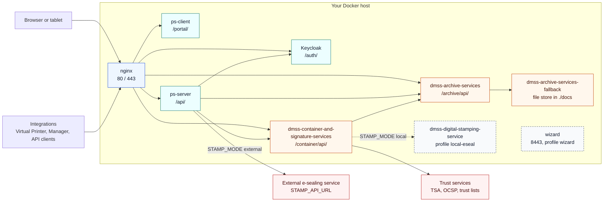

# 1.1 Architecture

This page describes the services `docker-compose.yml` defines, how requests reach them, which ports
they use and where they keep data. Everything runs on one Docker host, on one Docker bridge network.

Dashed boxes are optional services that start only when their compose profile is active.

## Services

| Service | What it does | Listens on (inside the network) | Host port |
|---|---|---|---|
| `nginx` | Public reverse proxy. Terminates TLS with the certificate in `nginx/certs/`, redirects HTTP to HTTPS and `/` to `/portal/`. | 80, 443 | `80`, `443` on all interfaces |
| `ps-client` | The portal: a React single-page app with the PDF viewer and signature pad, served by its own nginx. | 80 | none |
| `ps-server` | The PadSign API. Accepts documents from integrations (API key), serves the portal (Keycloak token), calls the DMSS services and the e-sealer, and runs document routing. | 3001 | none |
| `keycloak` | Identity provider for the portal and the API. Realm `padsign`, clients `padsign-client` (portal) and `padsign-backend` (ps-server). | 8080 (health on 9000) | `127.0.0.1:8080` |
| `dmss-archive-services` | Document archive API: creates documents, stores each signed version and serves downloads. Ships with an in-memory database. | 8090 | `127.0.0.1:86` |
| `dmss-archive-services-fallback` | Filesystem archive. Despite its name it is the archive's first storage connection in this configuration (`FS-MAIN`, priority 1 in `dmss-archive-services/application.yml`) and holds the document files in `./docs`. | 8095 | none |
| `dmss-container-and-signature-services` | Applies the visual signature to a PDF and, in local e-sealing mode, the e-seal. Uses the signing profiles in `documentsigningprofiles.json`. | 8092 | `127.0.0.1:84` |
| `dmss-digital-stamping-service` | Holds the e-seal key (`dmss-digital-stamping-service/seal/seal.p12`) and signs digests for container-signature. Profile `local-eseal` only. | 8084 | none |
| `wizard` | The Deployment Wizard. Profile `wizard` only, started on demand. Mounts the host's Docker socket. | 8443 | `127.0.0.1:8443` (set `WIZARD_BIND_ADDRESS` in `.env` to change it) |

The loopback-only host ports exist for local diagnostics on the host itself (`curl localhost:84/...`).
Nothing outside the host can reach them. `validate-config.sh` fails if any service other than
`nginx` and `wizard` publishes a port on a non-loopback interface, and warns when the wizard does
([5.2 Validating configuration](05-02-validating-configuration.md)). Firewall guidance:
[2.3 Network and firewall](02-03-network-and-firewall.md).

Current image versions: [14.3 Release snapshot](14-03-release-snapshot.md).

## Routes

nginx (`nginx/nginx.conf`) sends each path prefix to one service by its service name:

| Public URL | Service |
|---|---|
| `https://<host>/` | redirect (`301`) to `/portal/` |
| `https://<host>/portal/...` | `ps-client` |
| `https://<host>/api/...` | `ps-server` (read timeout 180 s) |
| `https://<host>/auth/...` | `keycloak` |
| `https://<host>/archive/api/...` | `dmss-archive-services` |
| `https://<host>/container/api/...` | `dmss-container-and-signature-services` |
| `http://<host>/...` | redirect (`301`) to the same path over HTTPS |

ps-server also reaches the archive, container-signature and Keycloak through `https://<host>/...`
(the URLs in `config/config.js`). Inside the Docker network your hostname is a network alias of the
`nginx` service, so those calls go straight to nginx without leaving the host. `configure-host.sh`
sets the alias together with the hostname. To restrict which routes are public, see
[6.1 Route protection](06-01-route-protection.md).

## Optional services and compose profiles

Two services are gated by compose profiles, so a plain `docker compose up -d` never starts them:

- **`local-eseal`** starts `dmss-digital-stamping-service`. `bootstrap.sh --enable-local-eseal` (or
  `toggle-features.sh --enable-local-eseal`) writes `COMPOSE_PROFILES=local-eseal` to `.env`, so the
  profile then stays active for every `docker compose` command. It is one of three settings that
  must agree; the others are `STAMP_MODE` in `config/config.js` and container-signature's stamping URL.
  See [10. Local e-sealing](10-local-e-sealing.md).
- **`wizard`** starts the Deployment Wizard. It is never persisted in `.env`: you start it when you
  need it with `docker compose --profile wizard up -d wizard` and stop it afterwards
  ([3.1 Starting the wizard](03-01-starting-the-wizard.md)).

## Where data lives

| Location | Used by | Contents |
|---|---|---|
| `./docs/` | `dmss-archive-services-fallback` (`/docs`) | Document files of the archive. Owned by the uid that image runs as, mode 770. |
| `./signed-output/` | `ps-server` (`/signed-output`) | Filesystem routing output and the receive-back buffer. Owned by the uid the ps-server image runs as, mode 750. |
| `keycloak_data` (named volume) | `keycloak` | Keycloak's embedded database: realm, clients, users. |
| `config/config.js` | `ps-server` | Server configuration and secrets: backend client secret, API key, session secret, e-sealing credentials. |
| `config/constants.json`, `config/keycloak.js`, `config/TLlogo.png` | `ps-client` (read-only) | Portal configuration, Keycloak adapter overrides, logo. |
| `nginx/nginx.conf`, `nginx/certs/` | `nginx` (read-only) | Proxy routes and the TLS certificate. |
| `dmss-*/` directories | the DMSS services | Spring configuration, signing profiles, keystores. |
| `.env` | `docker compose` only (mode 600) | `KEYCLOAK_FIRST_BOOT_ADMIN_PASSWORD`, `COMPOSE_PROFILES`. |

`bootstrap.sh` and `upgrade.sh` create `docs/` and `signed-output/` and give them to the uid their
image runs as. Never widen them to `777`.

Two defaults are demo-grade and need attention before production (see
[6. Production hardening](06-production-hardening.md)):

- Keycloak runs with `start-dev` and its embedded H2 database in the `keycloak_data` volume. This is
  not a production-grade Keycloak configuration.
- `dmss-archive-services` uses an in-memory HSQLDB database (`dmss-archive-services/application.yml`).

## Startup order

Each service has a health check, and `depends_on` starts a service only when its dependencies are
healthy:

1. `dmss-archive-services-fallback`, `keycloak` and `ps-client` have no dependencies and start first.
2. `dmss-archive-services` waits for the fallback archive.
3. `dmss-container-and-signature-services` waits for both archive services.
4. `ps-server` waits for Keycloak, the archive and container-signature.
5. `nginx` waits for `ps-server` and `ps-client`.

The DMSS services are Java applications and take a few minutes on a cold start; their health checks
allow 300 seconds before a failed probe counts. The public site is up only once nginx has started.
More in [9.9 Health checks and startup](09-09-health-checks-and-startup.md).

## Outbound connections

The host needs outbound HTTPS to:

- the container registries, to pull images: Docker Hub (PadSign, DMSS and nginx images) and
  `quay.io` (Keycloak);
- the external e-sealing service in `STAMP_API_URL`, when e-sealing runs in external mode;
- the trust services the DMSS signature service uses (trust lists, OCSP responders and time-stamping
  authorities configured in `dmss-container-and-signature-services/application.yml`);
- any webhook endpoints you configure for document routing.

For the layered deployment view with network boundaries and all integrations, see
[14.2 Deployment and integration architecture](14-02-deployment-and-integration-architecture.md).
