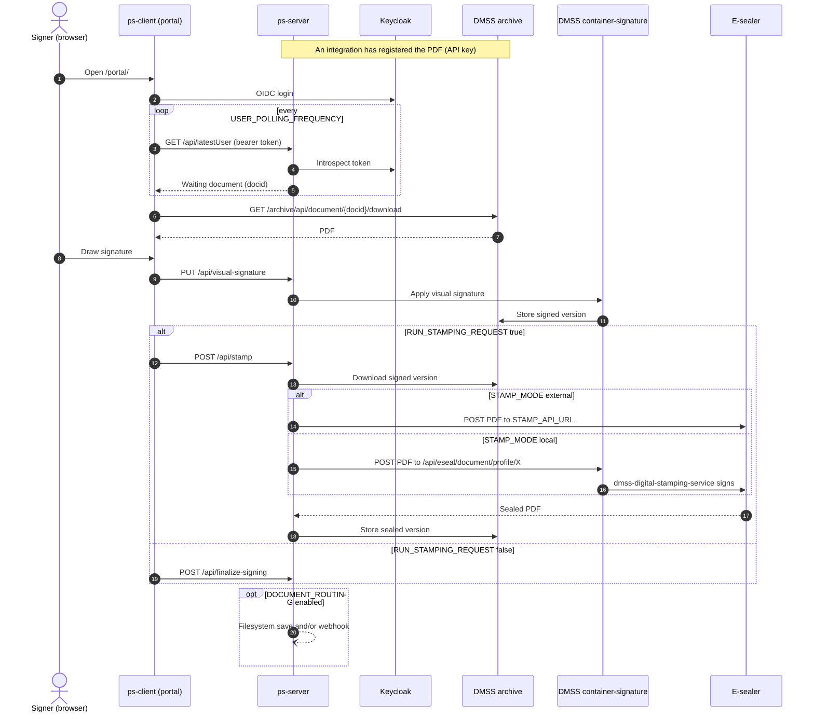

# 1.2 How signing works

This page follows one document from the moment an integration hands it to PadSign until the signed
PDF is stored and delivered. It names the settings that change each step, so you know which part of
the configuration you are touching.

## 1. A document is registered for a signer

An integration calls one of ps-server's API-key endpoints through `https://<host>/api/`:

- `POST /api/registerPDF` uploads a PDF and registers it for a signer (the Virtual Printer uses this).
- `GET /api/registerUser` and `GET /api/registerUserPDF` register a signer session for a device.
- `GET /api/removeUser` clears a registration.

The caller authenticates with `REGISTER_PDF_API_KEY` from `config/config.js` as a bearer token
([7.5 Register PDF API](07-05-register-pdf-api.md)). ps-server stores the PDF in the archive and
keeps the list of documents waiting for each signer in memory.

## 2. The signer logs in

The signer opens `https://<host>/portal/` and is redirected to Keycloak, which authenticates them
(OIDC authorization code flow with PKCE, public client `padsign-client`). The signer's company is
the Keycloak realm role named after it, the value you passed as `--company-role` at install time.
ps-server validates each portal request by introspecting the access token with its confidential
client `padsign-backend`; the token must carry `padsign-backend` in its audience
([8.2 Token audience](08-02-token-audience.md)).

## 3. The portal picks up the document

The portal polls `GET /api/latestUser` every `USER_POLLING_FREQUENCY` milliseconds (5000 by default,
in `config/constants.json`). When a document is waiting for the logged-in signer and their company,
the portal downloads it from `https://<host>/archive/api/document/<docid>/download` with the signer's
token and shows it.

## 4. The signer signs

The signer draws a signature. The portal sends it to `PUT /api/visual-signature`; ps-server forwards
it to `dmss-container-and-signature-services`, which embeds the visual signature into the PDF and
stores the result in the archive as a new version.

## 5. The document is sealed or finalized

What happens next depends on `RUN_STAMPING_REQUEST` in `config/constants.json` (`false` in the
shipped file):

- **`true`: e-seal.** The portal calls `POST /api/stamp`. ps-server downloads the signed version from
  the archive and sends it to the e-sealer chosen by `STAMP_MODE` in `config/config.js`:
  - `"external"` (the default): the cloud e-sealing service at `STAMP_API_URL`, authenticated with
    `STAMP_API_KEY`, `STAMP_COMPANY_ID` and `STAMP_COMPANY_SECRET`.
  - `"local"`: container-signature's `/api/eseal/document/profile/<profile>` endpoint, which signs
    with the key held by `dmss-digital-stamping-service`. Nothing leaves the host
    ([10. Local e-sealing](10-local-e-sealing.md)).

  ps-server stores the sealed PDF in the archive as a new version. It retries the e-sealer up to
  three times. If the e-sealer still answers with a server error, ps-server answers the portal with
  `stampStatus: "skipped"` so the signer is not left stuck, and nothing is routed.
- **`false`: no seal.** The portal calls `POST /api/finalize-signing` and the visually signed version
  is the final document.

## 6. The signed document is delivered

The archive always keeps the signed document. When `DOCUMENT_ROUTING` is enabled in
`config/config.js`, ps-server also delivers it, after a successful seal or on finalize, without
making the portal wait:

- **filesystem**: saves the PDF under `./signed-output/` and, for the Padsign Manager, into the
  receive-back buffer it polls and acknowledges;
- **webhook**: posts a signed-document event to your endpoint.

If signing fails at any step, the portal calls `POST /api/notify-signing-error`, and an enabled
webhook strategy receives a `document.signing_error` event. Configuration:
[11. Document routing and receive-back](11-document-routing-and-receive-back.md).

The client-side signing callback in `config/constants.json` (`PDF_SIGNING_STATUS_CALLBACK`,
`PDF_SIGNING_STATUS_CALLBACK_ENABLED`) is deprecated and not used by the current portal. Use the
webhook routing strategy instead.

## Sequence

What the signed PDF looks like and how to validate its signatures:
[13.6 Signed document format](13-06-signed-document-format.md).
