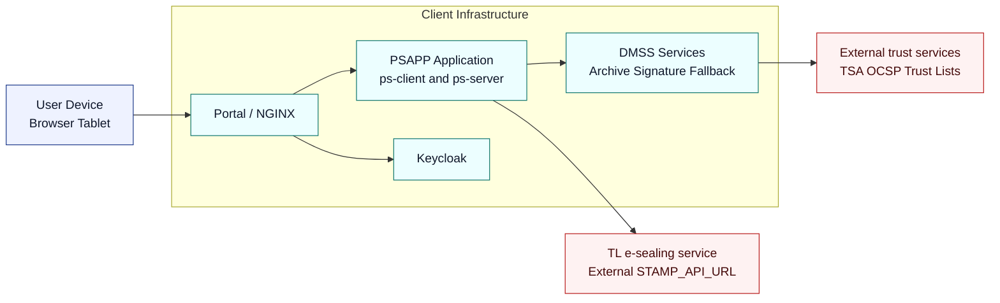

# 2. Overview

- Reverse proxy and TLS termination via NGINX.
- Authentication and authorization via Keycloak.
- PS Client (SPA) served via container.
- PS Server (Node.js backend) with configurable endpoints and Keycloak integration.
- DMSS services for archive, container/signature, and a local fallback archive.
- Docker Compose orchestration with a persistent volume for Keycloak data.

More detail: [7. Architecture](07-architecture.md) (services, routes, ports)
and [34. Appendix](34-appendix.md) (deployment and signing-flow diagrams).

---
