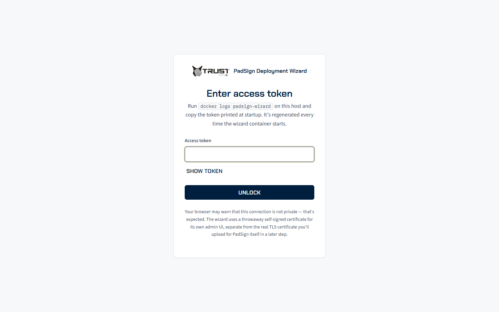
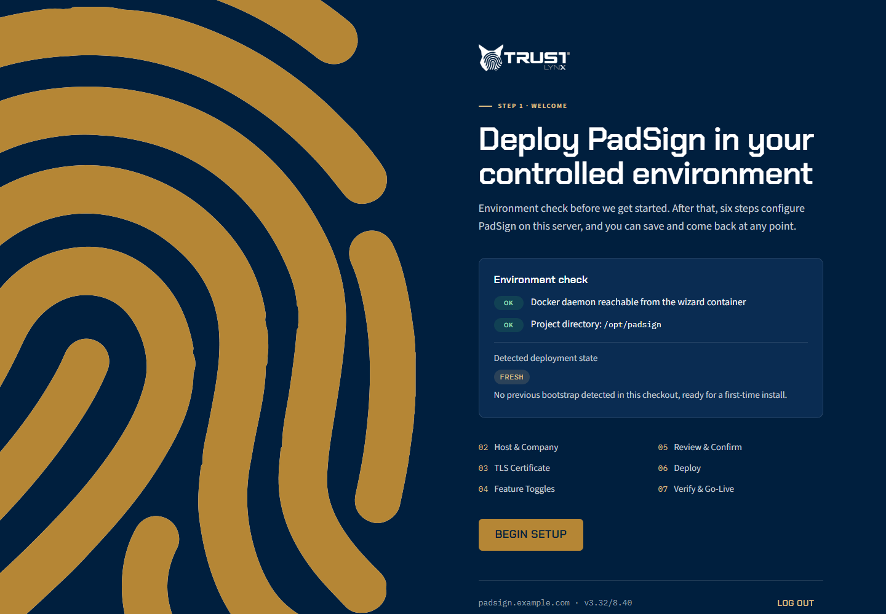
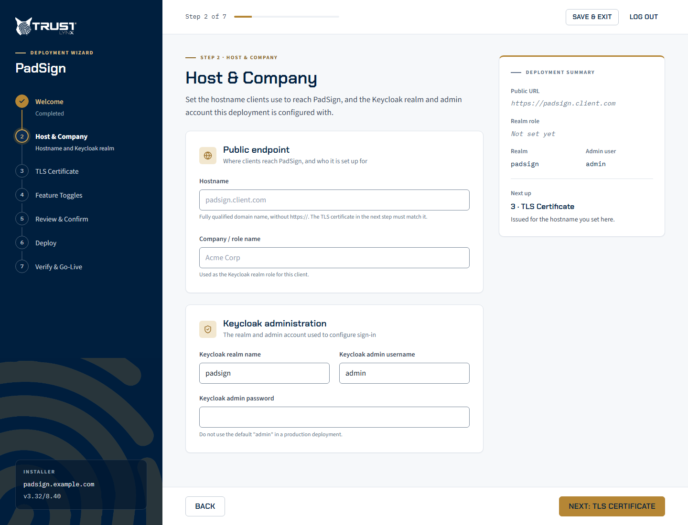
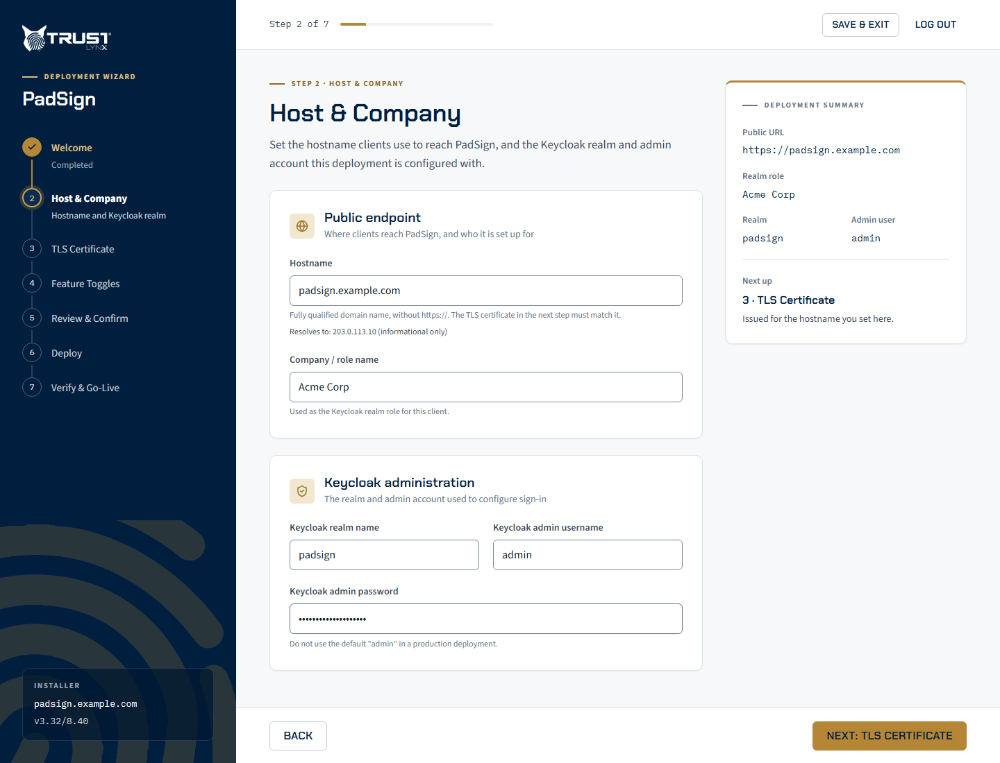
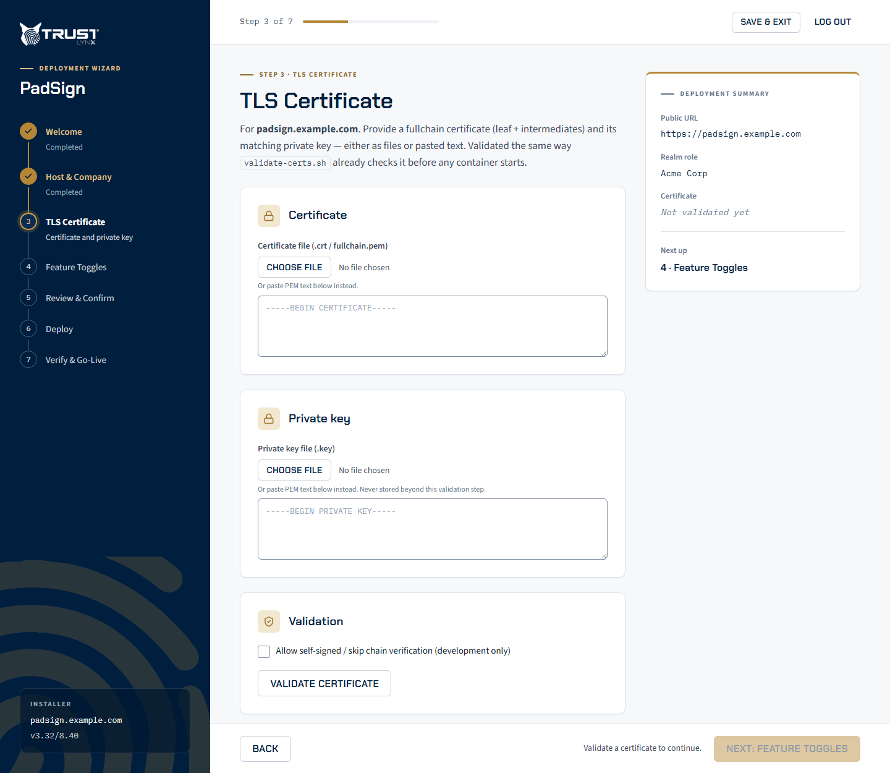
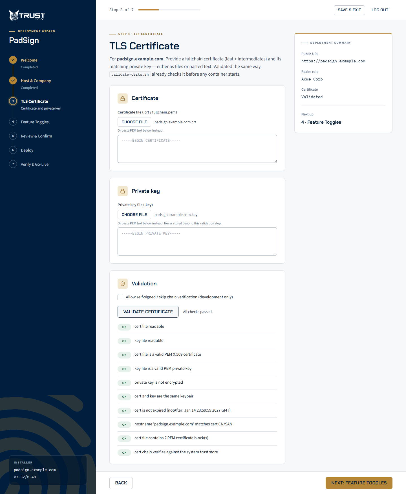
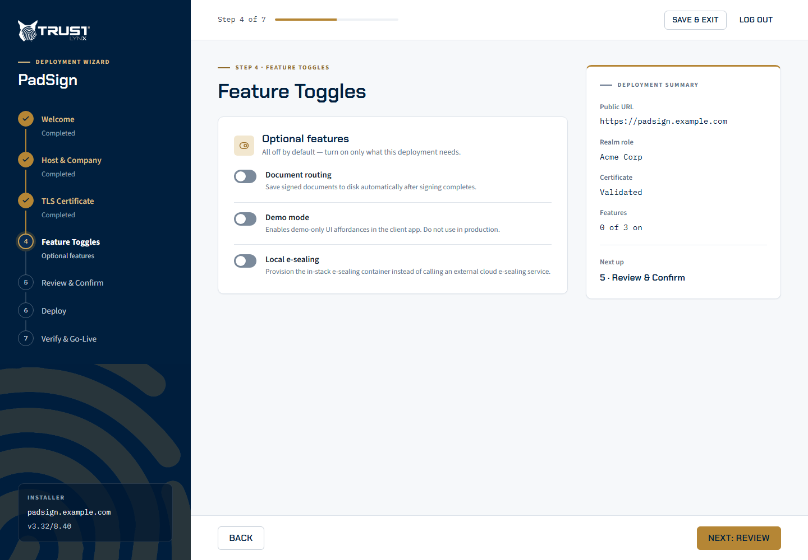
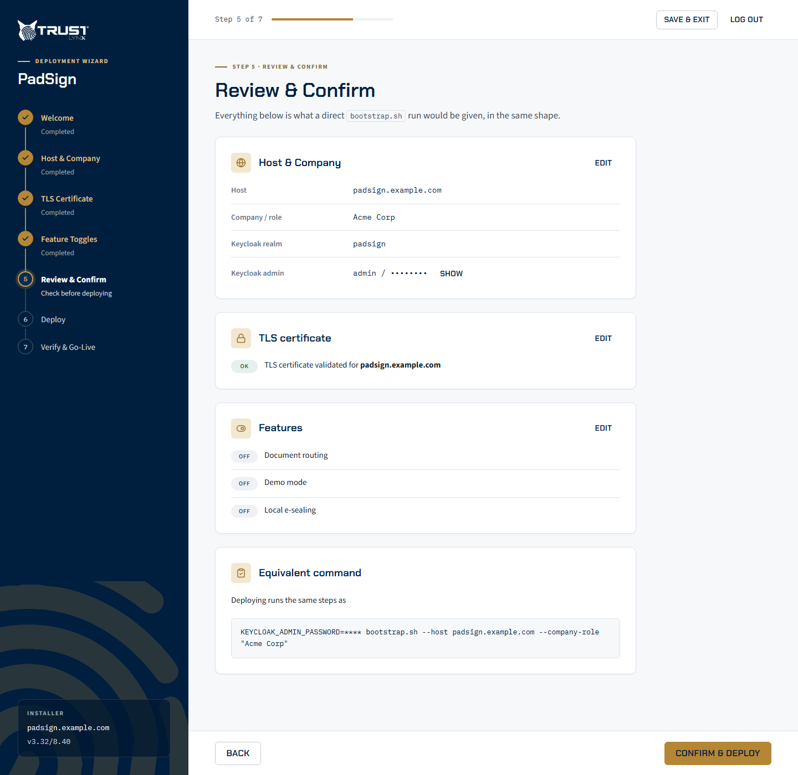
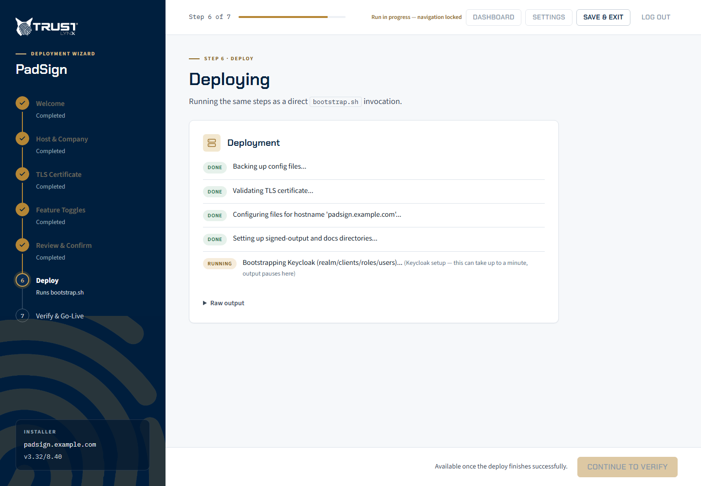
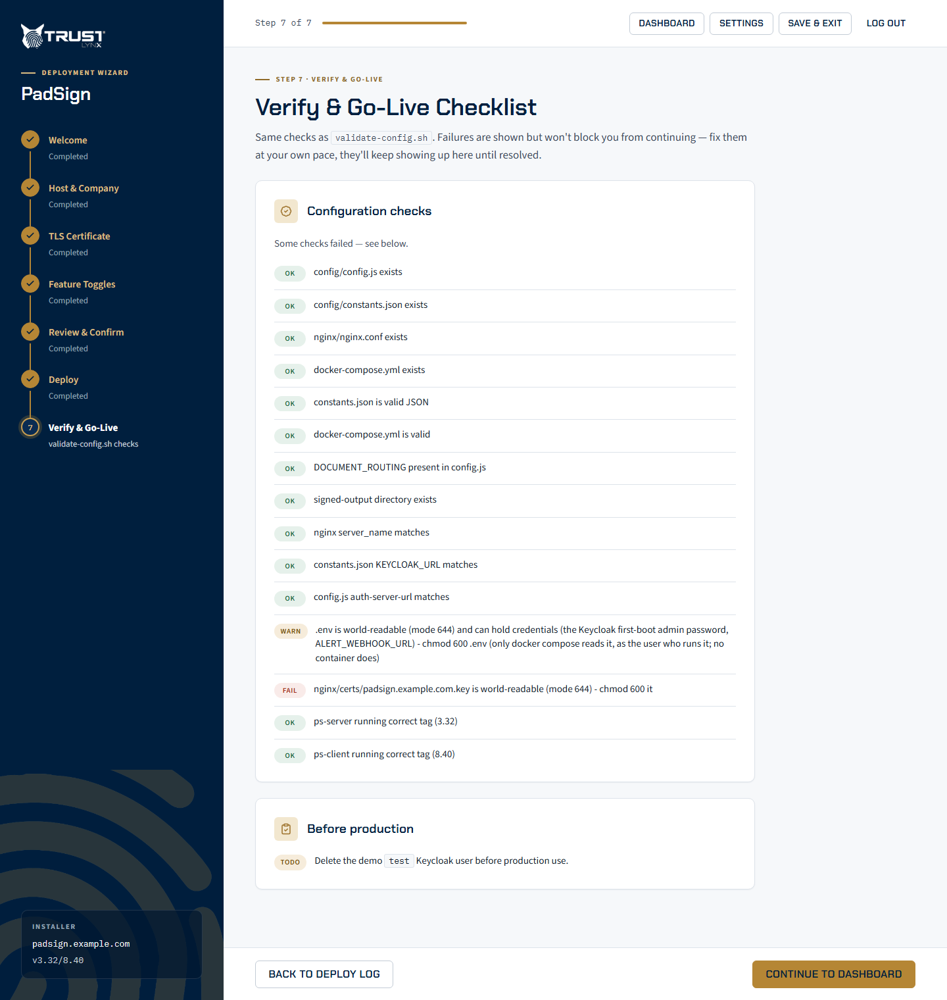

# 3.2 Walkthrough

This page walks through a first install in the wizard, screen by screen. The step numbers match the
step rail on the left of the wizard (1 Welcome to 7 Verify & Go-Live); on a narrow screen the rail
is replaced by a "Step N of 7" header at the top. You need the wizard
running and its access token ([3.1 Starting the wizard](03-01-starting-the-wizard.md)), and your
certificate and private key files at hand.

> The screenshots use the example host `padsign.example.com` and may differ slightly from the
> wizard you are running (example values, check results). The button and field names in the text
> are authoritative.

Two controls are available on steps 2 to 7:

- **The step rail is clickable.** Click any step you have already reached to go back to it, for
  example to fix a typo. Steps you have not reached are greyed out, and the wizard refuses a
  hand-typed URL for a later step too.
- **Save & Exit** (in the top bar) saves your answers and signs you out. The next time you
  unlock the wizard, the Welcome screen offers **Resume Setup** or **Start Over**. The Keycloak admin
  password is never saved; re-enter it in step 2 before you deploy.

## Unlock

Open `https://localhost:8443` through your SSH tunnel and accept the browser's certificate warning.
Paste the access token from `docker logs padsign-wizard` and click **Unlock**. The field is masked;
click **Show token** to check the paste.

## Step 1 — Welcome

The environment check confirms that the wizard can reach the Docker daemon and shows the project
directory it will install into (`/opt/padsign`). On a new host the detected deployment state is
**FRESH**. Click **Begin Setup**.

If Docker shows **FAIL**, the container is missing its `/var/run/docker.sock` mount; see
[3.4 Troubleshooting the wizard](03-04-troubleshooting-the-wizard.md).

If you used Save & Exit earlier, you see a **Welcome back** card naming the step to resume at, with
**Resume Setup** and **Start Over**.

## Step 2 — Host & Company

| Field | What to enter |
|---|---|
| **Hostname** | The DNS name users open PadSign at, for example `padsign.example.com`. |
| **Company / role name** | Your organisation's name. It becomes the Keycloak realm role that PadSign users are given. |
| **Keycloak realm name** | Leave `padsign`. Another name is only applied in Keycloak, not in the PadSign configuration files ([4.2](04-02-bootstrap-parameters.md#optional)). |
| **Keycloak admin username** | Defaults to `admin`. |
| **Keycloak admin password** | A strong password for the Keycloak administrator. Do not use `admin`. |

As you type the hostname, a hint says whether it already resolves from the host. It is
informational only and never blocks you; confirm DNS is right before go-live.

Click **Next: TLS Certificate**.

## Step 3 — TLS Certificate

Provide the full-chain certificate (leaf plus intermediates) and its private key, either as files
(**Certificate file**, **Private key file**) or pasted as PEM text. Click **Validate certificate**.

The wizard runs `installation-scripts/validate-certs.sh` on them: PEM format, key matches the
certificate, not expired, hostname covered, and the chain is complete. For an internal or test
deployment with a self-signed certificate, tick **Allow self-signed / skip chain verification
(development only)** before validating; the other checks still run. Requirements for the files are
in [2.2 DNS and TLS certificates](02-02-dns-and-tls-certificates.md).

**Next: Feature Toggles** stays disabled until every check passes (amber warnings do not block).
The validated files are saved as `installation-scripts/certs/<hostname>.crt` and `.key`, where the
install picks them up.

## Step 4 — Feature Toggles

All three toggles start unticked. Tick only what this deployment needs:

| Toggle | Effect | More |
|---|---|---|
| **Document routing** | Saves signed documents to disk automatically after signing. The shipped `config/config.js` already has routing on, so leaving this unticked does not turn it off; the toggle only matters for a `config.js` that has no `DOCUMENT_ROUTING` block or has it switched off. To turn routing off, run `toggle-features.sh --disable-routing` after the install ([9.4](09-04-toggling-features.md)). | [11. Document routing and receive-back](11-document-routing-and-receive-back.md) |
| **Demo mode** | Demo-only features in the client app. Not for production. | [9.4 Toggling features](09-04-toggling-features.md) |
| **Local e-sealing** | Runs the e-sealing service inside the stack instead of calling the external e-sealing service. The portal only requests a seal when `RUN_STAMPING_REQUEST` is `true` in `config/constants.json`; set it after the install ([10.3](10-03-fresh-install.md#after-bootstrap)). | [10. Local e-sealing](10-local-e-sealing.md) |

You can change these later without reinstalling ([9.4 Toggling features](09-04-toggling-features.md)).
Click **Next: Review**.

## Step 5 — Review & Confirm

A summary of everything you entered, and the equivalent `bootstrap.sh` command line. The admin
password is masked; click **show** to check it. Nothing has been written or started yet.

Click **Confirm & Deploy** to start the install.

## Step 6 — Deploy

The wizard runs `installation-scripts/bootstrap.sh` and shows its eight steps as they run
(what each step does: [4.1 What bootstrap does](04-01-what-bootstrap-does.md)). The collapsible
**Raw output** panel shows the script's full output.

Two waits are normal:

- **Step 5 (Keycloak)** shows no output for up to a minute or two while Keycloak starts and the
  realm, clients, roles and users are created. Do not refresh or leave the page.
- **Step 7 (pull and start)** waits until every service reports healthy, which can take several
  minutes on the first start.

On success you see **Bootstrap finished successfully.** and **Continue to Verify** becomes
available.

On failure, a red banner shows the exit code, the failed step is marked **FAILED**, and you get
three buttons:

| Button | What it does |
|---|---|
| **Retry** | Runs the same command again with the same answers, admin password included. Use it for a transient problem such as a slow image pull. |
| **Back to Review** | Returns to step 5 so you can change an answer first. |
| **Copy log** | Copies the full output to the clipboard, for you or for TrustLynx support. |

If a retry fails the same way, stop retrying and follow
[3.4 Troubleshooting the wizard](03-04-troubleshooting-the-wizard.md).

## Step 7 — Verify & Go-Live

The wizard runs `installation-scripts/validate-config.sh` against the new deployment and lists each
check as **OK**, **WARN** or **FAIL**. Failures do not block you; the page re-runs every check each
time you open it, so you can fix items and come back.

One item is always shown as a to-do: delete the demo `test` Keycloak user before production use.

Click **Continue to Dashboard**. After this, unlocking the wizard opens the Dashboard (version,
health, upgrades) and a **Settings** page for post-go-live changes; see
[9. Operations](09-operations.md).

## Next steps

1. Log in to PadSign. The wizard does not show the demo `test` user's password; create a
   disposable login with `installation-scripts/smoke-user.sh` as described in
   [5.1 First login](05-01-first-login.md).
2. Run the checks in [5. First login and verification](05-first-login-and-verification.md).
3. Work through [6. Production hardening](06-production-hardening.md) before real use.
4. Stop the wizard: `docker compose --profile wizard stop wizard` from `/opt/padsign`.
