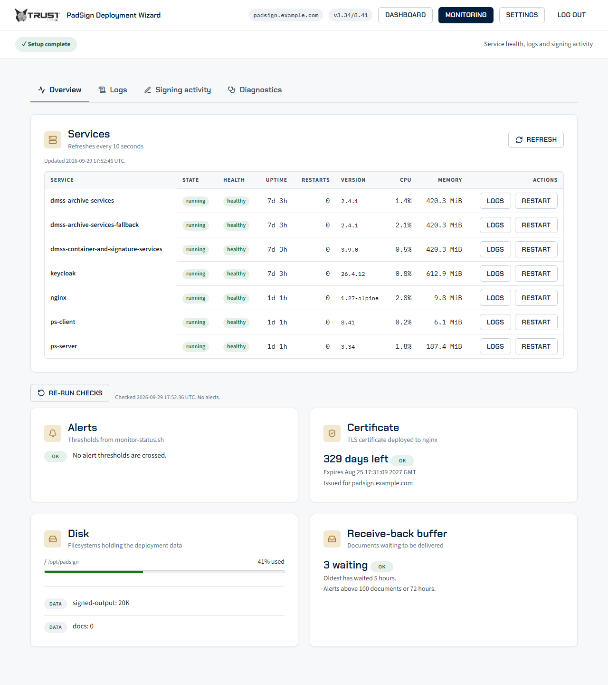
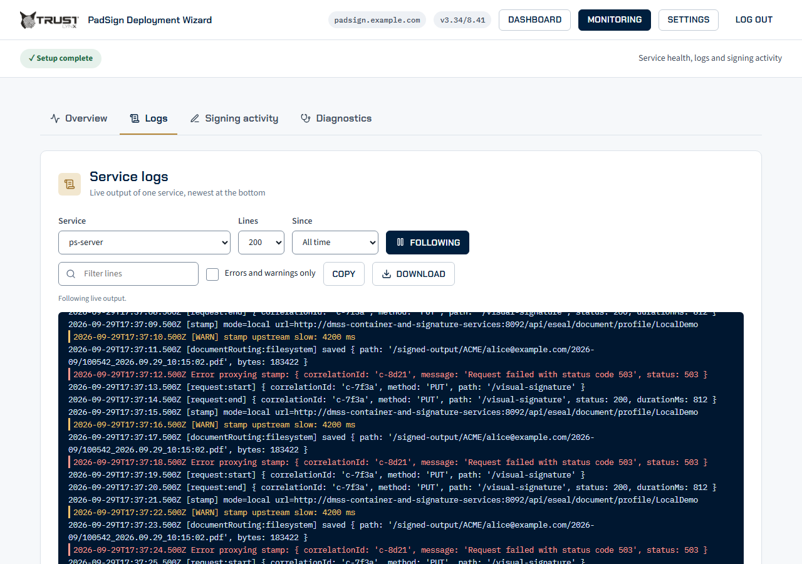
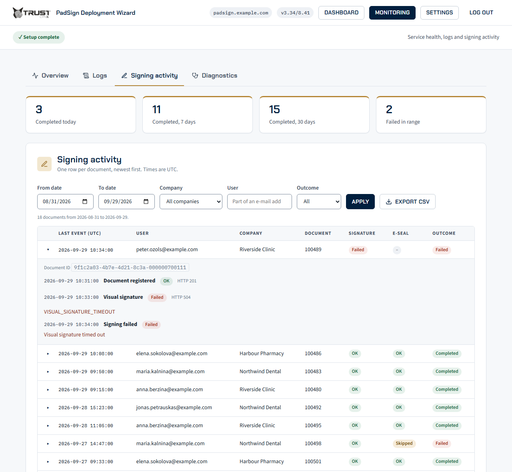
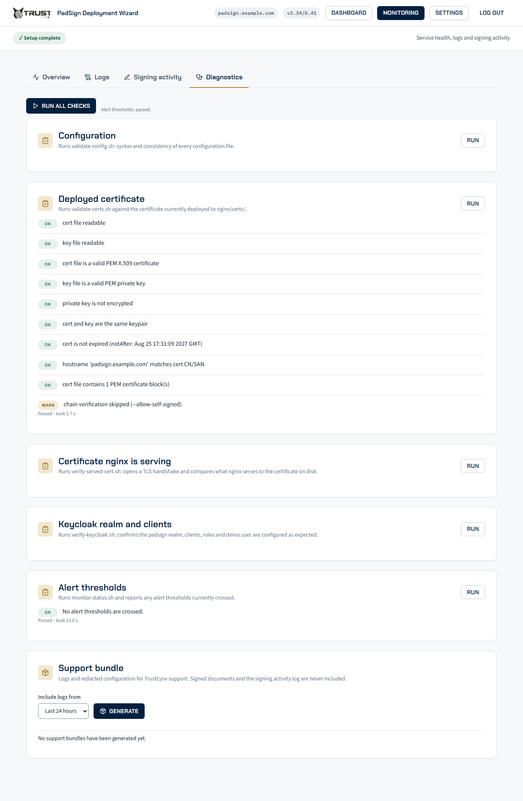
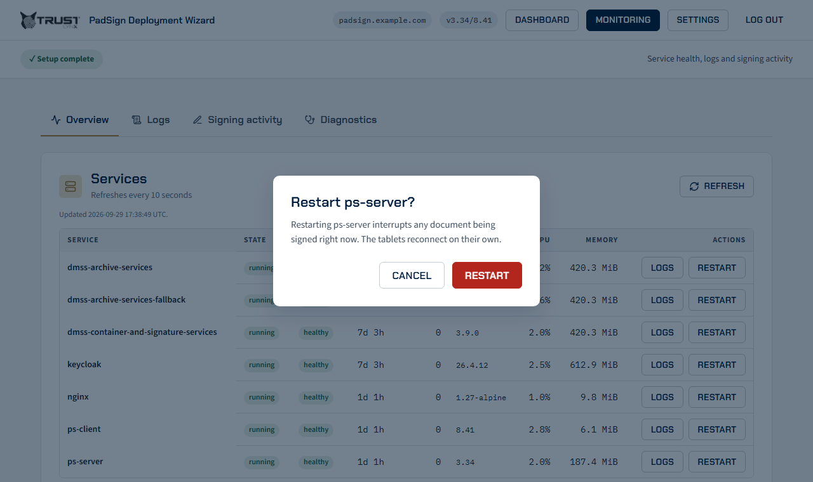

# 9.12 Monitoring from the wizard

The Deployment Wizard has a **Monitoring** page for looking at a running deployment without a shell:
service state, logs, signing history, read-only health checks and a support bundle. It appears in the
wizard's top bar, next to **Settings**, once the first setup has completed. It runs the same scripts
you can run by hand, and each section below names the command that does the same thing.

## What Monitoring is, and is not

Monitoring shows the state of the stack at the moment you open or refresh a page. The wizard is an
on-demand tool: start it when you need to look, and stop it afterwards
([3.1 Starting the wizard](03-01-starting-the-wizard.md)). It keeps no history of its own, collects
nothing in the background and sends nothing anywhere.

So it does not replace alerting. To be told about a service that is down, a certificate close to
expiry or a full disk when nobody is looking, run `monitor-status.sh --alert` from cron
([9.10 Monitoring and alerting](09-10-monitoring-and-alerting.md)).

## Opening it

Start the wizard, sign in with its access token and choose **Monitoring** in the top bar
([3.1 Starting the wizard](03-01-starting-the-wizard.md)). The page has four tabs: **Overview**,
**Logs**, **Signing activity** and **Diagnostics**.

## Overview

A table of every service in the active compose profiles, refreshed every 10 seconds, with cards for
alerts, the certificate, disk and the receive-back buffer below it:



The screenshots on this page show a sample deployment with example data.

| Column | Meaning |
|---|---|
| State and health | Docker's container state and, where the service has one, its health check ([9.9](09-09-health-checks-and-startup.md)) |
| Uptime and restarts | Time since the container started, and how many times Docker has restarted it |
| Version | The image tag the container runs |
| CPU and memory | Current CPU share (%) and memory use |

Each row has a **Logs** link, which opens the Logs tab on that service, and a **Restart** button
([Restarting a service](#restarting-a-service)).

Cards above the table summarise alerts, certificate expiry, disk use and the receive-back buffer
([11](11-document-routing-and-receive-back.md)). They come from
`installation-scripts/monitor-status.sh --format json`, the read-only report of
[9.10](09-10-monitoring-and-alerting.md): it keeps no state file and sends no webhook.

The disk card lists the two signed-document stores at the paths the compose model mounts them from.
The wizard container sees the deployment directory only, so a store on another disk shows as "cannot
inspect from the wizard" with its path, rather than "not created yet"; the disk figures for it come
from running `monitor-status.sh` on the host
([9.11](09-11-start-at-boot-backups-and-customized-hosts.md#storage-outside-the-checkout)).

## Logs

Read a service's log in the browser.



| Control | What it does |
|---|---|
| Service | Any service of the deployment except the wizard itself, whose log prints its access token |
| Tail | How many of the latest lines to load: 200, 1000 or 5000 |
| Since | Limit to the last 15 minutes, 1, 6 or 24 hours, or all |
| Follow | Keeps the view live and appends new lines as they are written |
| Filter | Shows only lines that contain the text |
| Errors and warnings only | Hides everything else |
| Pause scrolling | Stops the view from jumping to the newest line while you read |
| Copy, Download | Copy the visible lines, or save them as a `.log` file |

Follow uses Server-Sent Events over `docker compose logs -f`. A session may keep up to 4 live streams
open, and the wizard up to 8 in all. When the limit is reached, stop following in one tab before you
start another.

Every container's log is rotated by Docker (5 files of 20 MB per container, see
[9.10](09-10-monitoring-and-alerting.md#how-often-an-alert-repeats)), so on a busy service the oldest
lines are already gone.

The same lines are available on the host:

```bash
cd /opt/padsign
docker compose logs --tail 200 --since 1h ps-server
```

## Signing activity

A history of documents through ps-server, built from its signing audit log
([9.13 Signing activity log](09-13-signing-activity-log.md)). Each row is one document:



| Column | Meaning |
|---|---|
| Last event | Time of the document's latest event, in UTC |
| User | The signer's e-mail address |
| Company | The company the document belongs to |
| Document | The document number, or the file name when there is no number |
| Signature, E-seal | How the signature and the seal ended |
| Outcome | `completed`, `failed` or `pending` |

Expand a row to see the document's events in order. Filter by date range (the last 30 days by
default), company, user and outcome. The tiles show documents completed today, in the last 7 days and
in the last 30 days, and failed in the selected range. The tiles count the whole date range, not the
subset the other filters leave. **Export CSV** downloads the filtered set. The list shows 50 rows per
page.

When the tab is empty, it says why: ps-server is older than the version that writes the log,
`AUDIT_LOG` is disabled in `config/config.js`, the log directory is on the host outside the deployment
directory, or nothing has been signed yet. [9.13](09-13-signing-activity-log.md) covers each cause.

## Diagnostics

Five read-only checks, each with a **Run** button. A run shows its result as rows marked OK, WARN or
FAIL, the same as the script's own output.



| Check | Script the wizard runs | Same check by hand |
|---|---|---|
| Configuration | `validate-config.sh` | `./installation-scripts/validate-config.sh --host padsign.example.com` ([5.2](05-02-validating-configuration.md)) |
| Deployed certificate | `validate-certs.sh`, on the certificate file in `nginx/certs/` | `./installation-scripts/validate-certs.sh --host padsign.example.com --cert-crt nginx/certs/padsign.example.com.crt --cert-key nginx/certs/padsign.example.com.key` |
| Certificate nginx is serving | `verify-served-cert.sh` | `./installation-scripts/verify-served-cert.sh --host padsign.example.com` ([9.3](09-03-monitoring-the-served-certificate.md)) |
| Keycloak realm and clients | `verify-keycloak.sh` | `./installation-scripts/verify-keycloak.sh --host padsign.example.com --company-role "<company>"` ([8.1](08-01-automated-setup.md)) |
| Alert thresholds | `monitor-status.sh --format json` | `./installation-scripts/monitor-status.sh --host padsign.example.com` ([9.10](09-10-monitoring-and-alerting.md)) |

The two certificate checks answer different questions. **Deployed certificate** reads the file on
disk. **Certificate nginx is serving** opens a TLS connection and compares what nginx presents with
that file, which is the check that catches a renewal that reached the disk but not nginx.

None of the checks changes anything. Below them is the [Support bundle](#support-bundles) card.

## Restarting a service

**Restart** on an Overview row opens a confirmation dialog that names the service and what users may
notice. Confirming runs `installation-scripts/restart-service.sh`, which does a
`docker compose restart` of that one service, keeping the container and its log, and then waits until
the service is healthy again. The wizard cannot restart itself.



| Service | What users see while it restarts |
|---|---|
| `ps-server` | Signing in progress is interrupted; registered documents waiting for a signer are lost ([7.4](07-04-server-config-js.md#in-memory-state)) |
| `keycloak` | Logins are unavailable for about a minute; signed-in users may have to sign in again |
| `nginx` | The portal is unreachable for a few seconds |
| `ps-client` | The portal is briefly unavailable |
| DMSS services | Signing and archiving fail until the service is healthy again, which can take several minutes (its health check allows a 300 s start period, [9.9](09-09-health-checks-and-startup.md)) |

A restart does not apply changes to `docker-compose.yml` or `.env`: that needs
`docker compose up -d`, which recreates the container. It also does not restart the services that
depend on the one you restarted.

The command line does the same:

```bash
cd /opt/padsign
./installation-scripts/restart-service.sh --service ps-server
./installation-scripts/restart-service.sh --service dmss-archive-services --health-timeout 480
```

`--health-timeout` is the number of seconds to wait for a healthy service. Exit code `0` means the
service restarted and is healthy, `1` that it did not restart or did not become healthy in time, and
`2` a usage error, including a request to restart the wizard.

## Support bundles

A support bundle is one archive that holds what TrustLynx support usually asks for, with secrets
removed. In the wizard, open **Diagnostics**, choose a window (last hour, 6 hours, 24 hours, 3 days
or 7 days) in the **Support bundle** card, press **Generate**, then **Download**. Generating can take
a minute or two.

On the host:

```bash
cd /opt/padsign
./installation-scripts/support-bundle.sh --since 24h
```

The script writes `support-bundles/padsign-support-<host>-<UTC time>.tar.gz`. The directory is mode
700, the archive mode 600, and `support-bundles/` is git-ignored. `--output-dir DIR` writes elsewhere
and `--host` names the host in the file name. Exit code `0` means the archive was written (single
items may have printed a warning), `1` that it could not be written, and `2` a usage error.

| In the bundle | Notes |
|---|---|
| `README.txt`, `versions.txt`, `host.txt` | What the bundle is, image tags and tool versions, host facts |
| `compose-ps.txt`, `monitor-status.txt`, `validate-config.txt` | Service state, the monitoring report, the configuration check |
| `deployment-evidence.json` | Revision, image digests and config checksums ([14.1](14-01-file-map.md)) |
| `config/config.js`, `config/constants.json`, `nginx/nginx.conf`, `docker-compose.yml`, `dmss-*/application.yml` | With secrets replaced by `<redacted>` |
| `config/env-keys.txt` | The names of the variables in `.env`, never their values |
| Logs | Every service except the wizard, for the chosen window, redacted |

Not included: signed documents, the signing activity log, the values in `.env`, TLS private keys and
the wizard's own log.

Redaction removes secrets, not all personal data. The signing audit lines in ps-server's log are
reduced to their time, event and outcome ([9.13](09-13-signing-activity-log.md)), but other log lines
can still contain signers' names or e-mail addresses. Read the bundle before you send it, share it only
with TrustLynx support ([14.5 Support](14-05-support.md)), and delete it afterwards.

Every command the script runs has a time limit, so a hung Docker daemon cannot stop it: an item that
times out prints a warning and the rest of the bundle is still written. `SUPPORT_BUNDLE_CMD_TIMEOUT`,
`SUPPORT_BUNDLE_LOGS_TIMEOUT`, `SUPPORT_BUNDLE_REPORT_TIMEOUT` and `SUPPORT_BUNDLE_DEADLINE` change the
limits; the defaults keep a whole run under the wizard's 10-minute limit.

## When docker compose fails

The Monitoring pages read the stack with `docker compose`, run inside the wizard container from the
deployment directory. When a compose call fails, the page shows compose's own reason (the first line
that is not a warning, with secret values replaced by `<redacted>`) instead of an empty list:

| Where | What it shows |
|---|---|
| Overview, services table | `docker compose failed: <reason>`, tried again every 10 seconds |
| Logs | The same message above a disabled service list |
| Receive-back buffer card | `docker compose exec into ps-server failed: <reason>` |

When `COMPOSE_FILE` in `.env` names a compose file the wizard container cannot read, the message
names that file. Run the same command on the host to see the full error:

```bash
cd /opt/padsign
docker compose config --services
```

### On an overlay-managed checkout

On a host run as release plus overlay
([9.11](09-11-start-at-boot-backups-and-customized-hosts.md#customized-hosts-overlay)), `.env` sets
`COMPOSE_FILE` to `docker-compose.yml`, `<overlay>/compose.overlay.yml` and `.overlay-wizard.yml`.
The wizard container mounts only the deployment directory and the Docker socket, so it would not see
the overlay's compose file. `overlay.sh apply` writes `.overlay-wizard.yml` into the deployment
directory to close that gap:

```yaml
services:
  wizard:
    volumes:
      - type: bind
        source: "/etc/padsign/overlay/20261005-initial"
        target: "/etc/padsign/overlay/20261005-initial"
        read_only: true
```

It mounts the overlay directory read-only at the same absolute path, so every `docker compose` call
the wizard makes reads the same files as on the host. It changes only the wizard service, which runs
only with the `wizard` profile. Docker Compose cannot derive this mount from `COMPOSE_FILE` itself,
which is why `apply` writes it. The file is git-ignored, `overlay.sh capture` does not carry it, and
the next `apply` rewrites it.

Start the wizard as usual; compose reads `COMPOSE_FILE` from `.env`:

```bash
cd /opt/padsign
docker compose --profile wizard up -d wizard
```

`overlay.sh verify` reports whether the mount is in place. When it warns that the Deployment Wizard
container would not see the overlay directory, re-run
`./installation-scripts/overlay.sh apply --overlay <overlay> --force` and run the command above
again: it recreates the wizard container with the mount (a `docker compose restart` would not).

Any file that `compose.overlay.yml` names by path, such as an `env_file`, must be inside the overlay
directory or the deployment directory for the wizard to read it.

## Security notes

- Monitoring uses the wizard's access token and session like the rest of the wizard: there is no
  separate sign-in. A session lasts up to 2 hours; after that a page shows a sign-in message and you
  enter the token again ([3.3](03-03-how-the-wizard-works.md)).
- The pages show and export operational data: log lines, signer e-mail addresses in Signing activity,
  and support bundles. Treat downloads as confidential, and keep port 8443 on loopback
  ([3.1](03-01-starting-the-wizard.md)).
- Restart is the only Monitoring action that changes the running stack. Everything else reads.
