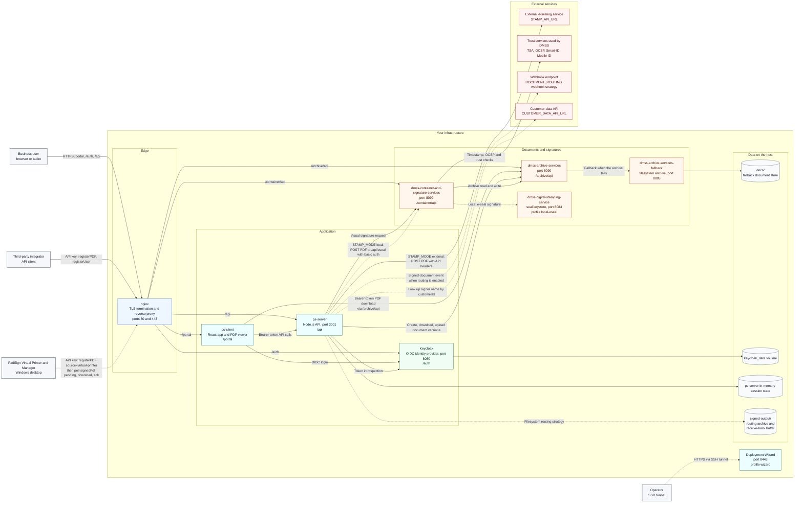

# 14.2 Deployment and integration architecture

One diagram of every PadSign component, the systems it talks to, and the data it keeps. Use it when
you plan firewall rules, integrations or backups. For a walk-through of the components see
[1.1 Architecture](01-01-architecture.md); for the signing sequence see
[1.2 How signing works](01-02-how-signing-works.md).

Solid lines are always present. Dashed lines are optional:

- local e-sealing (`STAMP_MODE: "local"`, compose profile `local-eseal`, [10](10-local-e-sealing.md)).
  The external and the local e-sealer are alternatives; `STAMP_MODE` selects exactly one;
- document routing and receive-back (`DOCUMENT_ROUTING`, [11](11-document-routing-and-receive-back.md));
- the customer-data lookup for Virtual Printer uploads (`CUSTOMER_DATA_*`, [7.4](07-04-server-config-js.md));
- the Deployment Wizard (compose profile `wizard`, [3](03-install-with-the-wizard.md)), reached only by
  the operator through an SSH tunnel.

Inside the Docker network, nginx reaches every service by its service name and container port.
Only nginx (80, 443) is meant to be reachable from users' networks; see
[2.3 Network and firewall](02-03-network-and-firewall.md) for every published port.

The wizard is drawn without connections inside the stack: it runs the installation scripts and
`docker compose` through the host's Docker socket, so it can change every component
([3.3 How the wizard works](03-03-how-the-wizard-works.md)).
