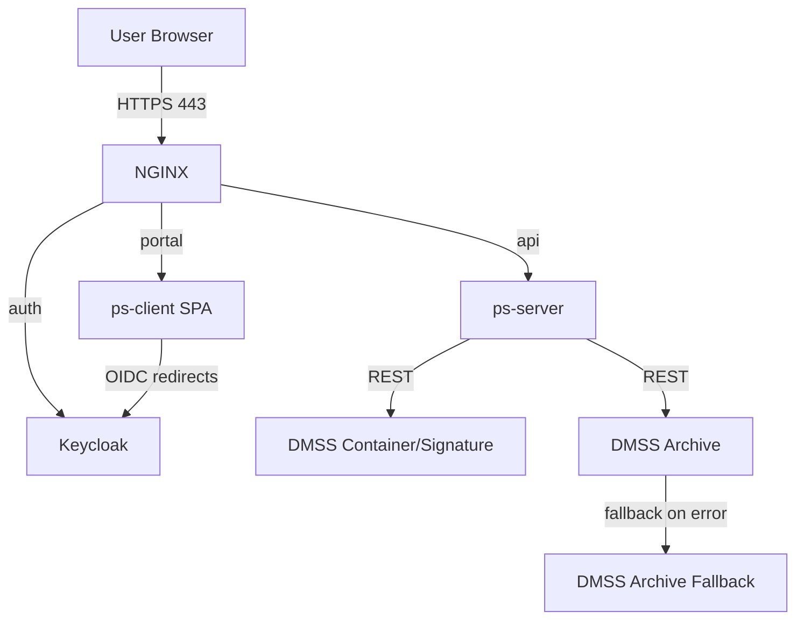
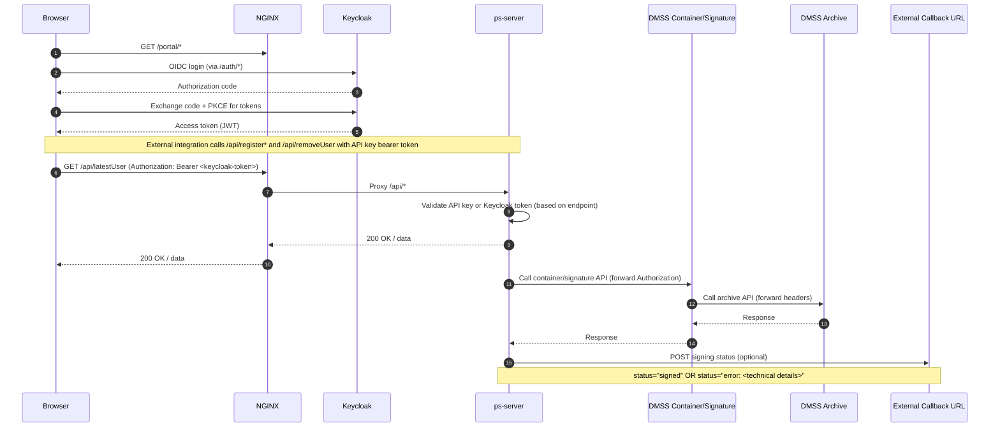

# 23. Data Flow

```mermaid
flowchart TD
  U[User Browser] -->|HTTPS 443| N[NGINX];
  N -->|portal| C[ps-client SPA];
  N -->|auth| K[Keycloak];
  N -->|api| B[ps-server];
  B -->|REST| CS[DMSS Container/Signature];
  B -->|REST| AR[DMSS Archive];
  AR -->|fallback on error| FB[DMSS Archive Fallback];
  C -->|OIDC redirects| K;
```

Legend: portal = /portal/*, auth = /auth/*, api = /api/*

```mermaid
sequenceDiagram
  autonumber
  participant Browser
  participant NGINX
  participant Keycloak
  participant Backend as ps-server
  participant DMSSCS as DMSS Container/Signature
  participant DMSSAR as DMSS Archive
  participant Callback as External Callback URL

  Browser->>NGINX: GET /portal/*
  Browser->>Keycloak: OIDC login (via /auth/*)
  Keycloak-->>Browser: Authorization code
  Browser->>Keycloak: Exchange code + PKCE for tokens
  Keycloak-->>Browser: Access token (JWT)
  Note over Browser,Backend: External integration calls /api/register* and /api/removeUser with API key bearer token
  Browser->>NGINX: GET /api/latestUser (Authorization: Bearer <keycloak-token>)
  NGINX->>Backend: Proxy /api/*
  Backend->>Backend: Validate API key or Keycloak token (based on endpoint)
  Backend-->>NGINX: 200 OK / data
  NGINX-->>Browser: 200 OK / data
  Backend->>DMSSCS: Call container/signature API (forward Authorization)
  DMSSCS->>DMSSAR: Call archive API (forward headers)
  DMSSAR-->>DMSSCS: Response
  DMSSCS-->>Backend: Response
  Backend->>Callback: POST signing status (optional)
  Note over Backend,Callback: status="signed" OR status="error: <technical details>"
```

---

