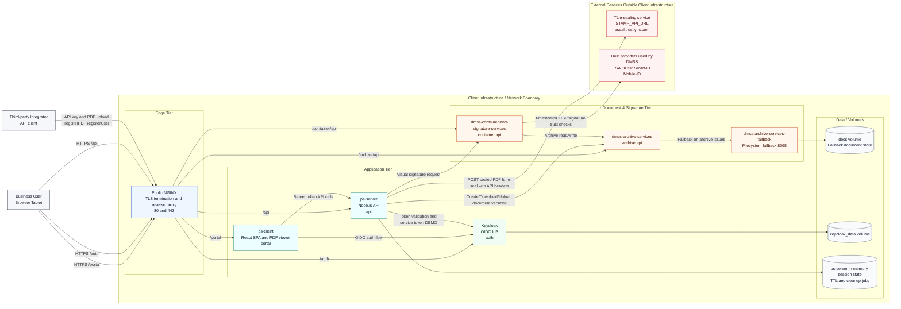

# 34.1 Deployment and integration architecture

```mermaid
flowchart LR
  %% ===== Styles =====
  classDef user fill:#f5f7fb,stroke:#1f2937,stroke-width:1px,color:#111827;
  classDef edge fill:#eef6ff,stroke:#1d4ed8,stroke-width:1px,color:#0f172a;
  classDef core fill:#ecfeff,stroke:#0f766e,stroke-width:1px,color:#0f172a;
  classDef dmss fill:#fff7ed,stroke:#c2410c,stroke-width:1px,color:#431407;
  classDef security fill:#f0fdf4,stroke:#166534,stroke-width:1px,color:#052e16;
  classDef external fill:#fef2f2,stroke:#b91c1c,stroke-width:1px,color:#450a0a;
  classDef storage fill:#f8fafc,stroke:#475569,stroke-width:1px,color:#0f172a;

  U1[Business User<br/>Browser Tablet]:::user
  U2[Third-party Integrator<br/>API client]:::user

  subgraph CUST[Client Infrastructure / Network Boundary]
    direction LR

    subgraph EDGE[Edge Tier]
      NGINX[Public NGINX<br/>TLS termination and reverse proxy<br/>80 and 443]:::edge
    end

    subgraph APP[Application Tier]
      PSC[ps-client<br/>React SPA and PDF viewer<br/>portal]:::core
      PSS[ps-server<br/>Node.js API<br/>api]:::core
      KC[Keycloak<br/>OIDC IdP<br/>auth]:::security
    end

    subgraph DMSS[Document & Signature Tier]
      DCS[dmss-container-and-signature-services<br/>container api]:::dmss
      DAS[dmss-archive-services<br/>archive api]:::dmss
      DAF[dmss-archive-services-fallback<br/>Filesystem fallback 8095]:::dmss
    end

    subgraph DATA[Data / Volumes]
      DOCS[(docs volume<br/>Fallback document store)]:::storage
      KCV[(keycloak_data volume)]:::storage
      MEM[(ps-server in-memory session state<br/>TTL and cleanup jobs)]:::storage
    end
  end

  subgraph EXT[External Services Outside Client Infrastructure]
    TLSEAL[TL e-sealing service<br/>STAMP_API_URL<br/>eseal.trustlynx.com]:::external
    TRUST[Trust providers used by DMSS<br/>TSA OCSP Smart-ID Mobile-ID]:::external
  end

  U1 -->|HTTPS /portal| NGINX
  U1 -->|HTTPS /auth| NGINX
  U1 -->|HTTPS /api| NGINX
  U2 -->|API key and PDF upload registerPDF registerUser| NGINX

  NGINX -->|/portal| PSC
  NGINX -->|/api| PSS
  NGINX -->|/auth| KC
  NGINX -->|/container/api| DCS
  NGINX -->|/archive/api| DAS

  PSC -->|Bearer token API calls| PSS
  PSC -->|OIDC auth flow| KC

  PSS -->|Token validation and service token DEMO| KC
  PSS -->|Create/Download/Upload document versions| DAS
  PSS -->|Visual signature request| DCS
  PSS -->|POST sealed PDF for e-seal with API headers| TLSEAL

  DAS -->|Fallback on archive issues| DAF
  DAF --> DOCS
  KC --> KCV
  PSS --> MEM

  DCS -->|Archive read/write| DAS
  DCS -->|Timestamp/OCSP/signature trust checks| TRUST
```

