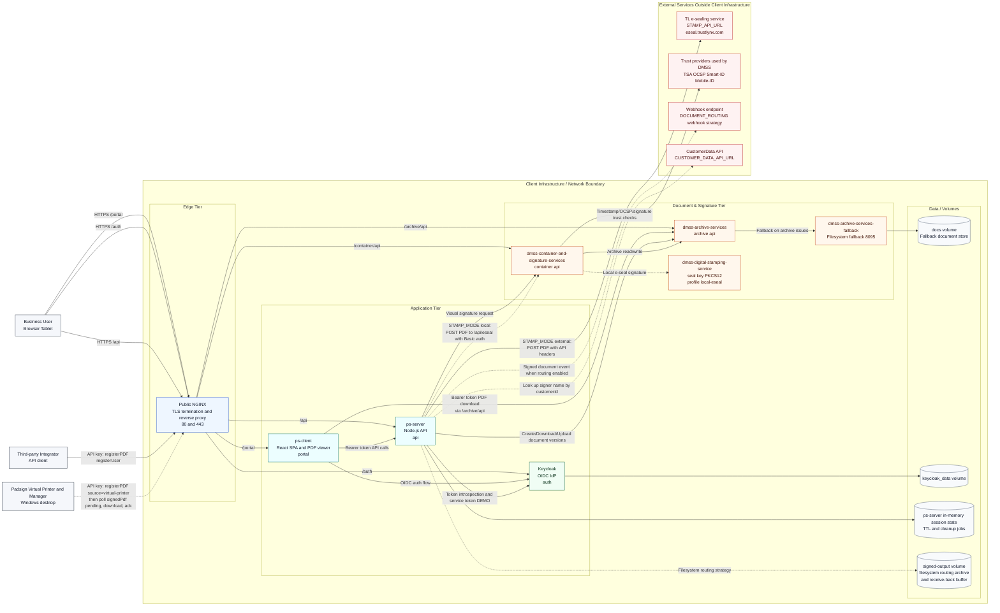

# 34.1 Deployment and integration architecture

Solid lines are always present. Dashed lines are optional: local e-sealing (`STAMP_MODE: "local"`, compose profile `local-eseal`, [4](04-enabling-local-e-sealing.md)), document routing and receive-back (`DOCUMENT_ROUTING`, [35](35-receive-back-deployment-runbook.md)), and the CustomerData lookup for virtual-printer uploads (`CUSTOMER_DATA_*`, [18.4](18-04-server-configconfigjs.md)). The two e-sealers are alternatives: `STAMP_MODE` picks exactly one.

