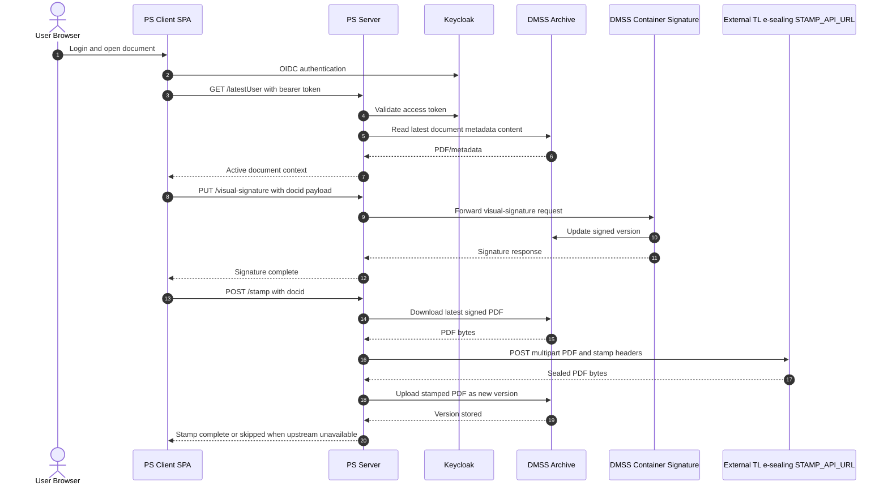

# 34.2 Signing and stamping execution flow

```mermaid
sequenceDiagram
  autonumber
  actor User as User Browser
  participant SPA as PS Client SPA
  participant API as PS Server
  participant KC as Keycloak
  participant ARC as DMSS Archive
  participant SIG as DMSS Container Signature
  participant ESEAL as External TL e-sealing STAMP_API_URL

  User->>SPA: Login and open document
  SPA->>KC: OIDC authentication
  SPA->>API: GET /latestUser with bearer token
  API->>KC: Validate access token
  API->>ARC: Read latest document metadata content
  ARC-->>API: PDF/metadata
  API-->>SPA: Active document context

  SPA->>API: PUT /visual-signature with docid payload
  API->>SIG: Forward visual-signature request
  SIG->>ARC: Update signed version
  SIG-->>API: Signature response
  API-->>SPA: Signature complete

  SPA->>API: POST /stamp with docid
  API->>ARC: Download latest signed PDF
  ARC-->>API: PDF bytes
  API->>ESEAL: POST multipart PDF and stamp headers
  ESEAL-->>API: Sealed PDF bytes
  API->>ARC: Upload stamped PDF as new version
  ARC-->>API: Version stored
  API-->>SPA: Stamp complete or skipped when upstream unavailable
```

