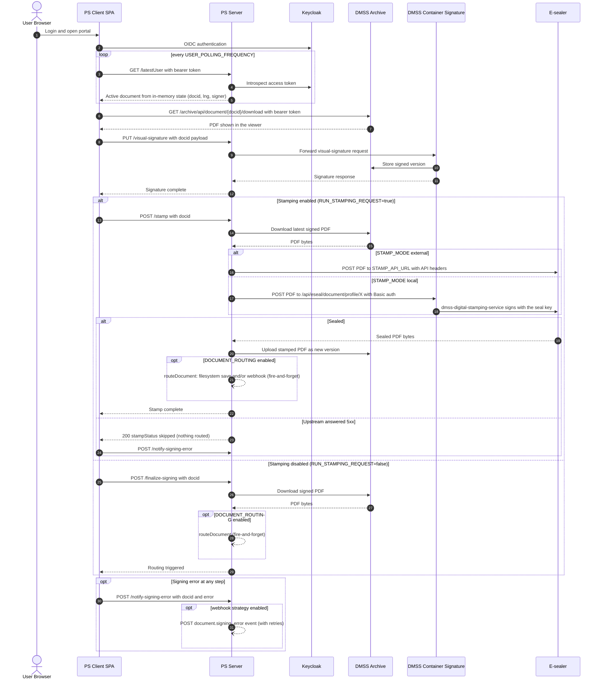

# 34.2 Signing and stamping execution flow

The document is already registered (by `/api/registerPDF`, `/api/registerUser` or a demo upload), so ps-server holds its user entry in memory. The e-seal goes to the external service or, with `STAMP_MODE: "local"`, to container-signature's `/api/eseal`, which signs with the key held by `dmss-digital-stamping-service`. Routing runs only when `DOCUMENT_ROUTING` is enabled ([18.4](18-04-server-configconfigjs.md)).

When a filesystem strategy is enabled, the routed PDF also enters the receive-back buffer, which the Padsign Manager polls and acknowledges. That flow is in [35](35-receive-back-deployment-runbook.md).
