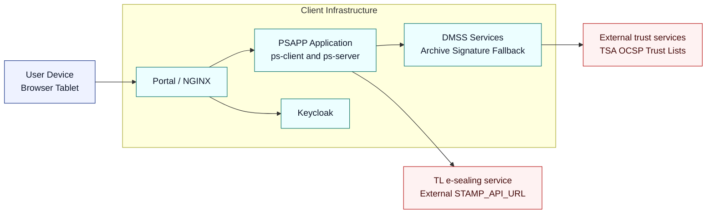

# 34.3 Very high-level component view

```mermaid
flowchart LR
  classDef user fill:#eef2ff,stroke:#1e3a8a,stroke-width:1px,color:#0f172a;
  classDef core fill:#ecfeff,stroke:#0f766e,stroke-width:1px,color:#0f172a;
  classDef ext fill:#fef2f2,stroke:#b91c1c,stroke-width:1px,color:#450a0a;

  User[User Device<br/>Browser Tablet]:::user

  subgraph ClientNet[Client Infrastructure]
    direction LR
    NGINX[Portal / NGINX]:::core
    PSAPP[PSAPP Application<br/>ps-client and ps-server]:::core
    DMSS[DMSS Services<br/>Archive Signature Fallback]:::core
    IDP[Keycloak]:::core
  end

  ESeal[TL e-sealing service<br/>External STAMP_API_URL]:::ext
  Trust[External trust services<br/>TSA OCSP Trust Lists]:::ext

  User --> NGINX
  NGINX --> PSAPP
  NGINX --> IDP
  PSAPP --> DMSS
  PSAPP --> ESeal
  DMSS --> Trust
```

---

