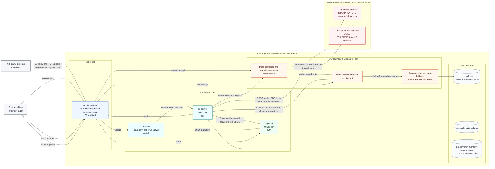
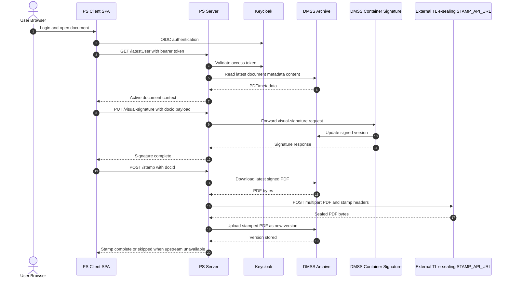
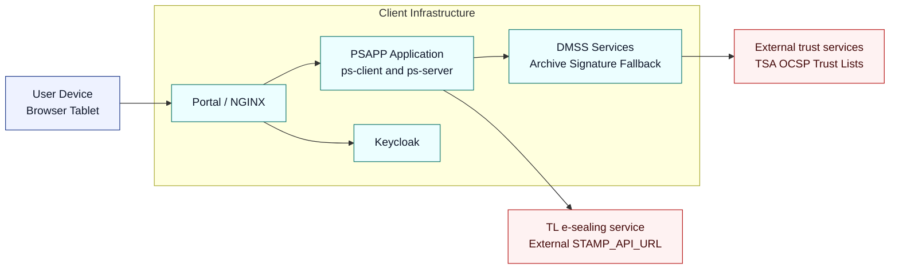

# 34. Appendix

## 34.1 Deployment and integration architecture

```mermaid
flowchart LR
  %% ===== Styles =====
  classDef user fill:#f5f7fb,stroke:#1f2937,stroke-width:1px,color:#111827;
  classDef edge fill:#eef6ff,stroke:#1d4ed8,stroke-width:1px,color:#0f172a;
  classDef core fill:#ecfeff,stroke:#0f766e,stroke-width:1px,color:#0f172a;
  classDef dmss fill:#fff7ed,stroke:#c2410c,stroke-width:1px,color:#431407;
  classDef security fill:#f0fdf4,stroke:#166534,stroke-width:1px,color:#052e16;
  classDef external fill:#fef2f2,stroke:#b91c1c,stroke-width:1px,color:#450a0a;
  classDef storage fill:#f8fafc,stroke:#475569,stroke-width:1px,color:#0f172a;

  U1[Business User<br/>Browser Tablet]:::user
  U2[Third-party Integrator<br/>API client]:::user

  subgraph CUST[Client Infrastructure / Network Boundary]
    direction LR

    subgraph EDGE[Edge Tier]
      NGINX[Public NGINX<br/>TLS termination and reverse proxy<br/>80 and 443]:::edge
    end

    subgraph APP[Application Tier]
      PSC[ps-client<br/>React SPA and PDF viewer<br/>portal]:::core
      PSS[ps-server<br/>Node.js API<br/>api]:::core
      KC[Keycloak<br/>OIDC IdP<br/>auth]:::security
    end

    subgraph DMSS[Document & Signature Tier]
      DCS[dmss-container-and-signature-services<br/>container api]:::dmss
      DAS[dmss-archive-services<br/>archive api]:::dmss
      DAF[dmss-archive-services-fallback<br/>Filesystem fallback 8095]:::dmss
    end

    subgraph DATA[Data / Volumes]
      DOCS[(docs volume<br/>Fallback document store)]:::storage
      KCV[(keycloak_data volume)]:::storage
      MEM[(ps-server in-memory session state<br/>TTL and cleanup jobs)]:::storage
    end
  end

  subgraph EXT[External Services Outside Client Infrastructure]
    TLSEAL[TL e-sealing service<br/>STAMP_API_URL<br/>eseal.trustlynx.com]:::external
    TRUST[Trust providers used by DMSS<br/>TSA OCSP Smart-ID Mobile-ID]:::external
  end

  U1 -->|HTTPS /portal| NGINX
  U1 -->|HTTPS /auth| NGINX
  U1 -->|HTTPS /api| NGINX
  U2 -->|API key and PDF upload registerPDF registerUser| NGINX

  NGINX -->|/portal| PSC
  NGINX -->|/api| PSS
  NGINX -->|/auth| KC
  NGINX -->|/container/api| DCS
  NGINX -->|/archive/api| DAS

  PSC -->|Bearer token API calls| PSS
  PSC -->|OIDC auth flow| KC

  PSS -->|Token validation and service token DEMO| KC
  PSS -->|Create/Download/Upload document versions| DAS
  PSS -->|Visual signature request| DCS
  PSS -->|POST sealed PDF for e-seal with API headers| TLSEAL

  DAS -->|Fallback on archive issues| DAF
  DAF --> DOCS
  KC --> KCV
  PSS --> MEM

  DCS -->|Archive read/write| DAS
  DCS -->|Timestamp/OCSP/signature trust checks| TRUST
```

## 34.2 Signing and stamping execution flow

```mermaid
sequenceDiagram
  autonumber
  actor User as User Browser
  participant SPA as PS Client SPA
  participant API as PS Server
  participant KC as Keycloak
  participant ARC as DMSS Archive
  participant SIG as DMSS Container Signature
  participant ESEAL as External TL e-sealing STAMP_API_URL

  User->>SPA: Login and open document
  SPA->>KC: OIDC authentication
  SPA->>API: GET /latestUser with bearer token
  API->>KC: Validate access token
  API->>ARC: Read latest document metadata content
  ARC-->>API: PDF/metadata
  API-->>SPA: Active document context

  SPA->>API: PUT /visual-signature with docid payload
  API->>SIG: Forward visual-signature request
  SIG->>ARC: Update signed version
  SIG-->>API: Signature response
  API-->>SPA: Signature complete

  SPA->>API: POST /stamp with docid
  API->>ARC: Download latest signed PDF
  ARC-->>API: PDF bytes
  API->>ESEAL: POST multipart PDF and stamp headers
  ESEAL-->>API: Sealed PDF bytes
  API->>ARC: Upload stamped PDF as new version
  ARC-->>API: Version stored
  API-->>SPA: Stamp complete or skipped when upstream unavailable
```

## 34.3 Very high-level component view

```mermaid
flowchart LR
  classDef user fill:#eef2ff,stroke:#1e3a8a,stroke-width:1px,color:#0f172a;
  classDef core fill:#ecfeff,stroke:#0f766e,stroke-width:1px,color:#0f172a;
  classDef ext fill:#fef2f2,stroke:#b91c1c,stroke-width:1px,color:#450a0a;

  User[User Device<br/>Browser Tablet]:::user

  subgraph ClientNet[Client Infrastructure]
    direction LR
    NGINX[Portal / NGINX]:::core
    PSAPP[PSAPP Application<br/>ps-client and ps-server]:::core
    DMSS[DMSS Services<br/>Archive Signature Fallback]:::core
    IDP[Keycloak]:::core
  end

  ESeal[TL e-sealing service<br/>External STAMP_API_URL]:::ext
  Trust[External trust services<br/>TSA OCSP Trust Lists]:::ext

  User --> NGINX
  NGINX --> PSAPP
  NGINX --> IDP
  PSAPP --> DMSS
  PSAPP --> ESeal
  DMSS --> Trust
```

---

