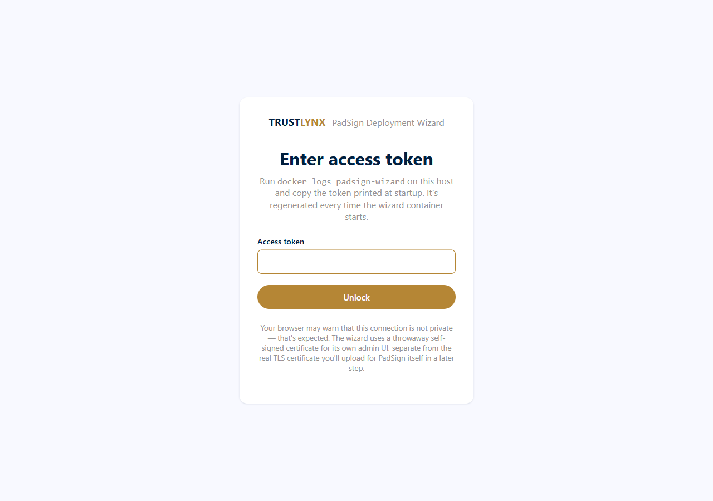
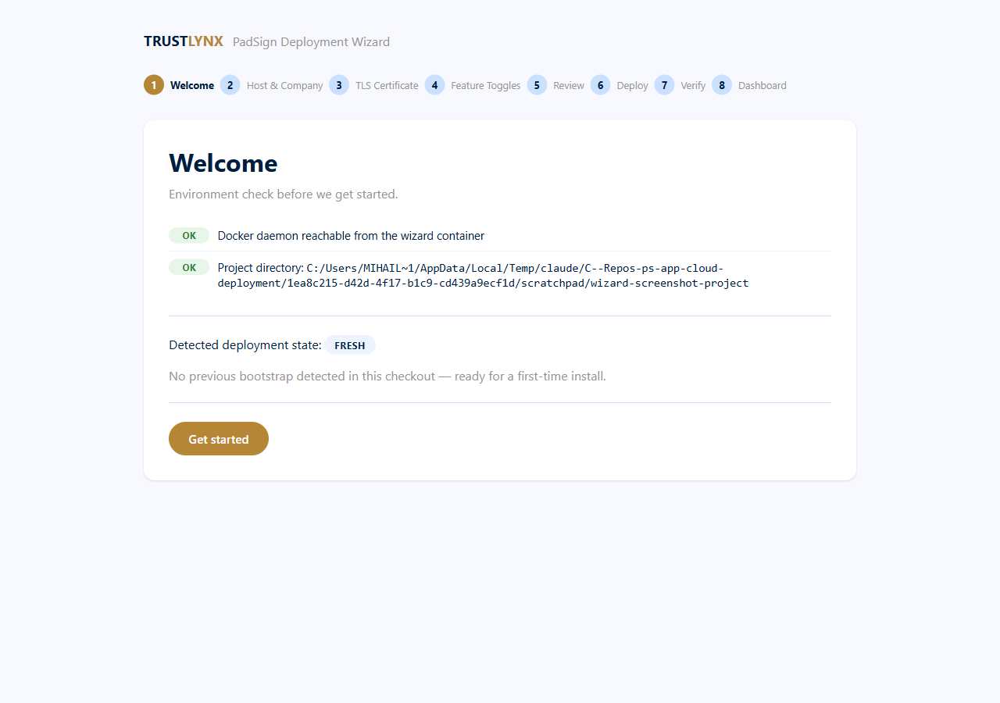
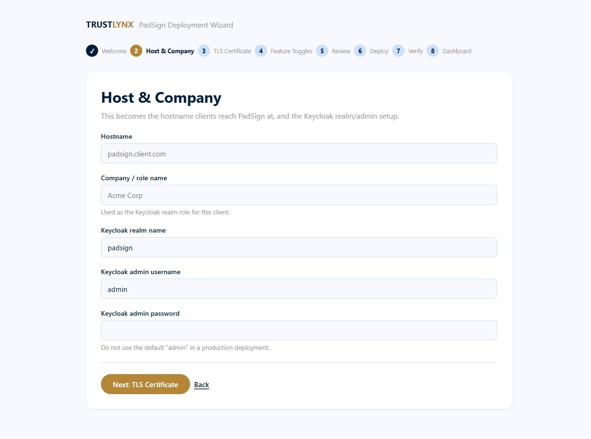
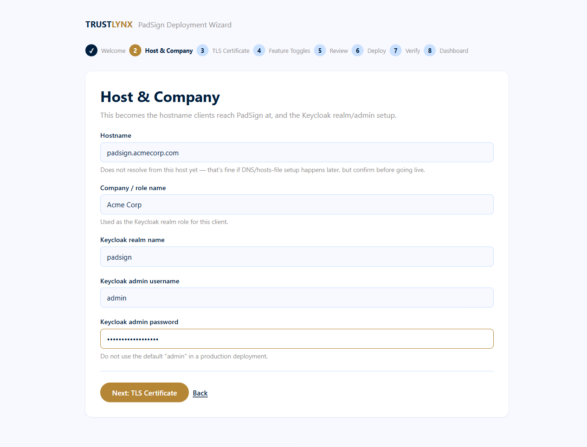
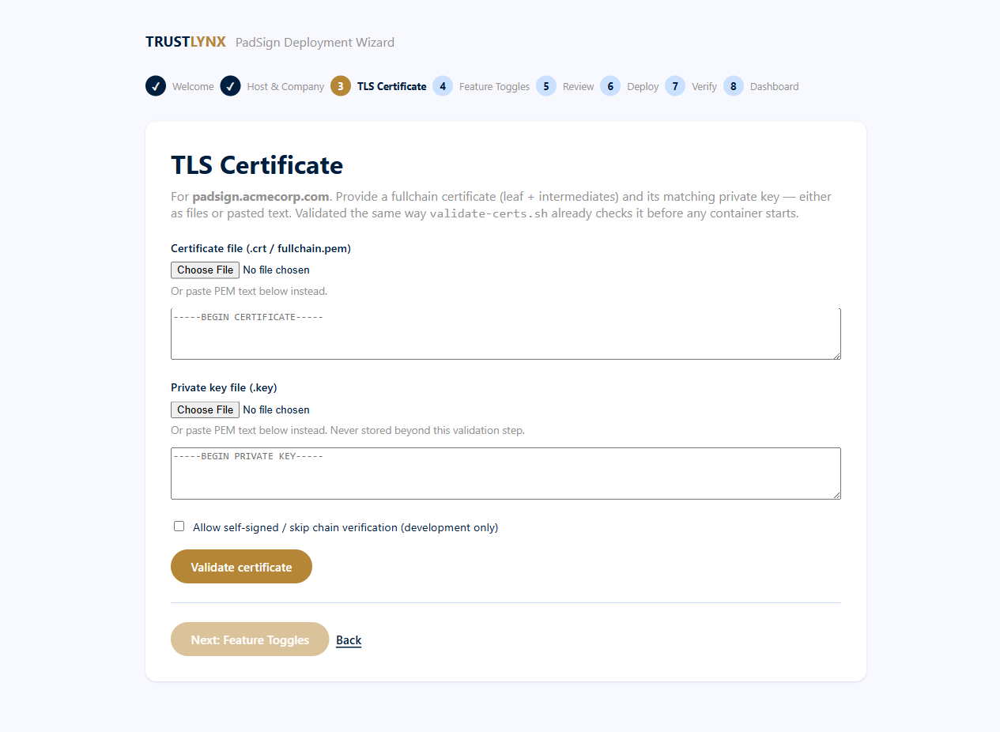
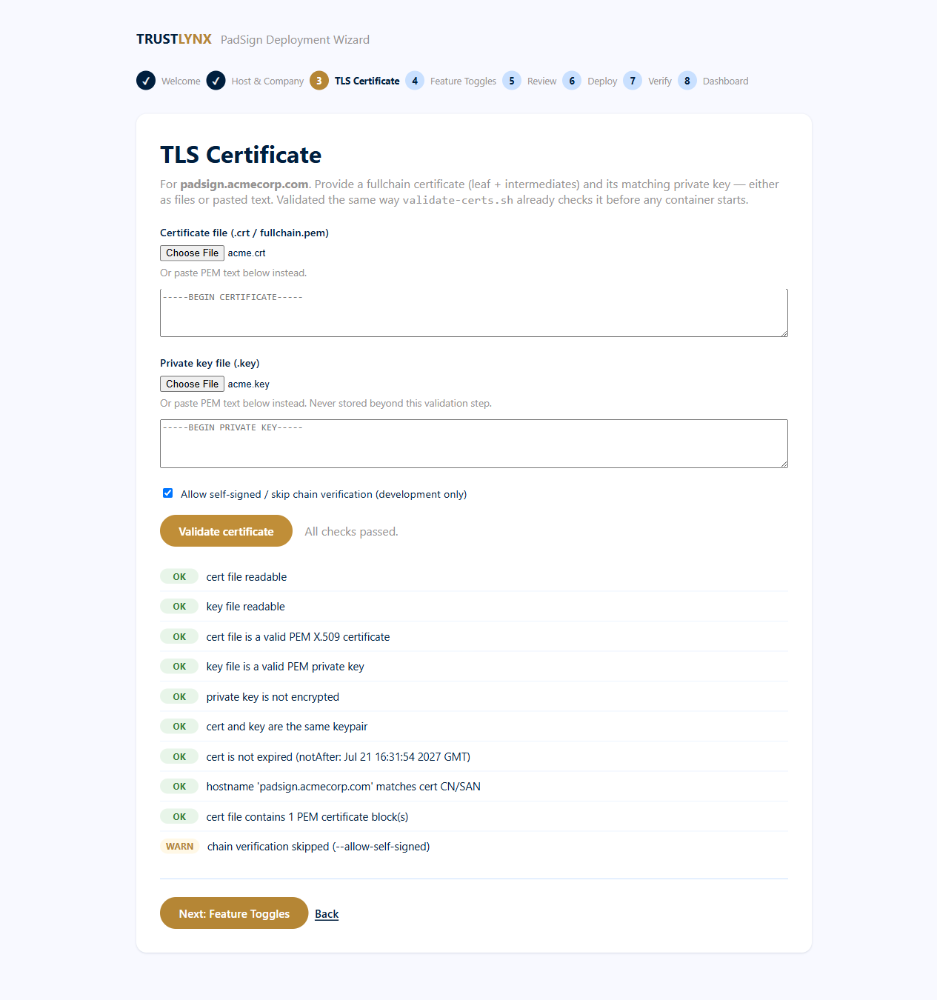
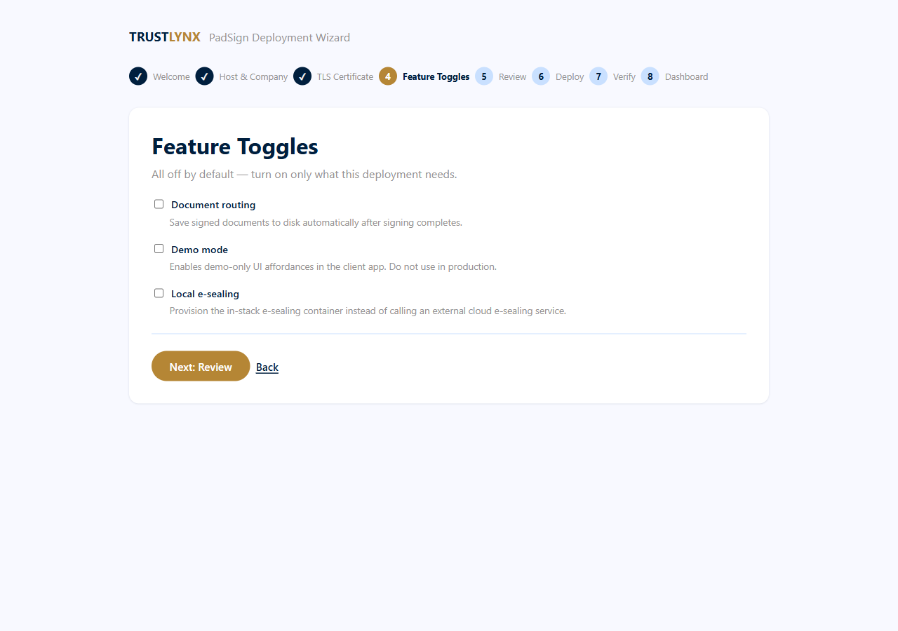
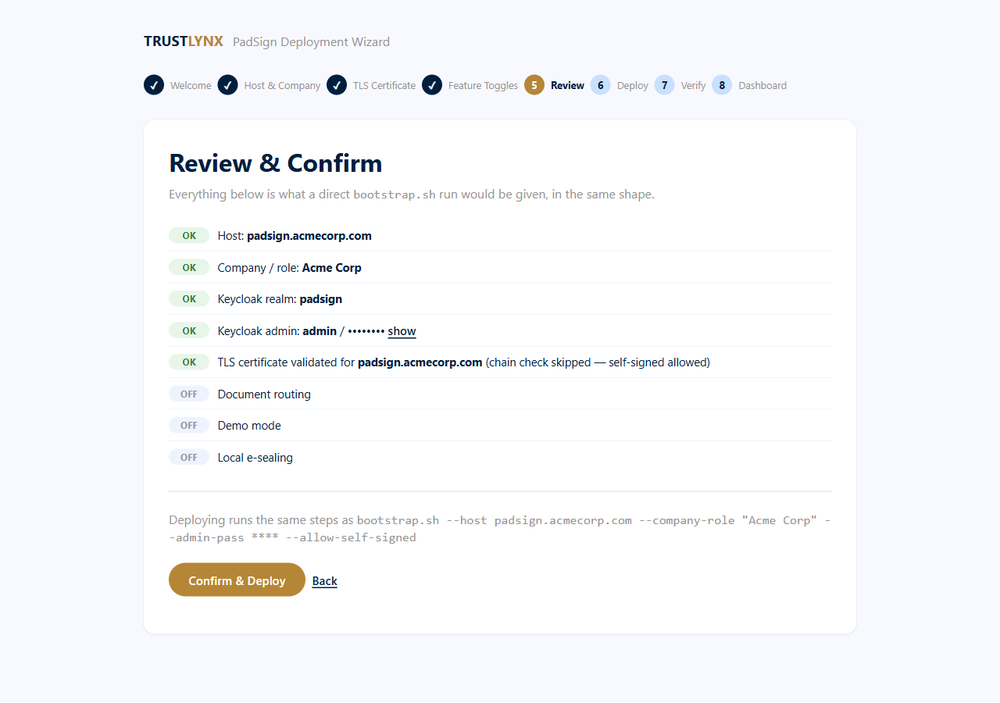
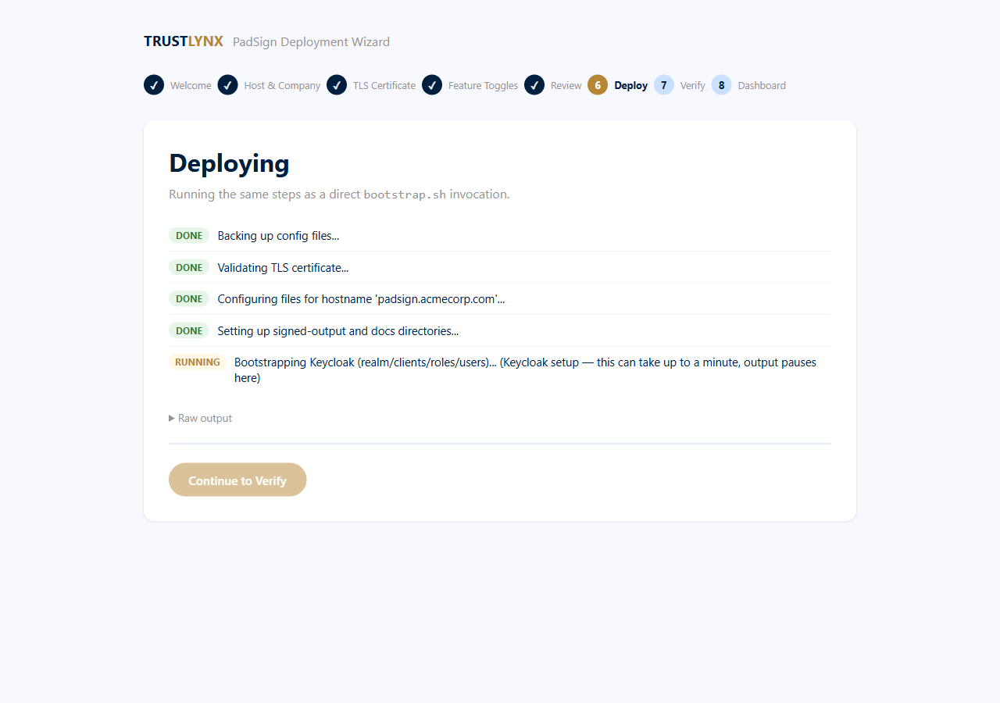
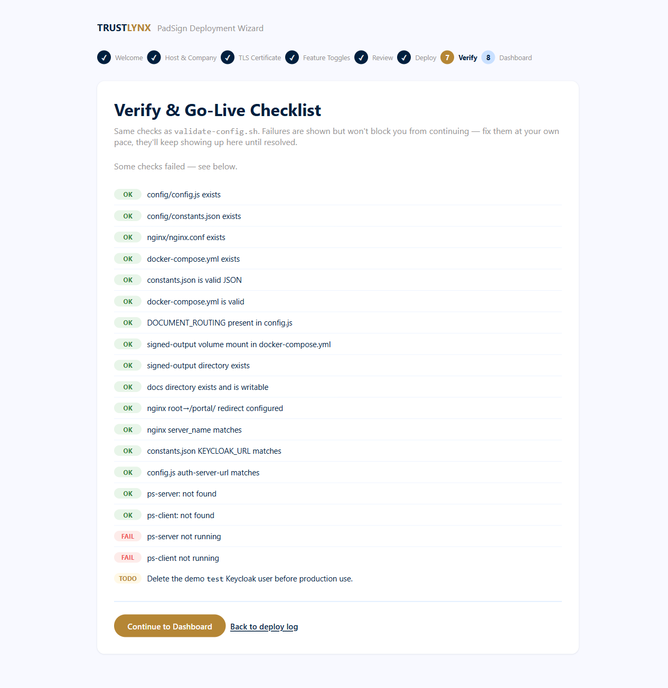

# 36.8 Visual Walkthrough (Screenshots)

A step-by-step picture guide to a first-time install through the deployment wizard. Hand this page directly to whoever will be clicking through the install — no command-line knowledge required. Screenshots below are from a real run of the wizard; your own hostname, company name, and check results will differ. Treat the images as illustrative — exact colours and button placement may differ slightly from the build you're running; the button *names* in the text below are authoritative.

Before you start, make sure someone with server access has run the one command that starts the wizard (see [36.2 Starting the wizard](36-02-starting-the-wizard.md)) and has the access token from `docker logs padsign-wizard` ready.

Two things that apply on every screen:

- The **progress rail** across the top is clickable. Any step you've already been through can be revisited — click its circle to jump straight back, fix something, and use the Next buttons to return. Steps you haven't reached yet are greyed out and inert.
- **Save & Exit** (top right of the rail) stores your answers and signs you out. Next time you unlock the wizard it offers to resume where you stopped. Your Keycloak admin password is deliberately *not* saved, so you'll re-enter that one on resume.

---

## Step 1 — Unlock the wizard

Open `https://<your-server-address>:8443` in your browser. Your browser will warn that the connection isn't private — that's expected here, click through it (e.g. "Advanced" → "Proceed"). Paste in the access token and click **Unlock**.

The token is a long random string, so it's masked as you paste it. Click **Show token** if you want to check the paste landed correctly before submitting.

---

## Step 2 — Welcome

The wizard checks that it can reach Docker and shows which folder it will be deploying into. If this is a brand-new install, it will say **FRESH** and offer a **Begin Setup** button.

If you've started before and used Save & Exit, you'll instead see a **Welcome back** card naming the step you stopped at, with **Resume Setup** and **Start Over**.

---

## Step 3 — Host & Company

Fill in:
- **Hostname** — the address people will use to reach PadSign (e.g. `padsign.yourcompany.com`)
- **Company / role name** — your organization's name
- **Keycloak realm name** — leave as `padsign` unless told otherwise
- **Keycloak admin username / password** — choose a strong password; don't use the default

As you type the hostname, the wizard tells you whether it resolves yet — this is informational only and won't stop you from continuing (DNS is often set up separately).

Click **Next: TLS Certificate**.

---

## Step 4 — TLS Certificate

Upload (or paste) your certificate and its matching private key.

The wizard checks the files the moment you click **Validate certificate** — file format, that the key matches the certificate, that it isn't expired, and that your hostname is actually covered by it. If you're using a self-signed certificate for an internal/test deployment, check **"Allow self-signed"** first.

You can only move on once every check shows **OK** (warnings, shown in amber, don't block you). Until then **Next: Feature Toggles** stays greyed out with a note explaining why.

---

## Step 5 — Feature Toggles

Everything is off by default. Only turn on what this specific deployment needs — each option has a one-line explanation.

---

## Step 6 — Review & Confirm

A final summary of everything you entered before anything is written to disk or started. Your password is masked (click **show** to reveal it if you want to double-check it).

Click **Confirm & Deploy** when you're ready — this is the point of no easy return, though everything is backed up first automatically.

---

## Step 7 — Deploy

Watch each step complete live. **One step in particular — "Bootstrapping Keycloak" — pauses with no visible progress for up to a minute.** This is normal: that step is doing several things behind the scenes (creating your realm, roles, and accounts) before it reports back. Don't refresh the page or assume it's frozen.

If everything succeeds, you'll see a green **"Bootstrap finished successfully"** banner and the **Continue to Verify** button becomes available.

If a step fails, you get a red banner naming the failure and its exit code, the failed step marked **FAILED** in the list, and three buttons:

| Button | What it does |
|---|---|
| **Retry** | Runs the exact same command again, with the same answers — you don't re-enter anything, including the admin password. Use this for transient failures (a slow image pull, a service not up yet). |
| **Back to Review** | Returns to Step 6 so you can change an answer before trying again. |
| **Copy log** | Copies the full raw output to your clipboard — paste it to whoever is helping you troubleshoot. |

The collapsible **Raw output** panel holds the same log if you'd rather read it in place.

If a retry keeps failing on the same step, stop and share the copied log rather than retrying repeatedly — see [36.6 Troubleshooting the wizard](36-06-troubleshooting-the-wizard.md).

---

## Step 8 — Verify & Go-Live Checklist

A final health check across every part of the deployment — config files, container status, and network wiring. Green (**OK**) means that item is good to go; red (**FAIL**) tells you specifically what still needs attention, and it's safe to come back to this page later — it re-checks everything fresh each time.

One item is always shown as a reminder rather than an automatic check: **delete the demo `test` Keycloak user before using this deployment for real signing.**

Once you're satisfied, continue to the Dashboard — see [36.4 Upgrade walkthrough](36-04-upgrade-walkthrough.md) for what that looks like and how to run an upgrade later.
